# KS0530 DIY Solar Tracking Kit

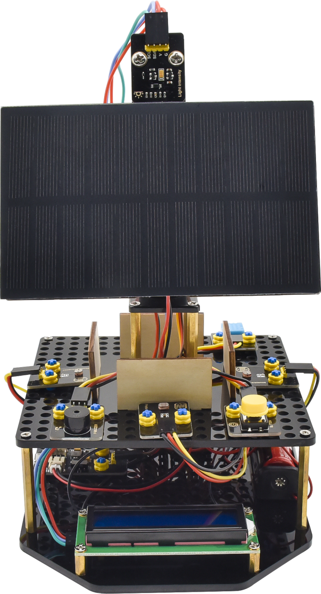

# 1.Description：

The solar tracking kit launched by KEYES is based on Arduino. It consists of 4 ambient light sensors, 2 DOF servos, a solar panel and so on, aiming at converting light energy into electronic energy and charging power devices.

It also boasts a charging module, a temperature and humidity sensor, a BH1750 light sensor, a buzzer, an LCD1602 display, a push button module, an LED module and others, highly enriching the tutorial and making projects more interesting.

This kit can not only help kids have a better learning about programming but obtain knowledge about electronics, machinery, controlling logic and computer science.

Furthermore, as a cost-effective and open-source programming device, it is easy to build.

The 11 projects, from simple to complex, guide you step by step. You can either start from those basic ones like learning how to control a signal module or sensor, or aim at a more sophisticated one, the one integrating most of these components.

What’s more, you can also alter the code or connect it with other sensors or modules through the Lego parts reserved to conduct your own experiments.

Now, let’s embark on an excellent journey together.

**Tutorial and code download address：**

**[KS0530 Tutorial](https://fs.keyestudio.com/KS0530)**

**[KS0530 Github ](https://github.com/keyestudio/KS0530-Keyestudio-Solar-Tracking-Kit/archive/refs/heads/master.zip)**


**Demo video address ：**[https://youtu.be/Bk5ajceXU6w](https://youtu.be/Bk5ajceXU6w)

**Assembly video address ：**[https://youtu.be/PmtsjYsefT4](https://youtu.be/PmtsjYsefT4)

# 2.Features：

-   Multiple functions: track light automatically, read temperature, humidity and light intensity, button control, 1602 LCD display and charge by solar energy;
    
-   Easy to build: insert into Lego jack to install and no need to fix with screws and nuts or solder circuit; also easy to dismantle;
    
-   Novel style: adopt acrylic boards and copper pillars;sensors or modules connected to acrylic boards via Lego jacks; LCD 1602 modules and solar panels add technologies to it;
    
-   High extension:preserve IIC, UART, SPI ports and Lego jacks, and extend other sensors and modules;
    
-   Basic programming : program in C language with Arduino IDE .

# 3.Parameters：

-   Working voltage: 5v

-   Input voltage: 3.7V

-   Maximum output current: 1.5A

-   Maximum power dissipation: 7.5W

# 4.Kit List：

When you receive this delicate kit please confirm whether all components listed below are delivered.

| \\ | Picture                                                    | Component                                                                 | Quantity |
|----|------------------------------------------------------------|---------------------------------------------------------------------------|----------|
| 1  | 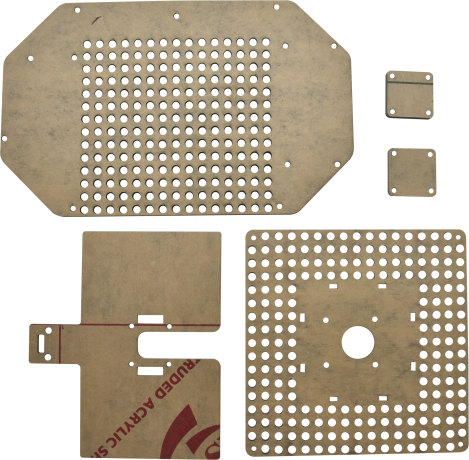       | Acrylic Board*5                                                          | 1        |
| 2  | 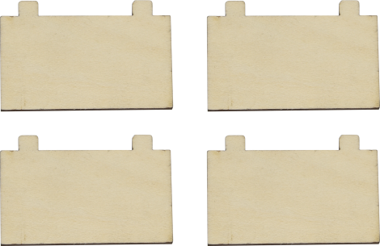          | Wooden Board 3mm* 4                                                      | 1        |
| 3  | 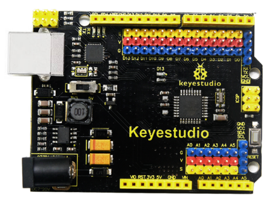            | Keyestudio UNO Development Board                                          | 1        |
| 4  | 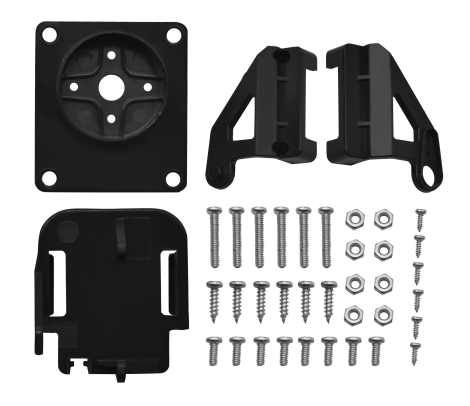   | Mounting Bracket Kit                                                      | 1        |
| 5  | 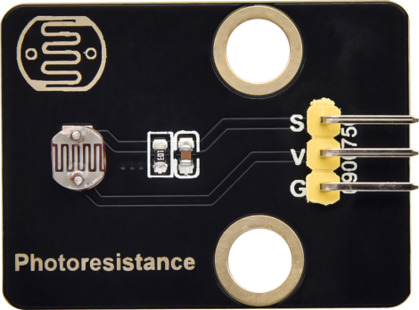           | Keyestudio Photoresistor Module in Building Block Structure               | 4        |
| 6  |             | 1860 Lithium Battery Holder                                               | 1        |
| 7  | 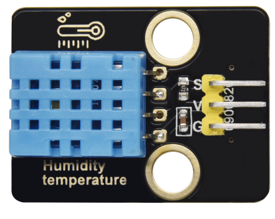           | keyestudio Temperature and Humidity Sensor in Building Block Structure    | 1        |
| 8  | 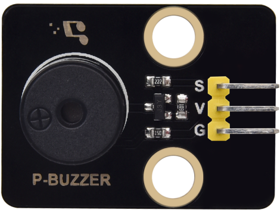           | keyestudio Passive Buzzer Module in Building Block Structure              | 1        |
| 9  | 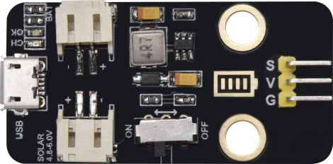          | keyestudio Lithium Power Module Powered by Solar Energy and Via USB Cable | 1        |
| 10 | 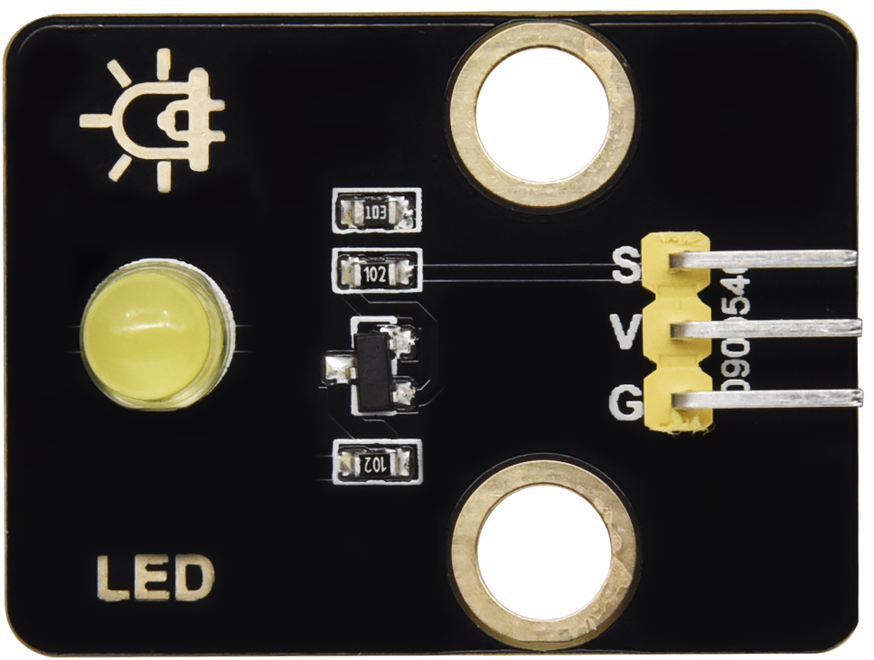       | keyestudio Yellow LED Module                                              | 1        |
| 11 | 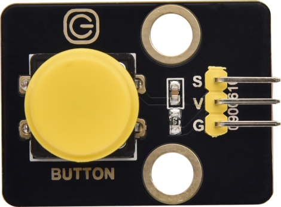           | keyestudio Single-channel Push Button Module                              | 1        |
| 12 | 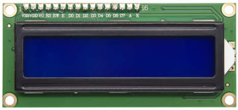  | Keyestudio I2C1602 Module                                                 | 1        |
| 13 | 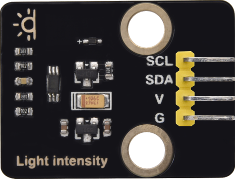           | keyestudio BH1750FVI Digital Light Intensity Module IIC Interface         | 1        |
| 14 | 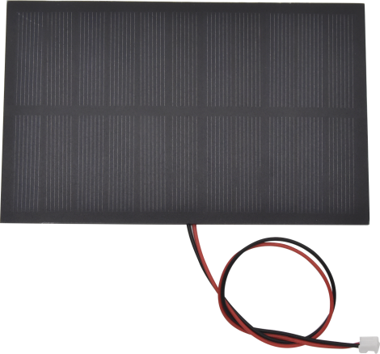          | Solar Panel with Tape And Wires                                           | 1        |
| 15 |       | 2.0*40MM Screwdriver                                                     | 1        |
| 16 |       | 3.0*40MM Screwdriver                                                     | 1        |
| 17 | 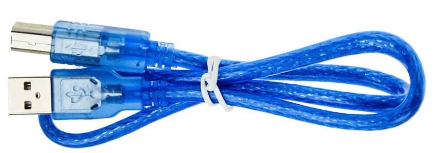            | USB Cable                                                                 | 1        |
| 18 | 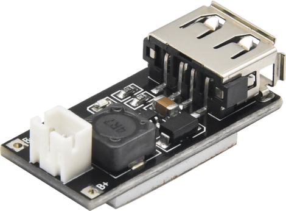           | Smart Phone Charging Module                                               | 1        |
| 19 | 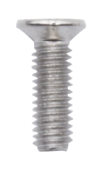 | M3*8MM Flat Head Screw                                                   | 29       |
| 20 |  | M3*14MM Flat Head Screw                                                  | 4        |
| 21 | 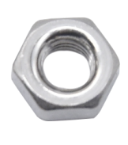      | M3 Nickle-plated Nut                                                      | 6        |
| 22 | 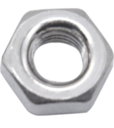      | M4 Nickle-plated Nut                                                      | 2        |
| 23 | 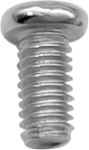        | M4*8MM Round Head Screw                                                  | 2        |
| 24 | 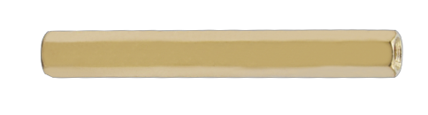   | M3*45MM Double Pass Copper Pillar                                        | 8        |
| 25 | 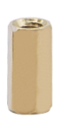   | M3*10MM Double Pass Copper Pillar                                        | 7        |
| 26 | 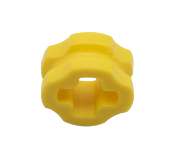           | Lego Part 4265c                                                           | 18       |
| 27 | 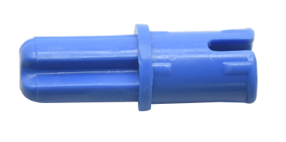           | Lego Part 43093                                                           | 18       |
| 28 | 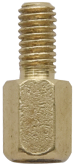           | M3*6+6MM Single Pass Copper Pillar                                       | 4        |
| 29 | 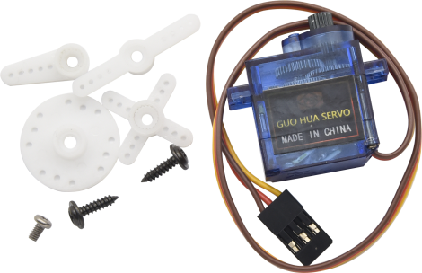          | Servo                                                                     | 2        |
| 30 | 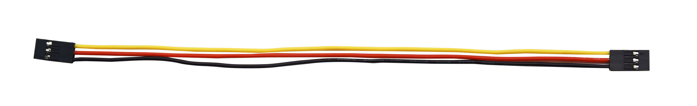            | 3P 26AWG 200mm F-F DuPont Wire                                            | 7        |
| 31 |             | 4P F-F 26AWG 350mm DuPont Wire                                            | 1        |
| 32 |             | 4P 26AWG 200mm DuPont Wire                                                | 1        |
| 33 | 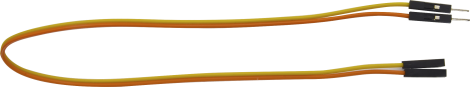           | 20cm M to F DuPont Wire                                                   | 1        |
| 34 | 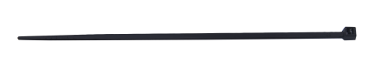   | Plastic String                                                            | 4        |
| 35 | 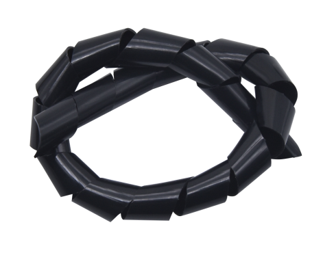   | Plastic Pipe                                                              | 1        |

# 5.Get Started with Arduino

## Install Arduino IDE

When you get control board, you need to download Arduino IDE and driver firstly.

You could download Arduino IDE from the official website:<https://www.arduino.cc/>, click the SOFTWARE on the browse bar, click“DOWNLOADS” to enter download page, as shown below:


There are various versions of IDE for Arduino. Just download a version compatible with your system. Here we will show you how to download and install the windows version of Arduino IDE.

There are two versions of IDE for WINDOWS system. You can choose between the installer (.exe) and the Zip file. For installer, it can be directly downloaded, without the need of installing it manually. However, for Zip package, you will need to install the driver manually.

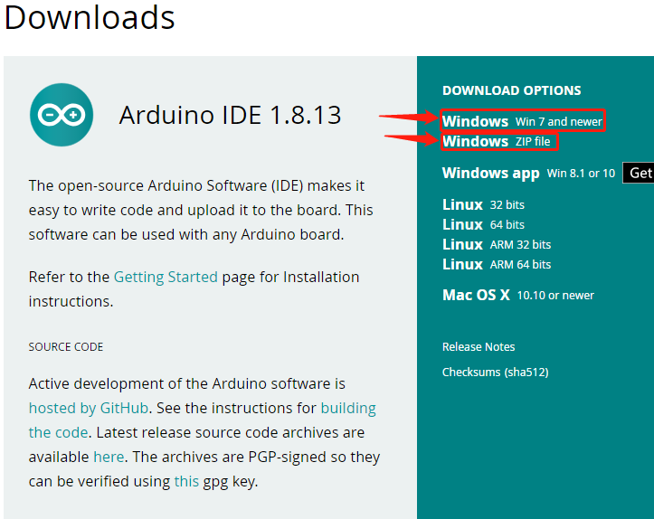

Click JUST DOWNLOAD.

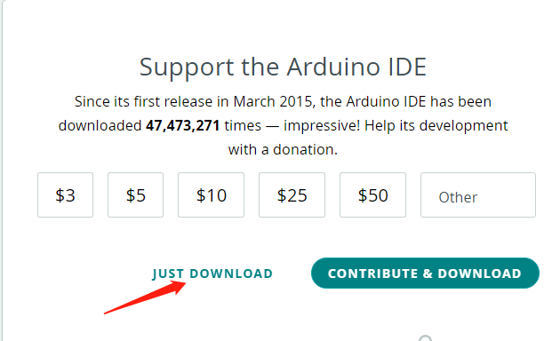

## Keyestudio UNO Development Board

You need to know that Keyestudio UNO development board is the core of this solar tracking device.


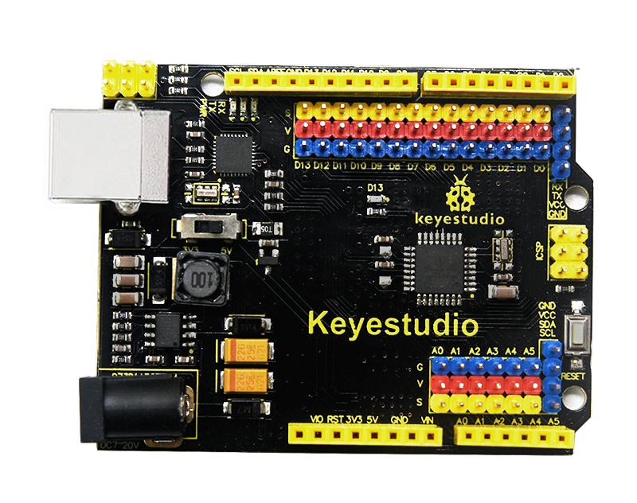

This UNO development board can satisfy all requirements of microcontrollers. All you need to do is to connect it to a computer via a USB cable and power it by an external power supply of DC 7-12.

The core processor of this board is ATMEGA328P-AU with chip ATMEGA16U2 which can be UART-to-USB conversion plug.

It has 14 digital input/output pins (of which 6 can be used as PWM outputs), 6 analog inputs, a 16 MHz crystal oscillator, a USB connection, a power jack, 1 ICSP headers, and a reset button.

It controls the microcontroller. You can use it by connecting it to computer.

| Microcontroller             | ATMEGA328P-AU                                            |
| --------------------------- | :------------------------------------------------------- |
| Operating Voltage           | 5V                                                       |
| Input Voltage (recommended) | DC 7-12V                                                 |
| Digital I/O Pins            | 14 (D0-D13)                                              |
| PWM Digital I/O Pins        | 6 (D3，D5，D6，D9，D10，D11)                             |
| Analog Input Pins           | 6 (A0-A5)                                                |
| Flash Memory                | 32 KB (ATMEGA328P-PU) of which 0.5 KB used by bootloader |
| SRAM                        | 2 KB (ATMEGA328P-PU)                                     |
| EEPROM                      | 1 KB (ATMEGA328P-PU)                                     |
| Clock Speed                 | 16 MHz                                                   |

Element and Interfaces:

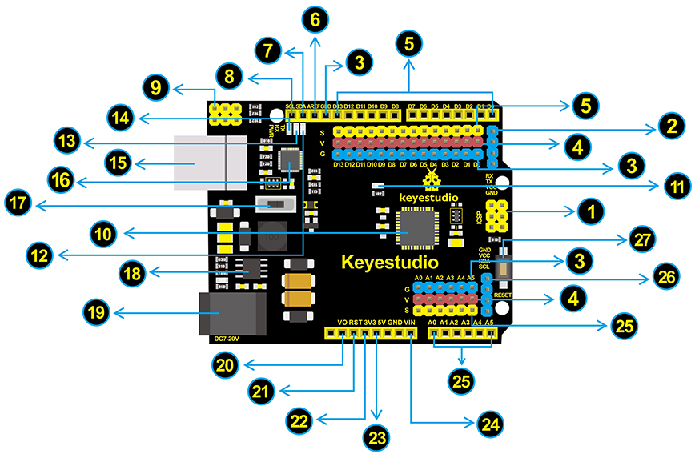

| 1 | ICSP (In-Circuit Serial Programming) Header ICSP is the AVR, an Arduino micro-program header consisting of MOSI, MISO, SCK, RESET, VCC, and GND. It is often called the SPI (serial peripheral interface) and can be considered an "extension" of the output. In fact, slave the output devices under the SPI bus host. When connecting to PC, program the firmware to ATMEGA328P-AU.                                                                                          |
|-------------------------------------------------|--------------------------------------------------------------------------------------------------------------------------------------------------------------------------------------------------------------------------------------------------------------------------------------------------------------------------------------------------------------------------------------------------------------------------------------------------------------------------------|
| 2 | Serial Communication Pin Connect to serial communication. 4Pins (GND, VCC (3.3V or 5V controlled by slide switch), RX, TX)                                                                                                                                                                                                                                                                                                                                                     |
| 3 | GND Ground pins                                                                                                                                                                                                                                                                                                                                                                                                                                                                |
| 4 | V Pins (VCC) Power the external sensors and modules. Select the voltage of 3.3V or 5V via a slide switch.                                                                                                                                                                                                                                                                                                                                                                      |
| 5 | Digital I/O It has 14 digital input/output pins, labeled D0 to D13 (of which 6 can be used as PWM outputs). These pins can be configured as digital input pin to read the logic value (0 or 1). Or used as digital output pin to drive different modules like LED, relay, etc. The pin D3, D5, D6, D9, D10, and D11 can be used to generate PWM. For digital port, you can connect through female headers, or through pin headers (labeled S) of 2.54mm pitch.                 |
| 6 | AREF For Analog reference. Sometimes used to set an external reference voltage (0-5V) as the upper limit of analog input pins.                                                                                                                                                                                                                                                                                                                                                 |
| 7 | SDA IIC communication pin                                                                                                                                                                                                                                                                                                                                                                                                                                                      |
| 8 | SCL IIC communication pin                                                                                                                                                                                                                                                                                                                                                                                                                                                      |
| 9 | ICSP (In-Circuit Serial Programming) Header ICSP is an AVR, an Arduino micro-program header consisting of MOSI, MISO, SCK, RESET, VCC, and GND. Connected to ATMEGA 16U2-MU. When connecting to PC, program the firmware to ATMEGA 16U2-MU.                                                                                                                                                                                                                                    |
| 10 | Microcontroller Each control board has its own microcontroller. You can regard it as the brain of your board. Microcontrollers are usually from ATMEL. Before you load a new program on the Arduino IDE, you must know what IC is on your board. This information can be checked at the top of IC. The microcontroller used in this board is [ATMEGA328P-AU](http://ww1.microchip.com/downloads/en/DeviceDoc/Atmel-7810-Automotive-Microcontrollers-ATmega328P_Datasheet.pdf). |
| 11 | D13 LED There is a built-in LED driven by digital pin 13. When the pin is HIGH value, the LED is on, when the pin is LOW, it's off.                                                                                                                                                                                                                                                                                                                                            |
| 12 | TX LED Onboard you can find the label: TX (transmit) When the board communicates via serial port, send the message, TX led flashes.                                                                                                                                                                                                                                                                                                                                            |
| 13 | RX LED Onboard you can find the label: RX(receive ) When the board communicates via serial port, receive the message, RX led flashes.                                                                                                                                                                                                                                                                                                                                          |
| 14 | Power LED LED on means that your circuit board is correctly powered on. Otherwise LED is off.                                                                                                                                                                                                                                                                                                                                                                                  |
| 15 | USB Connection You can power the board via USB connection. Or can upload the program to the board via USB port. Connect the board to PC using a USB cable via USB port.                                                                                                                                                                                                                                                                                                        |
| 16 | ATMEGA 16U2-MU USB to serial chip, can convert the USB signal into serial port signal.                                                                                                                                                                                                                                                                                                                                                                                         |
| 17 | Slide Switch You can slide the switch to control the voltage of pin V (VCC), 3.3V or 5V.                                                                                                                                                                                                                                                                                                                                                                                       |
| 18 | Voltage Regulator To control the voltage provided to the board, as well as to stabilize the DC voltage used by the processor and other components. Convert an external input DC7-12V voltage into DC 5V, then switch DC 5V to the processor and other components, output DC 5V, drive current is 2A.                                                                                                                                                                           |
| 19 | DC Power Jack The board can be supplied with an external power DC7-12V from the DC power jack.                                                                                                                                                                                                                                                                                                                                                                                 |
| 20 | IOREF Used to configure the operating voltage of microcontrollers. Use it less.                                                                                                                                                                                                                                                                                                                                                                                                |
| 21 | RESET Header Connect an external button to reset the board. The function is the same as reset button.                                                                                                                                                                                                                                                                                                                                                                          |
| 22 | Pin 3V3 Output Provides 3.3V voltage output                                                                                                                                                                                                                                                                                                                                                                                                                                    |
| 23 | Pin 5V Output Provides 5V voltage output                                                                                                                                                                                                                                                                                                                                                                                                                                       |
| 24 | Vin You can supply an external voltage input DC7-12V through this pin to the board.                                                                                                                                                                                                                                                                                                                                                                                            |
| 25 | Analog Pins The board has 6 analog inputs, labeled A0 through A5. Can also used as digital pins, A0=D14, A1=D15, A2=D16, A3=D17, A4=D18, A5=D19. For analog port, you can connect through female headers, or through pin headers (labeled S) of 2.54mm pitch.                                                                                                                                                                                                                  |
| 26 | IIC Communication Pin Connect to the IIC communication. 4Pins (GND, VCC (3.3V or 5V controlled by slide switch), SDA, SCL)                                                                                                                                                                                                                                                                                                                                                     |
| 27 | RESET Button You can reset your board to start the program from the initial status.                                                                                                                                                                                                                                                                                                                                                                                            |

## Install Driver

Windows 10:

The driver will be automatically installed if you plug control board to your computer. Then the COM port is shown below:

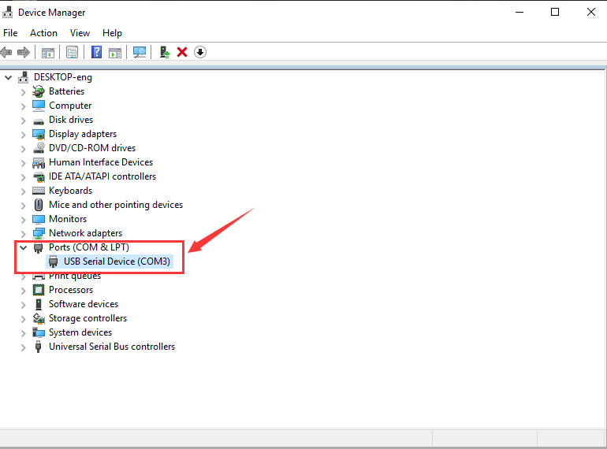

You need to install it manually if your computer is other Windows system.

We will take win7 system as example. Right-click  and click Open file location to find out the drivers folder

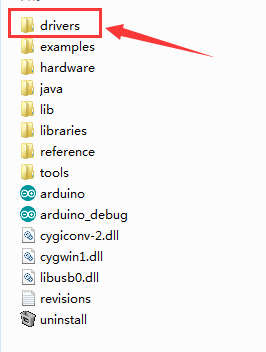

Copy driver folder to D drive.

Right click Computer----- Properties----- Device Manager.

You will view Unknown Device.

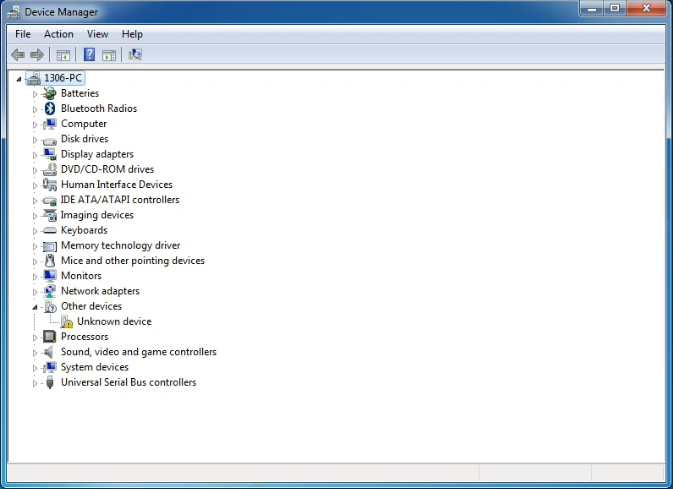

Click Unknown devices to select Update Device Management:

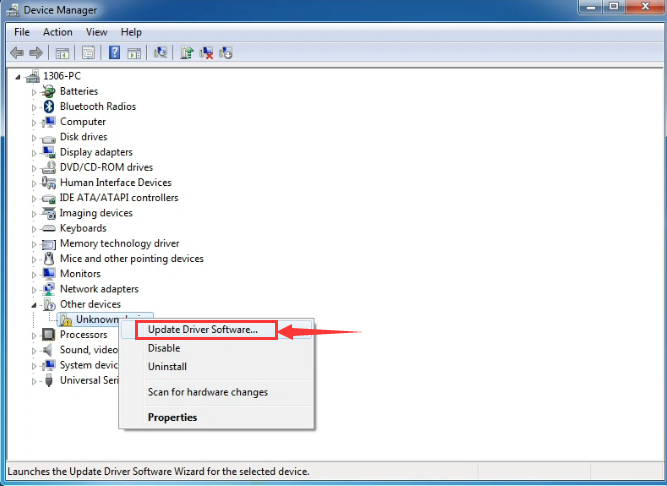

Click“Browse.....manually”:

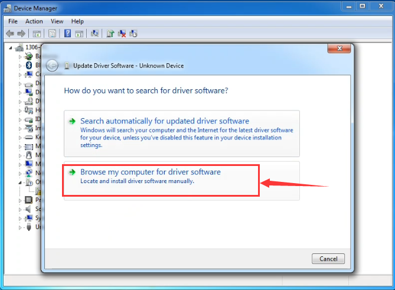

Find the“drivers”file，and tap“Next”.

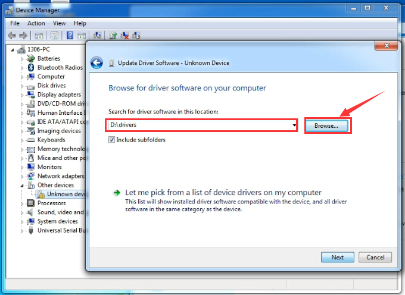

Click“install this driver software anyway”:

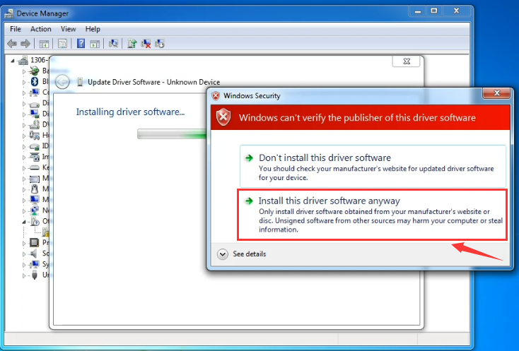

Then click“Close”and check the serial port:

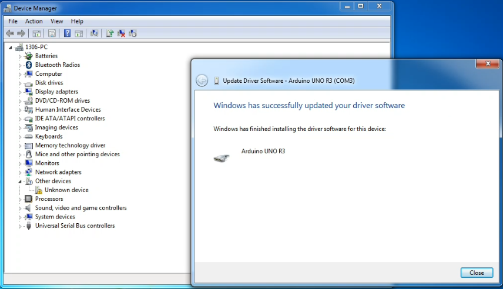

Return to Device Manager page if the driver is installed. Then check correct port :

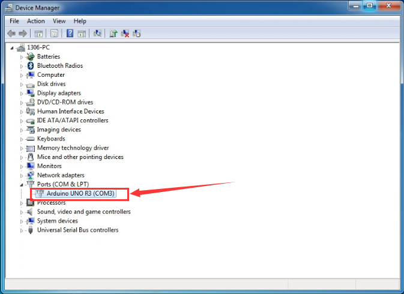

## Arduino IDE Setting


Click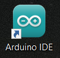icon，open Arduino IDE.

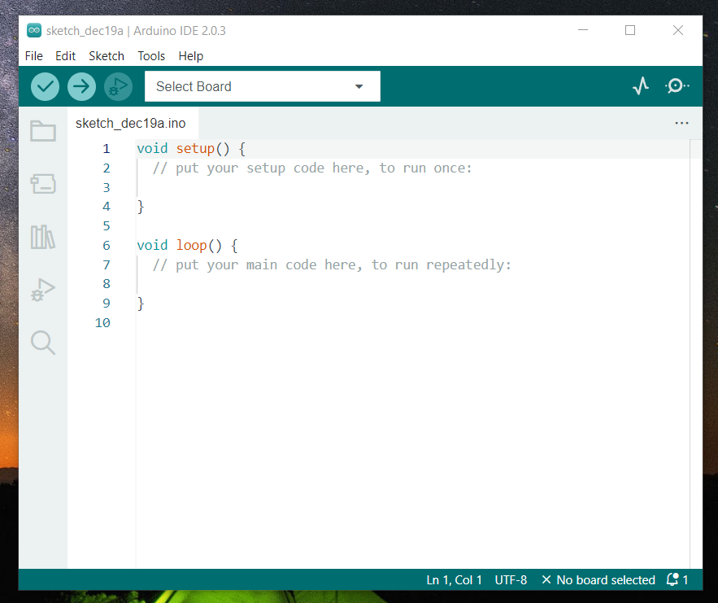

To avoid the errors when uploading the program to the board, you need to select the correct Arduino board that matches the board connected to your computer.

Then come back to the Arduino software, you should click Tools→Board, select the board. (as shown below)

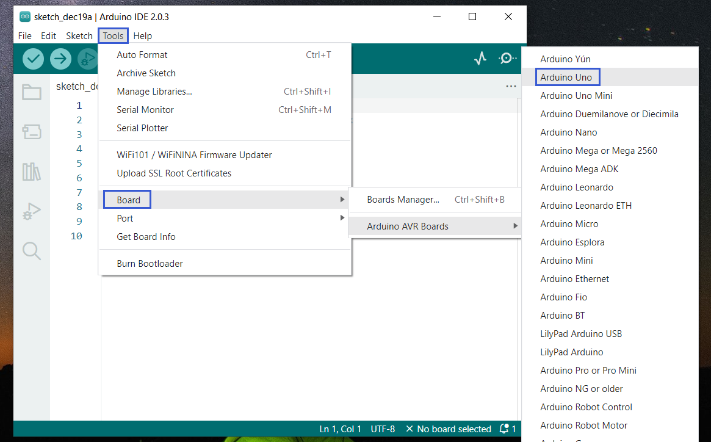

Then select the correct COM port (you can see the corresponding COM port after the driver is successfully installed)

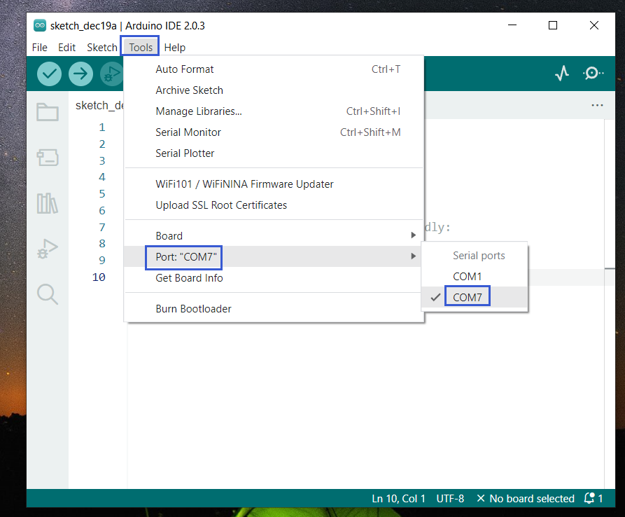

Before uploading the program to the board, let’s demonstrate the function of each symbol in the Arduino IDE toolbar.

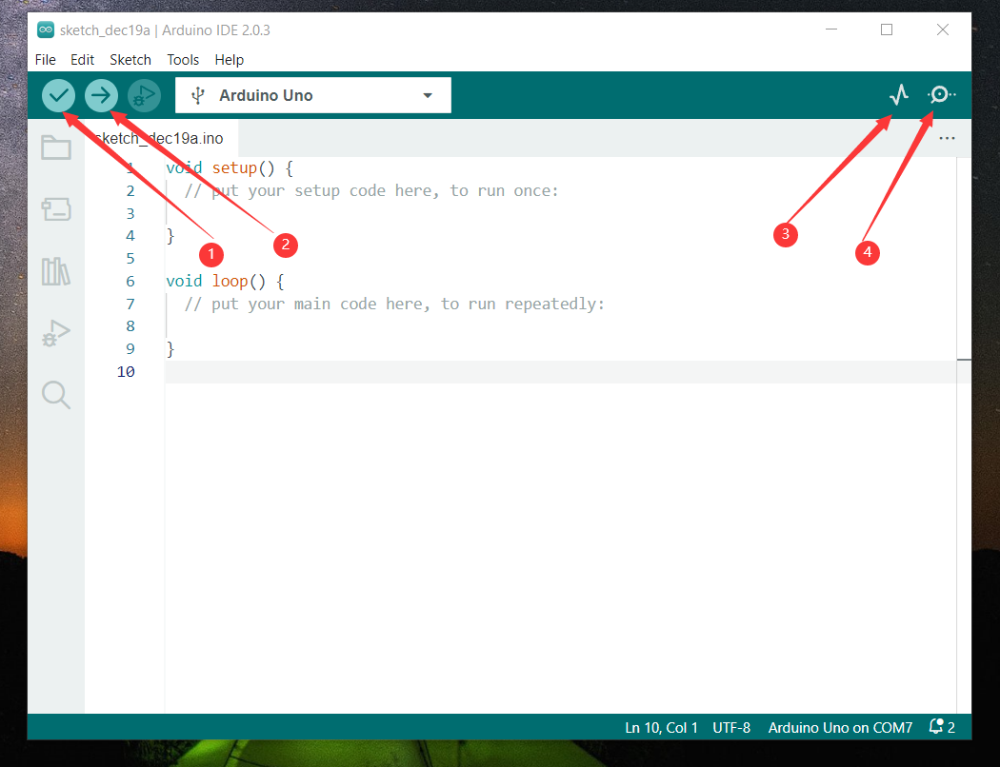

1- Used to verify whether there is any compiling mistakes or not.

2- Used to upload the sketch to your Arduino board.

3- Used to send the serial data received from board to the serial plottle.

4- Used to send the serial data received from board to the serial monitor.

## Start First Program

Open the file to select Example, choose BLINK from BASIC, as shown below:

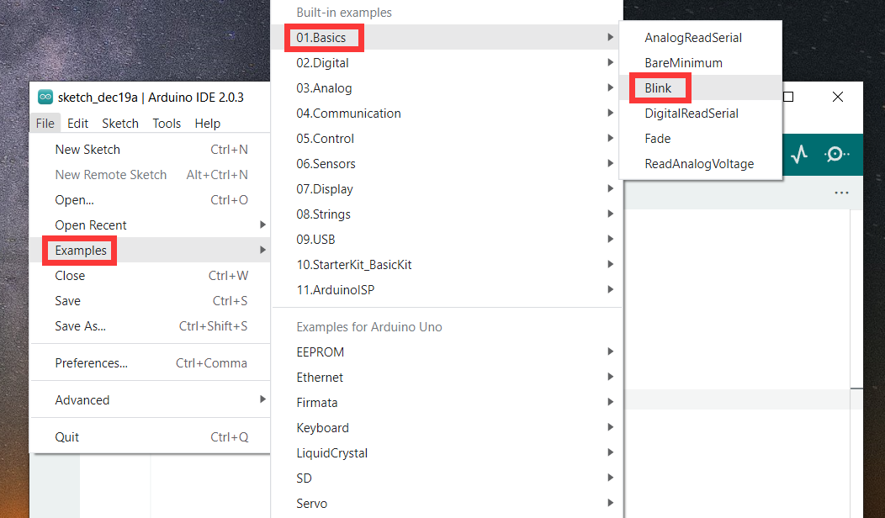 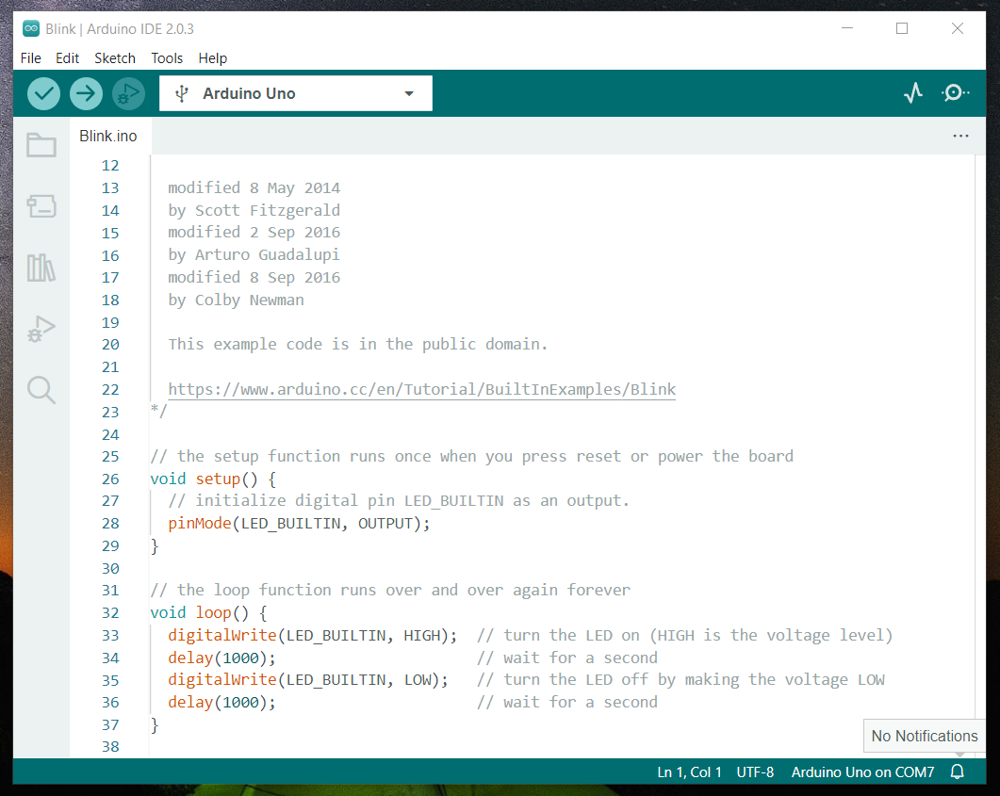

Set board and COM port, the corresponding board and COM port are shown on the lower right of IDE.


Clickto start compiling the program, check errors.


Clickto upload the program, upload successfully.


Upload the program successfully, the onboard LED lights on for 1s, lights off for 1s. Congratulation, you have finished the first program.

# 6. How to Add Libraries?

**What are Libraries ?**

[Libraries](https://www.arduino.cc/en/Reference/Libraries) are a collection of code that makes it easy for you to drive a sensor,display, module, etc.

For example, the built-in LiquidCrystal library helps talk to LCD displays. There are hundreds of additional libraries available on the Internet for download.

The built-in libraries and some of these additional libraries are listed in the reference.

<https://www.arduino.cc/en/Reference/Libraries>

**Add ZIP Libraries**

When you want to add a zip library, you need to download it as a ZIP file, put in the proper directory. The Libraries needed to run the mini tank can be found on：<https://fs.keyestudio.com/KS0530>


Click Sketch---->Include Library—>Add.ZIP Library，then Then navigate to the library file you downloaded and click "open."


Import the library. You can find it in the include library list.


Then, the libraries of home smart are successfully installed.


# 7.Projects

Now with all these preparations done, let’s start our projects.

We will start from those basic projects involved only one single sensor or module and then move to a more intricate one , solar tracking, combining these components together.

Note: (G), marked on each sensor and module, is the negative pole and connected to“G”,“-”or“GND”on the sensor shield or control board ; (V) is the positive pole and interfaced with“V”,“VCC”,“+”or“5V”on the sensor shield or control board.

## Project 1: LED Blinks

（1）Description：


For the starter and enthusiast, this is a fundamental program---LED Blinks.

LED, the abbreviation of light emitting diodes, consist of Ga, As, P, N chemical compound and so on. It is often applied to numbers and text display as an indicator in the circuit.

The LED can flash diverse color by altering the delay time in the test code. When in control, power on GND and VCC, the LED will be on if S end is high level; nevertheless, it will go off.

(2) Parameters:


-   Control interface: digital port

-   Working voltage: DC 3.3-5V

-   Pin spacing: 2.54mm

-   LED display color: yellow

(3) Component Needed：

| Keyestudio UNO*1                               | keyestudio Yellow LED Module*1                      | 20cm 3pin F-F 26AWG DuPont Line*1              |
|-------------------------------------------------|------------------------------------------------------|-------------------------------------------------|
|  |  |  |
| USB Cable*1                                    |                                                      |                                                 |
|  |                                                      |                                                 |

(4) Connection Diagram：


The pin -, + and S of LED module are connected to the pin G, 5V and D3 port of expansion board.

(5)Test Code：
```cpp
/*
  keyestudio sun_follower
  lesson 1.1
  Blink
  http://www.keyestudio.com
*/
#define LED  3 //define the pin of LED as D3

void setup()
{
  pinMode(LED, OUTPUT);// initialize digital pin LED as an output.
}

void loop() // the loop function runs over and over again forever
{
  digitalWrite(LED, HIGH);   // turn the LED on (HIGH is the voltage level
  delay(1000);    // wait for a second
  digitalWrite(LED, LOW);    // turn the LED off by making the voltage LOW
  delay(1000);    // wait for a second
}
```
（6）Test Results：

After uploading the program, the LED blinks with the interval of 1s.

（7）Code Explanations:

pinMode(LED，OUTPUT) - This function can denote that the pin is INPUT or OUTPUT.

digitalWrite(LED，HIGH) -When pin is OUTPUT, we can set it to HIGH(output 5V) or LOW(output 0V).

（8）Extension Practice：

The LED flashes for 1s through the test result. Therefore, delay time can change flash frequency.

（9）Test Code:
```cpp
/*
  keyestudio sun_follower
  lesson 1.2
  Blink
  http://www.keyestudio.com
*/
#define LED 3 //define the pin the LED as D3

void setup()
{
  pinMode(LED, OUTPUT);// initialize digital pin LED as an output.
}
void loop() // the loop function runs over and over again forever
{
  digitalWrite(LED, HIGH);   // turn the LED on (HIGH is the voltage level
  delay(100);    // wait for a second
  digitalWrite(LED, LOW);    // turn the LED off by making the voltage LOW
  delay(100);    // wait for a second
}
```
Upload code and observe the state of the LED .

## Project 2: Adjust LED Brightness

1.Description：

In previous lesson, we control LED on and off and make it blink.

In this project, we will control LED brightness through PWM to simulate breathing effect. Similarly, you can change the step length and delay time in the code so as to demonstrate different breathing effect.

PWM is a means of controlling the analog output via digital means. Digital control is used to generate square waves with different duty cycles (a signal that constantly switches between high and low levels) to control the analog output.In general, the input voltage of port are 0V and 5V. What if the 3V is required? Or what if switch among 1V, 3V and 3.5V? We can’t change resistor
constantly. For this situation, we need to control by PWM.


For the Arduino digital port voltage output, there are only LOW and HIGH, which correspond to the voltage output of 0V and 5V. You can define LOW as 0 and HIGH as 1, and let the Arduino output five hundred 0 or 1 signals within 1 second.

If output five hundred 1, that is 5V; if all of which is 1, that is 0V. If output 010101010101 in this way then the output port is 2.5V, which is like showing movie. The movie we watch are not completely continuous. It actually outputs 25 pictures per second. In this case, the human can’t tell it, neither does PWM. If want different voltage, need to control the ratio of 0 and 1. The more 0,1 signals output per unit time, the more accurately control.

1. Components Needed：

| Keyestudio UNO*1                               | keyestudio Yellow LED Module*1                      | 20cm 3pin F-F 26AWG DuPont Line*1              |
|-------------------------------------------------|------------------------------------------------------|-------------------------------------------------|
|  |  |  |
| USB Cable*1                                    |                                                      |                                                 |
|  |                                                      |                                                 |

3. Connection Diagram：


4.Test Code
```cpp
/*
  keyestudio sun_follower
  lesson 2.1
  PWM
  http://www.keyestudio.com
*/
#define LED 3 //define the pin of the LED as D3
int value;
void setup()
{
  pinMode(LED, OUTPUT);// initialize digital pin LED as an output.
}
void loop () {
  for (value = 0; value < 255; value = value + 1) {
    analogWrite (LED, value); // LED lights gradually light up
    delay (5); // delay 5MS
  }
  for (value = 255; value > 0; value = value - 1) {
    analogWrite (LED, value); // LED gradually goes out
    delay (5); // delay 5MS
  }
}
```
5.Test Results：

Upload test code successfully, LED gradually becomes brighter then darker, like human breath.

6. Code Explanation

When we need to repeat some statements, we could use FOR statement.

FOR statement format is shown below:


FOR cyclic sequence:

Round 1：1 → 2 → 3 → 4

Round 2：2 → 3 → 4

...

Until number 2 is not established, “for”loop is over,

After knowing this order, go back to code:

for (int value = 0; value < 255; value=value+1){

...}

for (int value = 255; value >0; value=value-1){

...}

The two“for”statements make value increase from 0 to 255, then reduce from 255 to 0, then increase to 255,....infinitely loop

There is a new function in the following ----- analogWrite()

We know that digital port only has two state of 0 and 1. So how to send an analog value to a digital value? Here,this function is needed. Let’s observe the Arduino board and find 6 pins marked“\~”which can output PWM signals.

Function format as follows:

analogWrite(pin,value)

analogWrite() is used to write an analog value from 0\~255 for PWM port, so the value is in the range of 0\~255. Attention that you only write the digital pins with PWM function, such as pin 2 , 3，4 , 5，6，7 , 8 , 9，10，11 , 12 , 13 , 44, 45 , 46.

PWM is a technology to obtain analog quantity through digital method. Digital control forms a square wave, and the square wave signal only has two states of turning on and off (that is, high or low levels). By controlling the ratio of the duration of turning on and off, a voltage varying from 0 to 5V can be simulated. The time turning on(academically referred to as high level) is called
pulse width, so PWM is also called pulse width modulation.

Through the following five square waves, let’s acknowledge more about PWM.


In the above figure, the green line represents a period, and value of analogWrite() corresponds to a percentage which is called Duty Cycle as well. Duty cycle implies that high-level duration is divided by low-level duration in a cycle. From top to bottom, the duty cycle of first square wave is 0% and its corresponding value is 0. The LED brightness is lowest, that is, turn off. The
more time high level lasts, the brighter the LED. Therefore, the last duty cycle is 100%, which correspond to 255, LED is brightest. 25% means darker.

PWM mostly is used for adjusting the LED brightness or rotation speed of motor.

It plays vital role in controlling smart robot car. I believe that you can’t wait to enter next project.

6. Extension Practice：

Let’s observe the status of LED if we change the delay value.
```cpp
/*
  keyestudio sun_follower
  lesson 2.2
  PWM
  http://www.keyestudio.com
*/
#define LED 3 //define the pin of the LED as D3
int value;

void setup()
{
  pinMode(LED, OUTPUT);// initialize digital pin LED as an output.
}
void loop () {
  for (value = 0; value < 255; value = value + 1) {
    analogWrite (LED, value); // LED lights gradually light up
    delay (20); // delay 20MS
  }
  for (value = 255; value > 0; value = value - 1) {
    analogWrite (LED, value); // LED gradually goes out
    delay (20); // delay 20MS
  }
}
```
Upload code to development board, the LED’s blink frequency is slower, isn’t it?

## Project 3：Push Button Module

(1)Description

In this project, we intend to use the push button module to control the LED.

(2)Parameters:

-   Working voltage：DC 3.3-5V

-   Control signal：digital signal

-   Size：34*22*15mm

-   Weight：3.8g

(3)Components Needed:

| Keyestudio UNO*1                                                                                                                                               | keyestudio Push Button Module*1                 | keyestudio Yellow LED Module*1                      |
|-----------------------------------------------------------------------------------------------------------------------------------------------------------------|--------------------------------------------------|------------------------------------------------------|
|                                                                                                                  |  |  |
| 20cm 3pin F-F 26AWG DuPont Line*2                                                                                                                              | USB Cable*1                                     |                                                      |
|  |   |                                                      |

(4)Connection Diagram

Please note that the pins G,V and S on the push button module should be connected with G, V and D2 on the development board respectively while the pins G,V and S on the LED module should be linked with G,V and D3 on the development board respectively.


(5)Test Code：read the signal of the push button module

```cpp
/*
  keyestudio sun_follower
  lesson 3.1
  button
  http://www.keyestudio.com
*/
#define button 2 //define the pin of the push button module as D2
volatile int buttonState;  //the state of the level output by the push button module

void setup()
{
  Serial.begin(9600);//set baud rate to 9600
  pinMode(button, INPUT);// initialize digital pin button as an input.
}
void loop () {
  buttonState = digitalRead(button);
  Serial.println(buttonState);  //Automatically wrap and output the digital signal read from digital port 2
  delay(100);//delay in 100ms
}

```
(6)Test Results:

After uploading test code, powering the module up and open the serial monitor to set the baud rate to 9600, the value 1 (high level) output by the push button module is shown on the serial monitor and when the button is pushed, it changes
to 0 (low level).


(7)Code Explanation:

Serial.begin(9600)-initialize the serial communication and set the baud rate to 9600

pinMode(pin, INPUT)-use the function pinMode() to tell Arduino whether it is an output pin or an input pin

digitalRead(pin)-read the digital level of pins,be HIGHT OT LOW

(8)Extension Project：control the LED by the push button module


```cpp
/*
  keyestudio sun_follower
  lesson 3.2
  button
  http://www.keyestudio.com
*/
#define LED 3 //define the LED pin as D3
#define button 2 //define the pin of the push button module as D2
volatile int buttonState;  //the state of the level output by the push

void setup()
{
  Serial.begin(9600); //set baud rate to 960
  pinMode(button, INPUT); // initialize digital pin button as an input.
  pinMode(LED, OUTPUT); // initialize digital pin LED as an output.
}

void loop ()
{
  buttonState = digitalRead(button);    //read the state of the push button module
  if (buttonState == 0) //if the button is pressed
  {
    digitalWrite(LED, HIGH);  //the LED lights up
  }
  else
  {
    digitalWrite(LED, LOW);   //the LED is off
  }
  delay(100); //delay in 100ms
}
```
Conclusion : when the button is pressed, the LED lights up; otherwise, it remains off.

## Project 4: Passive Buzzer

(1)Description

There are prolific interactive works completed by Arduino. The most common one is sound and light display. We always use LED to make experiments. For this lesson, we design circuit to emit sound. The universal sound components are buzzer and horns. Buzzer is easier to use. And buzzer includes about active buzzer and passive buzzer. In this experiment, we adopt passive buzzer.

While using passive buzzer, we can control different sound by inputting square waves with distinct frequency. During the experiment, we control code to make buzzer sound, begin with “tick, tick” sound, then make passive buzzer emit “do re mi fa so la si do”, and play specific songs.

(2)Parameters:

-   Control interface: digital port

-   Working voltage: DC 3.3-5V

(3)Components Needed

| Keyestudio UNO*1                               | Keyestudio Passive Buzzer*1                     | 200mm 26AWG 3P F-F DuPont Line                                                                                                                                  |
|-------------------------------------------------|--------------------------------------------------|-----------------------------------------------------------------------------------------------------------------------------------------------------------------|
|  |  |  |
| USB Cable*1                                    |                                                  |                                                                                                                                                                 |
|  |                                                  |                                                                                                                                                                 |

(4)Connection Diagram：

The G, V and S pins of passive buzzer are connected to G, V and D6.


(5)Test Code

```cpp
/*
  keyestudio sun_follower
  lesson 4.1
  buzzer
  http://www.keyestudio.com
*/
#define buzzer 6 //buzzer pin to D6

void setup() {
  pinMode(buzzer, OUTPUT);//set the digital pin 6 as output
}

void loop () {
  tone(buzzer, 262);  //output the sound with frequency of 262Hz
  delay(250);   //delay in 250ms
  tone(buzzer, 294);;   //output the sound with frequency of 294Hz
  delay(250);   //delay in 250ms
  tone(buzzer, 330);
  delay(250);
  tone(buzzer, 349);
  delay(250);
  tone(buzzer, 392);
  delay(250);
  tone(buzzer, 440);
  delay(250);
  tone(buzzer, 494);
  delay(250);
  tone(buzzer, 532);
  delay(250);
  noTone(buzzer);   //stop sound output
  delay(1000);
}
```
(6)Test Results:

Upload code to Keyestudio development board, power amplifier module will emit“do re mi fa so la si do”.

(7)Extension Practice：play music

```cpp
/*
  keyestudio sun_follower
  lesson 4.2
  buzzer
  http://www.keyestudio.com
*/

#define buzzer 6 //buzzer pin to D6

void setup() {
  pinMode(buzzer, OUTPUT);//set digital 6 to OUTPUT
}

void loop () {
  birthday();
}

////////////////////////Set the song Happy Birthday to You//////////////////////////////////
void birthday()
{
  tone(buzzer, 294); //buzzer outputs a sound with 294Hz
  delay(250);//delay in 250ms
  tone(buzzer, 440);
  delay(250);
  tone(buzzer, 392);
  delay(250);
  tone(buzzer, 532);
  delay(250);
  tone(buzzer, 494);
  delay(500);
  tone(buzzer, 392);
  delay(250);
  tone(buzzer, 440);
  delay(250);
  tone(buzzer, 392);
  delay(250);
  tone(buzzer, 587);
  delay(250);
  tone(buzzer, 532);
  delay(500);
  tone(buzzer, 392);
  delay(250);
  tone(buzzer, 784);
  delay(250);
  tone(buzzer, 659);
  delay(250);
  tone(buzzer, 532);
  delay(250);
  tone(buzzer, 494);
  delay(250);
  tone(buzzer, 440);
  delay(250);
  tone(buzzer, 698);
  delay(375);
  tone(buzzer, 659);
  delay(250);
  tone(buzzer, 532);
  delay(250);
  tone(buzzer, 587);
  delay(250);
  tone(buzzer, 532);
  delay(500);
}
```
## Project 5: 1602 LCD Display Module

Description：


With I2C communication module, this is a display module that can show 2 lines with 16 characters per line.

It shows blue background and white word and connects to I2C interface of MCU, which highly save the MCU resources.

On the back of LCD display, there is a blue potentiometer for adjusting the backlight. The communication address defaults to 0x27.

The original 1602 LCD can start and run with 11 IO ports, but ours is built with ARDUINOIIC/I2C interface, saving 9 IO ports. Alternatively, the module comes with 4 positioning holes with a diameter of 3mm, which is convenient for you to fix on other devices.

(2)Parameters：

-   I2C address: 0x27

-   Backlight (blue, white)

-   Power supply voltage: 5V

-   Adjustable contrast

-   GND: A pin that connects to ground

-   VCC: A pin that connects to a +5V power supply

-   SDA: A pin that connects to analog port 20 for IIC communication

-   SCL: A pin that connects to analog port 21 for IIC communication

(3)Components Needed:

| Keyestudio UNO*1                               | Keyestudio I2C1602 Display*1                             | 20cm 4P-1P F-F DuPon Line                                                        |
|-------------------------------------------------|-----------------------------------------------------------|----------------------------------------------------------------------------------|
|  |  |  |
| USB Cable*1                                    |                                                           |                                                                                  |
|  |                                                           |                                                                                  |

(4)Connection Diagram

Note：the pin GND, VCC, SDA and SCL of 1602LCD module are connected to GND(-), 5V(+), SDA and SCL of IIC communication


(5)Test Code

```cpp
/*
  keyestudio sun_follower
  lesson 5.1
  I2C 1602
  http://www.keyestudio.com
*/
#include <Wire.h>
#include <LiquidCrystal_I2C.h> // includes the LiquidCrystal_I2C Library 
LiquidCrystal_I2C lcd(0x27, 16, 2); // set the LCD address to 0x27 for a 16 chars and 2 line display

void setup() {
  lcd.init();
  // Print a message to the LCD.
  lcd.backlight();  //set backlight
  lcd.setCursor(0, 0); //set Cursor at(0,0)
  lcd.print("Hello, World!"); //display"Hello, World!"
  lcd.setCursor(0, 1); //set Cursor at(0,1)
  lcd.print("Hello, Keyes!"); //show"Hello, Keyes!"
}

void loop () {

}
```

(6)Test Results:

Upload code, wire up according to connection diagram and power on. 1602 LCD will display“Hello World！”at the first row and show“Hello Keyes！”at the second row.

Note: wire up connection diagram, upload code and power on. You can adjust the potentiometer on the back of 1602LCD display module to display the character strings.

Note: The working voltage of the LCD Display is 5V, please make sure the 3.3-5V Switch on the control board is dial to 5V.


## Project 6: Ambient Light Sensor

(1)Description

There are four identical modules in this kit, the ambient light sensors, with photoresistor as main component.

The resistance of a photoresistor varies with the light intensity. When there is light around, its resistance ranges in 5-10KΩ; while when it is dark, the resistance is only 0.2MΩ. Based on this property, a circuit can be built to convert the change in resistance to changes in voltage.

What’s more, the sensor comes with an anti-reverse insertion terminal with a pitch of 2.54mm to facilitate the wiring. It is also compatible with many kinds of microcontrollers, such the Arduino microcontroller series.

Here, we apply this sensor with the Arduino microcontroller. The S (signal) end of the sensor should be input to the analog pin of Arduino to detect the variation in analog value which will be printed on the serial monitor. And please notice that there are two positioning holes with a diameter of 4.9mm built on the sensor to help fix it.

(2)Parameters:

-   Working voltage：3.3V-5V（DC）

-   Interface：3PIN

-   Output signal：analog signal

-   Weight：2.3g

(3)Components Needed:

| Keyestudio UNO*1                               | keyestudio Photoresistor Module*1               | keyestudio Yellow LED Module*1                      |
|-------------------------------------------------|--------------------------------------------------|------------------------------------------------------|
|  |  |  |
| 15cm 3pin F-F 26AWG DuPont Line*2              | USB Cable*1                                     |                                                      |
|  |   |                                                      |

(4)Connection Diagram:

Please note that the pins G,V and S on the push button module should be connected with G, V and A0 on the expansion board respectively while the pins G,V and S on the LED module should be linked with G,V and 3 respectively.


(5)Test Code:

```cpp
/*
  keyestudio sun_follower
  lesson 6.1
  photovaristor
  http://www.keyestudio.com
*/
#define photos  A0   //photoresistance pin to A0
#define LED 3   //define the LED pin as D3
volatile int value = 0;
void setup() {
  Serial.begin(9600);
  pinMode(LED, OUTPUT);// initialize digital pin LED as an output.
}

void loop () {
  value = analogRead(photos);  //read the value detected by the sensor
  Serial.println(value);
  if (value < 300) {  //when the analog value is less than 300
    digitalWrite(LED, HIGH); //the LED lights up
  }
  else {  //when the analog value is bigger than 300
    digitalWrite(LED, LOW); //the LED is off
  }
  delay(100);               //delay in 100ms
}

```
(6)Test Results:

After wiring up according to the connection diagram, uploading the test code, powering it up and setting the baud rate to 9600, the serial monitor prints the value detected by the ambient light sensor. And when we block the sensor from light, the valued printed gets smaller. When the value sensed is less than 300, the LED lights up; otherwise, it remains off.


## Project 7: DHT11 Temperature and Humidity Sensor


(1)Description:

This DHT11 temperature and humidity sensor is a composite sensor which contains a calibrated digital signal output of the temperature and humidity.

DHT11 temperature and humidity sensor uses the acquisition technology of the digital module and temperature and humidity sensing technology, ensuring high reliability and excellent long-term stability.

It includes a resistive element and a NTC temperature measuring device.

(2)Parameters：

-   Working voltage: +5 V

-   Working temperature: 0-50 ℃ error of ± 2 ℃

-   Humidity: 20-90% RH ± 5% RH error

-   Interface: digital port

(3)Components needed:

| Keyestudio UNO*1                               | keyestudio DHT11 Sensor*1                       | 20cm 3pin DuPont Line *1                                                                                                                                       |
|-------------------------------------------------|--------------------------------------------------|-----------------------------------------------------------------------------------------------------------------------------------------------------------------|
|  |  |  |
| USB Cable*1                                    |                                                  |                                                                                                                                                                 |
|  |                                                  |                                                                                                                                                                 |

(4)Connection Diagram


Please note that when we conduct this experiment we need to import the library file of XHT11 first.

(5)Test Code:

```cpp
/*
  keyestudio sun_follower
  lesson 7.1
  DHT11
  http://www.keyestudio.com
*/
#include <dht11.h>  //include the library code:
dht11 DHT;
#define DHT11_PIN 7 //define the DHT11 as the digital port 7

void setup() {
  Serial.begin(9600);
}
void loop() {
  int chk;
  chk = DHT.read(DHT11_PIN);    //read data
  switch (chk) {
    case DHTLIB_OK:
      break;
    case DHTLIB_ERROR_CHECKSUM: //check and return errors
      break;
    case DHTLIB_ERROR_TIMEOUT: //timeout and return errors
      break;
    default:
      break;
  }
  // DISPLAT DATA
  Serial.print("humidity:");
  Serial.print(DHT.humidity);
  Serial.print("   temperature:");
  Serial.println(DHT.temperature);
  delay(200);
}
```

(6)Test Results:

After uploading test code, powering it up via USB cable and open the serial monitor to set the baud rate to 9600, the serial monitor displays the value of the current humidity and temperature as shown below:


## Project 8: BH1750 Digital Light Intensity Module

(1)Description:

 

The main component of this sensor is chip BH1750FVI which is an integrated chip for digital light intensity.

As shown in the picture below, BH1750 is composed of a photodiode, an operational amplifier, an ADC acquisition, a crystal oscillator, etc. The photodiode converts the input optical signal into an electrical signal through the photovoltaic effect. After being amplified by the operational amplifier circuit, the voltage is collected by the ADC, and then converted into a 16-bit
binary number through the logic circuit and stored in the internal register(Note: The stronger the light, the greater the photocurrent, and the greater the voltage, so the intensity of the light can be judged by the value of the voltage. 

However, it should be noted that the voltage and the light intensity are one-to-one correspondence, but not proportional. That is why this chip linear processing is done and why the integrated IC is used directly instead of photodiodes). BH1750 leads out the clock line and data line. The single-chip microcomputer can communicate with the BH1750 module through the I2C protocol.
You can choose the working mode of the BH1750, or you can extract the illuminance data of the BH1750 register.

(2)Parameters:

-   I2C digital interface, supporting a maximum rate of 400Kbps

-   The output is Illuminance

-   Measuring range is 1\~65535 lux, the minimum resolution is 1lux

-   Low power consumption (Power down) function

-   Shield the interference of light changes caused by 50/60Hz mains frequency 

-   Supports two I2C addresses, selected by the ADDR pin

-   Small measurement deviation(maximum accuracy error +/-20%)

-   GND power ground

-   SDA I2C bus data pin

-   SCL I2C bus clock pin

-   VCC power supply voltage 3-5V

(3)Components Needed:

| Keyestudio UNO*1                               | Keyestudio BH1750FVI Digital Light Intensity Module*1 | 350mm 4pin F-F 26AWG DuPont Line*1             |
|-------------------------------------------------|--------------------------------------------------------|-------------------------------------------------|
|  |        |  |
| USB Cable*1                                    |                                                        |                                                 |
|  |                                                        |                                                 |

(4)Connection Diagram:


(5)Test Code:

```cpp
/*
  keyestudio sun_follower
  lesson 8
  BH1750
  http://www.keyestudio.com
*/
#include <Wire.h>
#include <BH1750.h>
BH1750 lightMeter;

void setup() {
  Serial.begin(9600);

  // Initialize the I2C bus (BH1750 library doesn't do this automatically)
  Wire.begin();
  // On esp8266 you can select SCL and SDA pins using Wire.begin(D4, D3);
  // For Wemos / Lolin D1 Mini Pro and the Ambient Light shield use Wire.begin(D2, D1);
  lightMeter.begin();
  Serial.println(F("BH1750 Test begin"));

}

void loop() {
  float lux = lightMeter.readLightLevel();
  Serial.print("Light: ");
  Serial.print(lux);
  Serial.println(" lx");
  delay(1000);

}
```
(6)Test Results:

After uploading test code, powering the module up via the USB cable and open the serial monitor to set the baud rate to 9600, the serial monitor prints the value of the ambient light intensity(unit:lux). And when light source gets closer, the value becomes bigger as shown below:

(Note: since the I2C bus can have multiple devices with different addresses, when the digital light intensity module is used together with the I2C LCD1602 module, there is no conflict because they have different addresses.)


## Project 9: Servo


(1)Description：

Servo motor is a position control rotary actuator. It mainly consists of housing, circuit board, core-less motor, gear and position sensor. Its working principle is that the servo receives the signal sent by MCU or receiver, and produces a reference signal with a period of 20ms and width of 1.5ms, then compares the acquired DC bias voltage to the voltage of the potentiometer and
obtains the voltage difference output.


For the servo used in this project, the brown wire is the ground, the red one is the positive wire, and the orange one is the signal wire.

The rotation angle of servo motor is controlled by regulating the duty cycle of PWM (Pulse-Width Modulation) signal. The standard cycle of PWM signal is 20ms(50Hz). Theoretically, the width is distributed between 1ms-2ms, but in fact,it's between 0.5ms-2.5ms. The width corresponds to the rotation angle from 0° to 180°. But note that for different brand motor, the same signal may have different rotation angle.


More details:


(2)Parameters:

-   Working voltage: DC 4.8V \~ 6V

-   Operating angle range: about 180 ° (at 500 → 2500 μsec)

-   Pulse width range: 500 → 2500 μsec

-   No-load speed: 0.12 ± 0.01 sec / 60 (DC 4.8V) 0.1 ± 0.01 sec / 60 (DC 6V)

-   No-load current: 200 ± 20mA (DC 4.8V) 220 ± 20mA (DC 6V)

-   Stopping torque: 1.3 ± 0.01kg · cm (DC 4.8V) 1.5 ± 0.1kg · cm (DC 6V)

-   Stop current: ≦ 850mA (DC 4.8V) ≦ 1000mA (DC 6V)

-   Standby current: 3 ± 1mA (DC 4.8V) 4 ± 1mA (DC 6V)

-   Lead length: 250 ± 5 mm

-   Appearance size: 22.9 * 12.2 * 30mm

-   Weight: 9 ± 1 g (without servo horn)

(3)Components Needed:

| Keyestudio UNO*1                               | Servo*1                                               | USB Cable*1                                    |
|-------------------------------------------------|--------------------------------------------------------|-------------------------------------------------|
|  |  |  |

(4)Connection Diagram

Note: The servo is connected to G (GND), V (VCC), 9. The brown wire of the servo is connected to Gnd (G), the red wire is linked with 5v (V), and the orange wire is connected to digital pin 9.

When connecting the steering gear, an external power supply must be used. Because the current requirement for driving the steering gear is relatively large, and the current of the development board is far from enough. If the external power supply is not connected, the development board is likely to be burned out.


(5)Test Code1:

```cpp
/*
  keyestudio sun_follower
  lesson 9.1
  servo
  http://www.keyestudio.com
*/
int servoPin = 9; //set the pin of the servo

void setup() {
  pinMode(servoPin, OUTPUT);//set the pin of the servo
}
void loop() {
  servopulse(servoPin, 0);//rotate to 0 degree
  delay(1000);//delay in 1s
  servopulse(servoPin, 90);//rotate to 90 degrees
  delay(1000);
  servopulse(servoPin, 180);//rotate to 180 degrees
  delay(1000);
}

void servopulse(int pin, int myangle) { //the function of pluse
  int pulsewidth = map(myangle, 0, 180, 500, 2500); //Map angle to pulse width
  for (int i = 0; i < 10; i++) { //output pulse
    digitalWrite(pin, HIGH);//set the servo interface level to high
    delayMicroseconds(pulsewidth);//the delay time of pulse width
    digitalWrite(pin, LOW);//turn the servo interface level to low
    delay(20 - pulsewidth / 1000);
  }
}
```
After uploading the test code, the servo rotate at 0°,90° and 180° alternatively.

There is an easier way to control the servo that is use the servo library file of Arduino. The following link is for your reference:

<https://www.arduino.cc/en/Reference/Servo>

Test Code2:

Library file is used but the connection diagram remains the same.

```cpp
/*
  keyestudio sun_follower
  lesson 9.2
  servo
  http://www.keyestudio.com
*/
#include <Servo.h>  //include the library code:
Servo myservo;

void setup() {
  myservo.attach(9);  //link the servo to digital port 9

}

void loop () {
  //rotate from 0 degree to 180 degrees
  for (int i = 0; i < 180; i++) {
    myservo.write(i);
    delay(20);
  }
  delay(1000);  //wait for 1s

  //rotate from 180 degree to 0 degree
  for (int i = 180; i > 0; i--) {
    myservo.write(i);
    delay(20);
  }
  delay(1000);  //wait for 1s
}
```

(6)Test Results:

After uploading the test code and powering it up, the servo rotates from 0 degree to 180 degrees.

Please note that we usually use library file to control servo.

(7)Code Explanation:

#include <Servo.h> is the Servo function and sentences that come with Arduino. The following are several commonly used sentences of the servo function:

1.Attach ( pin )--set the pin of the servo

2.write(angle)--it is used to set the rotation angle of the steering gear. The range of angle is 0° to 180°

3.read（）--it is used to read the angle of the steering gear and can be understood as reading the value in the last write() command

4.attached（）--Determine whether the servo parameters have been sent to the interface where the servo is connected

Note: The writing format of the above sentences is "Servo variable name. Specific sentence ()" For example: myservo.attach(9).

## Project 10: Lithium Power Module 

(1)Description:

This module integrates a charging and discharging chip, which can be interfaced with an external rechargeable battery through the PH2.0MM interface. In the experiment,we use a single lithium battery.

It has a Micro USB port and a charging port for solar panels, which can supply power for an external lithium battery.

In addition, this module has a boost module which can increase the voltage of batteries to 6.6V. The DIP switch on the module is the OUTPUT switch of 6.6V. The pin G and V can output 6.6V and the pin S can read the battery voltage after the resistance 1/2 voltage.

The mobile phone charging module is a lithium battery boost module of 3.7V which can output 5V, 1A through the PH2.0 terminal and USB port.


Lithium Power Module Powering Smart Phone Charging Module by Solar Energy or Via USB Cable

(2)Parameters:

Lithium Power Module Powering by Solar Energy or Via USB Cable

| Charging Port                             | Micro USB, HP2.0MM port for solar panels |
|-------------------------------------------|------------------------------------------|
| Input Voltage of ports of the solar panel | 4.4-6V                                   |
| constant-voltage charging                 | 4.15-4.24V                               |
| Max Charging Current                      | 800mA                                    |
| Output Port                               | 3 P 2.54mm Pins                          |
| Input Voltage                             | 6.6V                                     |
| Max Output Current                        | 1A                                       |
| Batteries                                 | Single-cell Lithium Battery              |
| Environmental Attribute                   | ROHS                                     |

Smart Phone Charging Module

| Property              | non-isolated boost module (BOOST)                                                                  |
|-----------------------|----------------------------------------------------------------------------------------------------|
| Input voltage         | 1-5V                                                                                               |
| Output voltage        | 5士0.1V                                                                                            |
| Output current:       | Rated 1-1.5A (single cell lithium battery input), maximum 1.5A (single cell lithium battery input) |
| Conversion efficiency | Up to 96% .                                                                                        |
| Switching frequency   | 500KHz .                                                                                           |
| Working temperature   | industrial grade (-40°C to +85°C )                                                                 |
| Full load heating     | 30°C                                                                                               |
| Quiescent current     | 130uA                                                                                              |

(3)Schematic Diagram of Lithium Power Module Powering by Solar Energy or Via USB Cable


(4)Features：

Lithium Power Module Powering by Solar Energy or Via USB Cable


SOLAR4.8-6.0V, the input port of power, is connected to polar panels.

The solar energy is converted into electric energy via solar panels.


BAT, the output port of power, is interfaced with the lithium battery holder(rechargeable batteries) and saves the electric energy into batteries.


This is the switch. Slide to ON end, then the external lithium battery will be connected, supplying to the expansion board; on the contrary, slide to OFF, then the current of lithium battery will be disconnected.


You can charge the lithium battery via USB cable.

Smart phone charging Module


Place a lithium cell in the PH2.0 terminal.

Connect the USB port and the smart phone via a USB cable to charge.

## **Assemble the Solar Tracking** 


<iframe width="560" height="315" src="https://www.youtube.com/embed/PmtsjYsefT4" title="YouTube video player" frameborder="0" allow="accelerometer; autoplay; clipboard-write; encrypted-media; gyroscope; picture-in-picture" allowfullscreen></iframe>

**(Peel the sticker off the Acrylic boards first)**

**Part 1** Components Needed   
Installation Diagram   
Prototype   
**Part 2**  
Components Needed   
Installation Diagram   
Prototype   
**Part 3** Components Needed   
Installation Diagram   
Prototype   
**Part 4**  
Components Needed   
Installation Diagram   
Prototype   
**Part 5**  
Components Needed   
Installation Diagram (mind the installation direction)  Prototype   
**Part 6**  
Components Needed   
Installation Diagram  Prototype   
**Part 7**  
Components Needed   
Installation Diagram (mind the installation direction) \|   
Prototype   
**Part 8**  
Components Needed   
Installation Diagram   
Prototype 

**Part 9**  
Components Needed   
Installation Diagram (mind the installation direction of the servo)   
Prototype   
**Part 10**  
Components Needed   
Installation Diagram 

Prototype   
**Part 11** (adjust the angle of the servo before starting this step)

Components Needed (adjust the angle of the servo marked in red circle)


Test Code：

~~~~~~~~~~~~~~~~~~~~~~~~~~~~~~~~~~~~~~~~~~~~~~~~~~~~~~~~~~~~~~~~~~~~~~~~~~~~~~~~
    #include <Servo.h>
    Servo ud_servo;//define the name of the servo rotating right and left
    int ud_angle = 10;//set the initial angle to 10 degree;keep the solar panels upright to detect the strongest light
    const byte ud_servopin = 10;//define the servo rotating upwards and downwards and its control pin

    void setup() {
    ud_servo.attach(ud_servopin);  // set the control pin of the servo
    ud_servo.write(ud_angle);
    delay(1000);
    }

    void loop() {}
~~~~~~~~~~~~~~~~~~~~~~~~~~~~~~~~~~~~~~~~~~~~~~~~~~~~~~~~~~~~~~~~~~~~~~~~~~~~~~~~

Installation Diagram (pay attention to the angle of the servo as shown in the picture)

  
Prototype   
**Part 12**  
Components Needed   
Installation Diagram   
Prototype   
**Part 13**  
Components Needed   
Installation Diagram   
Prototype   
**Part 14** (adjust the angle of the servo before starting this step)   Components Needed (adjust the angle of the servo marked in red circle)


Test code：

~~~~~~~~~~~~~~~~~~~~~~~~~~~~~~~~~~~~~~~~~~~~~~~~~~~~~~~~~~~~~~~~~~~~~~~~~~~~~~~~
    #include <Servo.h>
    Servo lr_servo;//define the name of the servo rotating right and left
    int lr_angle = 90;//set the initial angle to 90 degreeset the initial angle to 90 degree
    const byte lr_servopin = 9;//define the name of the servo rotating upwards and downwards and its control pin

    void setup() {
    lr_servo.attach(lr_servopin);  // set the control pin of the servo
    lr_servo.write(lr_angle);//return to initial angle
    delay(1000);
    }

    void loop() {}
~~~~~~~~~~~~~~~~~~~~~~~~~~~~~~~~~~~~~~~~~~~~~~~~~~~~~~~~~~~~~~~~~~~~~~~~~~~~~~~~

Installation Diagram   
Prototype   
**Part 15**  
Components Needed   
Installation Diagram   
Prototype 

**Part 16**

Components Needed 
Installation Diagram 
Prototype 

**Part 17**

Components Needed   
Installation Diagram   
Prototype   
**Part 18**

Components Needed   
Installation Diagram 
Prototype   
**Part 19**  
Components Needed   
Installation Diagram  Prototype   
**Start Wiring**  
The battery holder aims to power the smart phone charging module
 

Plug the jack of the battery holder to the BAT end of the power module.


Connect the servo downward to D9 on the main board.
 

Connect the servo upward to D10 on the main board
 

Connect the solar panel to the SOLAR end

Connect the LCD module to A4 and A5, blue line to A4 and green line to A5


Note: The working voltage of the LCD Display is 5V, please make sure the 3.3-5V Switch on the control board is dial to 5V


Connect the push button module to D2.

Connect the passive buzzer to D6.

Connect the temperature and humidity sensor to D7.

Connect the digital light intensity module to the main board, blue line to SDA and green line to SCL.

Keep the LED display in front of you as reference , the photoresistor on the left is connected to A0.


Keep the LED display in front of you as reference, the photoresistor on the right is connected to A1.


Keep the LED display in front of you as reference, the photoresistor on the back is connected to A2.


Keep the LED display in front of you as reference, the photoresistor ahead is  connected to A3.


Wire up the power module to power the main board, G to GND and V to VIN.


## Project 11： Solar Panel Device with Multiply Functions

(1)Description:

In previous projects, we just focused on a single function of a certain sensor or module. Can we combine them together and make a device which is able to display various functions? The answer is positive. And in this lesson, we will write a set of test code to make the solar tracking device perform all functions illustrated before.

The wiring is almost the same but no need to attach the LED module to it.

(2)Flow Chart:


(3)Connection

In this experiment, the connection is almost the same. But we will connect two servos to D9 and D10, 4 photoresistor modules to A0,A1,A3 and A3 and others remain unchanged.

(4)Test Code：

```cpp
/*
  keyestudio sun_follower
  lesson 11
  sun_follower
  http://www.keyestudio.com
*/
#include <Wire.h>
#include <LiquidCrystal_I2C.h>
LiquidCrystal_I2C lcd(0x27, 16, 2);

#include <BH1750.h>
BH1750 lightMeter;

#include <dht11.h>    //include the library code:
dht11 DHT;
#define DHT11_PIN 7  //define the DHT11 as the digital pin 7

#include <Servo.h>
Servo lr_servo;//define the name of the servo rotating right and left
Servo ud_servo;//efine the name of the servo rotating upwards and downwards

const byte interruptPin = 2;  //the pin of button;the corruption is disrupted

int lr_angle = 90;//set the initial angle to 90 degree
int ud_angle = 10;//set the initial angle to 10 degree;keep the solar panels upright to detect the strongest light
int l_state = A0;//define the analog voltage input of the photoresistors
int r_state = A1;
int u_state = A2;
int d_state = A3;
const byte buzzer = 6;  //set the pin of the buzzer to digital pin 6
const byte lr_servopin = 9;//define the control signal pin of the servo rotating right and lef
const byte ud_servopin = 10;//define the control signal pin of the servo rotating clockwise and anticlockwise 

unsigned int light; //save the variable of light intensity
byte error = 15;//Define the error range to prevent vibration
byte m_speed = 10;//set delay time to adjust the speed of servo;the longer the time, the smaller the speed
byte resolution = 1;   //set the rotation accuracy of the servo, the minimum rotation angle 
int temperature;  //save the variable of temperature
int humidity; //save the variable of humidity

void setup() {
  Serial.begin(9600); //define the serial baud rate
  // Initialize the I2C bus (BH1750 library doesn't do this automatically)
  Wire.begin();
  lightMeter.begin();

  lr_servo.attach(lr_servopin);  // set the control pin of servo
  ud_servo.attach(ud_servopin);  // set the control pin of servo
  pinMode(l_state, INPUT); //set the mode of pin
  pinMode(r_state, INPUT);
  pinMode(u_state, INPUT);
  pinMode(d_state, INPUT);

  pinMode(interruptPin, INPUT_PULLUP);  //the button pin is set to input pull-up mode
  attachInterrupt(digitalPinToInterrupt(interruptPin), adjust_resolution, FALLING); //xternal interrupt touch type is falling edge; adjust_resolution is interrupt service function ISR

  lcd.init();          // initialize the LCD
  lcd.backlight();     //set LCD backlight

  lr_servo.write(lr_angle);//return to initial angle
  delay(1000);
  ud_servo.write(ud_angle);
  delay(1000);

}

void loop() {
  ServoAction();  //servo performs the action
  read_light();   //read the light intensity of bh1750
  read_dht11();   //read the value of temperature and humidity
  LcdShowValue(); //Lcd shows the values of light intensity, temperature and humidity

  //erial monitor displays the resistance of the photoresistor and the angle of servo
  /*Serial.print(" L ");
  Serial.print(L);
  Serial.print(" R ");
  Serial.print(R);
  Serial.print("  U ");
  Serial.print(U);
  Serial.print(" D ");
  Serial.print(D);
  Serial.print("  ud_angle ");
  Serial.print(ud_angle);
  Serial.print("  lr_angle ");
  Serial.println(lr_angle);*/
  //  delay(1000);//During the test, the serial port data is received too fast, and it can be adjusted by adding delay time */
}

/**********the function of the servo************/
void ServoAction(){
  int L = analogRead(l_state);//read the analog voltage value of the sensor, 0-1023
  int R = analogRead(r_state);
  int U = analogRead(u_state);
  int D = analogRead(d_state);
  /**********************system adjusting left and right序**********************/
  //  abs() is the absolute value function
  if (abs(L - R) > error && L > R) { //Determine whether the error is within the acceptable range, otherwise adjust the steering gear
    lr_angle -= resolution;//reduce the angle
    //    lr_servo.attach(lr_servopin);  // connect servo
    if (lr_angle < 0) { //limit the rotation angle of the servo
      lr_angle = 0;
    }
    lr_servo.write(lr_angle);  //output the angle of the servooutput the angle of servo
    delay(m_speed);

  }
  else if (abs(L - R) > error && L < R) { //Determine whether the error is within the acceptable range, otherwise adjust the steering gear
    lr_angle += resolution;//increase the angle
    //    lr_servo.attach(lr_servopin);    // connect servo
    if (lr_angle > 180) { //limit the rotation angle of servo
      lr_angle = 180;
    }
    lr_servo.write(lr_angle);  //output the angle of servo
    delay(m_speed);

  }
  else if (abs(L - R) <= error) { //Determine whether the error is within the acceptable range, otherwise adjust the steering gear
    //    lr_servo.detach();  //release the pin of servo
    lr_servo.write(lr_angle); //output the angle of servo
  }
  /**********************system adjusting up and down**********************/
  if (abs(U - D) > error && U >= D) { //Determine whether the error is within the acceptable range, otherwise adjust the steering gear
    ud_angle -= resolution;//reduce the angle
    //    ud_servo.attach(ud_servopin);  // connect servo
    if (ud_angle < 10) { //limit the rotation angle of servo
      ud_angle = 10;
    }
    ud_servo.write(ud_angle);  //output the angle of servo
    delay(m_speed);

  }
  else if (abs(U - D) > error && U < D) { //Determine whether the error is within the acceptable range, otherwise adjust the steering gear
    ud_angle += resolution;//increase the angle
    //    ud_servo.attach(ud_servopin);  // connect servo
    if (ud_angle > 90) { //limit the rotation angle of servo
      ud_angle = 90;
    }
    ud_servo.write(ud_angle);  //output the angle of servo
    delay(m_speed);

  }
  else if (abs(U - D) <= error) { //Determine whether the error is within the acceptable range. If it is, keep it stable and make no change in angle
    //    ud_servo.detach();  //release the pin of servo
    ud_servo.write(ud_angle);  //output the angle of servo
  }
}

void LcdShowValue() {
  char str1[5];
  char str2[2];
  char str3[2];
  dtostrf(light, -5, 0, str1); //Format the light value data as a string, left-aligned
  dtostrf(temperature, -2, 0, str2);
  dtostrf(humidity, -2, 0, str3);
  //LCD1602 display
  //display the value of the light intensity
  lcd.setCursor(0, 0);
  lcd.print("Light:");
  lcd.setCursor(6, 0);
  lcd.print(str1);
  lcd.setCursor(11, 0);
  lcd.print("lux");
  
  //display the value of temperature and humidity
  lcd.setCursor(0, 1);
  lcd.print(temperature);
  lcd.setCursor(2, 1);
  lcd.print("C");
  lcd.setCursor(5, 1);
  lcd.print(humidity);
  lcd.setCursor(7, 1);
  lcd.print("%");

  //show the accuracy of rotation
  lcd.setCursor(11, 1);
  lcd.print("res:");
  lcd.setCursor(15, 1);
  lcd.print(resolution);
  /*if (light < 10) {
    lcd.setCursor(7, 0);
    lcd.print("        ");
    lcd.setCursor(6, 0);
    lcd.print(light);
    } else if (light < 100) {
    lcd.setCursor(8, 0);
    lcd.print("       ");
    lcd.setCursor(6, 0);
    lcd.print(light);
    } else if (light < 1000) {
    lcd.setCursor(9, 0);
    lcd.print("      ");
    lcd.setCursor(6, 0);
    lcd.print(light);
    } else if (light < 10000) {
    lcd.setCursor(9, 0);
    lcd.print("      ");
    lcd.setCursor(6, 0);
    lcd.print(light);
    } else if (light < 100000) {
    lcd.setCursor(10, 0);
    lcd.print("     ");
    lcd.setCursor(6, 0);
    lcd.print(light);
    }*/
}

void read_light(){
  light = lightMeter.readLightLevel();  //read the light intensity detected by BH1750
}

void read_dht11(){
  int chk;
  chk = DHT.read(DHT11_PIN);      // read data
  switch (chk) {
    case DHTLIB_OK:
      break;
    case DHTLIB_ERROR_CHECKSUM:   //check and return error
      break;
    case DHTLIB_ERROR_TIMEOUT:    //Timeout and return error
      break;
    default:
      break;
  }
  temperature = DHT.temperature;
  humidity = DHT.humidity;
}

/*********function disrupts service**************/
void adjust_resolution() {
  tone(buzzer, 800, 100);
  delay(10);  //delay to eliminate vibration
  if (!digitalRead(interruptPin)){
    if(resolution < 5){
      resolution++;
    }else{
      resolution = 1;
    }
  }
}
```
(5)Test Results:

After uploading the test code and powering it up, the servos rotate to the initial angle. And when the ambient light sensor detects changes in light intensity, servos rotate to the position where the light is the strongest and LCD1602 shows the value of the light intensity and temperature and humidity detected by the BH1750 and XHT11 respectively.

We could push the button on the servo to adjust the accuracy of the angle to make it rotate faster. And 1 means 1 degree per push and 5 represents 5 degrees per push. And it can also be altered by changing the variable m_speed in the code.

# 8. Trouble Shooting

Q1.Solar tracking device doesn’t respond.

~~~~~~~~~~~~~~~~~~~~~~~~~~~~~~~~~~~~~~~~~~~~~~~~~~~~~~~~~~~~~~~~~~~~~~~~~~~~~~~~
A: Ensure the battery capacity fully charged.

A: Check if the wiring-up is correct.
~~~~~~~~~~~~~~~~~~~~~~~~~~~~~~~~~~~~~~~~~~~~~~~~~~~~~~~~~~~~~~~~~~~~~~~~~~~~~~~~

Q2.USB port can’t recognized by computer.

~~~~~~~~~~~~~~~~~~~~~~~~~~~~~~~~~~~~~~~~~~~~~~~~~~~~~~~~~~~~~~~~~~~~~~~~~~~~~~~~
A: Confirm that you’ve installed the driver.

A: Check if USB cable is good.
~~~~~~~~~~~~~~~~~~~~~~~~~~~~~~~~~~~~~~~~~~~~~~~~~~~~~~~~~~~~~~~~~~~~~~~~~~~~~~~~

Q3.The servo doesn’t rotate.

~~~~~~~~~~~~~~~~~~~~~~~~~~~~~~~~~~~~~~~~~~~~~~~~~~~~~~~~~~~~~~~~~~~~~~~~~~~~~~~~
A: Ensure the battery capacity fully charged or confirm whether the power
button has been pressed.

A: Check the setting of the angle. If it is struck, please cut off the power
immediately in case to damage it.
~~~~~~~~~~~~~~~~~~~~~~~~~~~~~~~~~~~~~~~~~~~~~~~~~~~~~~~~~~~~~~~~~~~~~~~~~~~~~~~~
