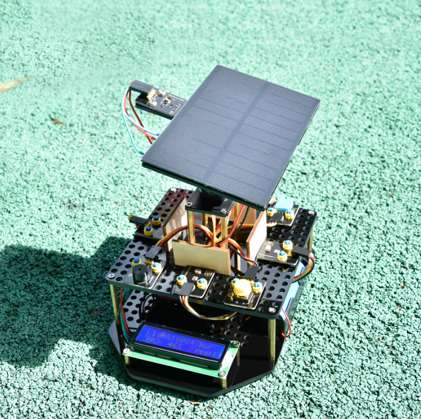

# Read Me First

Here's what you need to run the solar tracking kit:

1)Libraries

2)Code

3)Manual.pdf

4)Troubleshooting.pdf

The above files can be downloaded from here:

[https://fs.keyestudio.com/KS053](https://fs.keyestudio.com/KS0555)0

5)A 18650 Batteries and a charger(you need to prepare yourself)

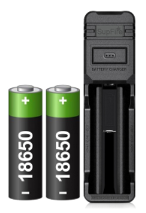

The following parameters are available for your purchase：

| Specifications      |                 |
|---------------------|-----------------|
| Size                | 18650           |
| Positive Terminal： | With a top      |
| Capacity            | \>2200mAh       |
| Nominal Voltage     | 3.6V            |
| Maximum Voltage     | 4.2V            |
| Rechargeable        | Yes             |
| Approx. Dimensions  | 18.5mm x 65.2mm |
| Weight              | approx. 45g     |

Support

KEYESTUDIO provides free and quick technical support, including but not limited to:

1)Quality problems of product

2)Problems encountered while using the product

3)Comments and suggestions

4)Your projects and ideas

If you find a technical or confusing error in a document or file, we would be grateful if you could report it to us.

Please send email to:

Amazon: service@keyestudio.com

AliExpress: tivon@keyestudio.com

Other channels: sunny@keyestudio.com

#  1.What's in the package?

| No. | Picture                                         | Component                                              | Quantity |
|-----|-------------------------------------------------|--------------------------------------------------------|----------|
| 1   | 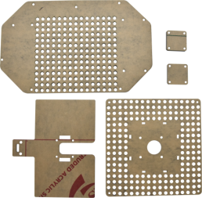 | Acrylic Board                                          | 1        |
| 2   | 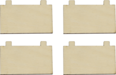 | Wooden Board 3mm\* 4                                   | 1        |
| 3   | 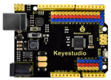 | Keyestudio UNO Board                                   | 1        |
| 4   | 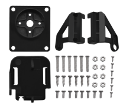 | Servo Mount Kit                                        | 1        |
| 5   | 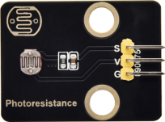 | Photoresistor Module                                   | 4        |
| 6   | 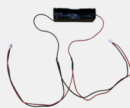 | Battery Holder（18650 battery not included）           | 1        |
| 7   | 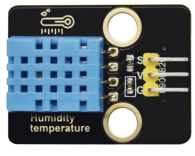 | Temperature and Humidity Sensor                        | 1        |
| 8   | 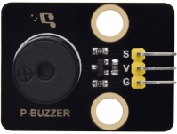 | Passive Buzzer Module                                  | 1        |
| 9   | 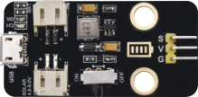 | Solar USB Charging Module                              | 1        |
| 10  | 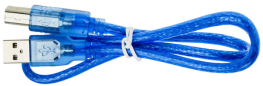 | USB Cable                                              | 1        |
| 11  | 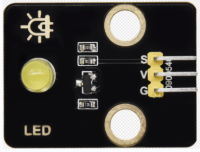 | Yellow LED Module                                      | 1        |
| 12  | 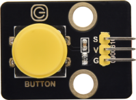 | Single-channel Push Button Module                      | 1        |
| 13  | 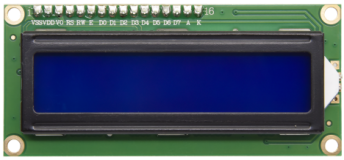 | I2C1602 Module                                         | 1        |
| 14  |  | BH1750FVI Digital Light Intensity Module IIC Interface | 1        |
| 15  | 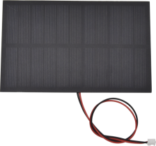 | Solar Panel with Tape And Wire                         | 1        |
| 16  |  | 2.0\*40MM Screwdriver                                  | 1        |
| 17  |  | 3.0\*40MM Screwdriver                                  | 1        |
| 18  | 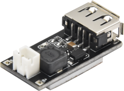 | Smart Phone Charging Module                            | 1        |
| 19  | 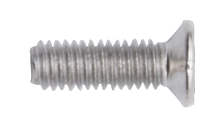 | M3\*8MM Flat Head Screw                                | 29       |
| 20  | 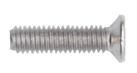 | M3\*14MM Flat Head Screw                               | 4        |
| 21  | 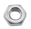 | M3 Nickle-plated Nut                                   | 6        |
| 22  |  | M4 Nickle-plated Nut                                   | 2        |
| 23  | 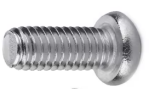 | M4\*8MM Round Head Screw                               | 2        |
| 24  | 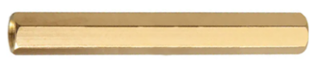 | M3\*45MM Double Pass Copper Pillar                     | 8        |
| 25  | 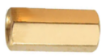 | M3\*10MM Double Pass Copper Pillar                     | 7        |
| 26  | 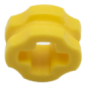 | Building Block 4265c                                   | 18       |
| 27  |  | Building Block 43093                                   | 18       |
| 28  | 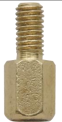 | M3\*6+6MM Single Pass Copper Pillar                    | 4        |
| 29  | 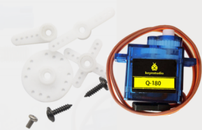 | Servo                                                  | 2        |
| 30  | 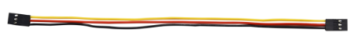 | 3P 26AWG 200mm F-F DuPont Wire                         | 7        |
| 31  | 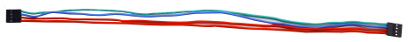 | 4P F-F 26AWG 350mm DuPont Wire                         | 1        |
| 32  | 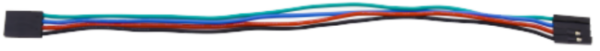 | 4P 26AWG 200mm DuPont Wire                             | 1        |
| 33  | 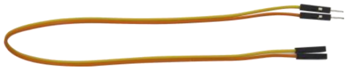 | 20cm M to F DuPont Wire                                | 1        |
| 34  | 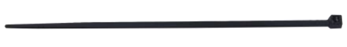 | Plastic String                                         | 4        |
| 35  | 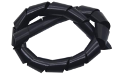 | Plastic Pip                                            | 1        |

# 2.Getting Started with Arduino

**2.1 What is Arduino?**

Arduino is an open-source electronics platform based on easy-to-use hardware and software. Arduino boards are able to read inputs - light on a sensor, a finger on a button, or a Twitter message - and turn it into an output - activating a motor, turning on an LED, publishing something online. You can tell your board what to do by writing the program code in the IDE and sending the instructions to the microcontroller on the board. To do so you use the Arduino programming language (based on Wiring), and the Arduino Software (IDE), based on Processing.

**2.2 Installing the Arduino IDE for Windows**

1.  Visit <https://www.arduino.cc/en/software> to download the latest Arduino IDE version for your computer’s operating system. There are versions for Windows, Mac, and Linux systems.

**The Arduino IDE 2**

The Arduino IDE 2 is a big step from its sturdy predecessor, Arduino IDE 1.x, and comes with revamped UI, improved board & library manager, debugger, autocomplete feature and much more.

Here we will show how to download and install the Arduino IDE 2.2.1 on your Windows

You can choose between the Installer (.exe) and the Zip packages. We suggest you use the first one that installs directly everything you need to use the Arduino Software (IDE), including the drivers. With the Zip package you need to install the drivers manually. The Zip file is also useful if you want to create a [portable installation](https://arduino.cc/en/Guide/PortableIDE).

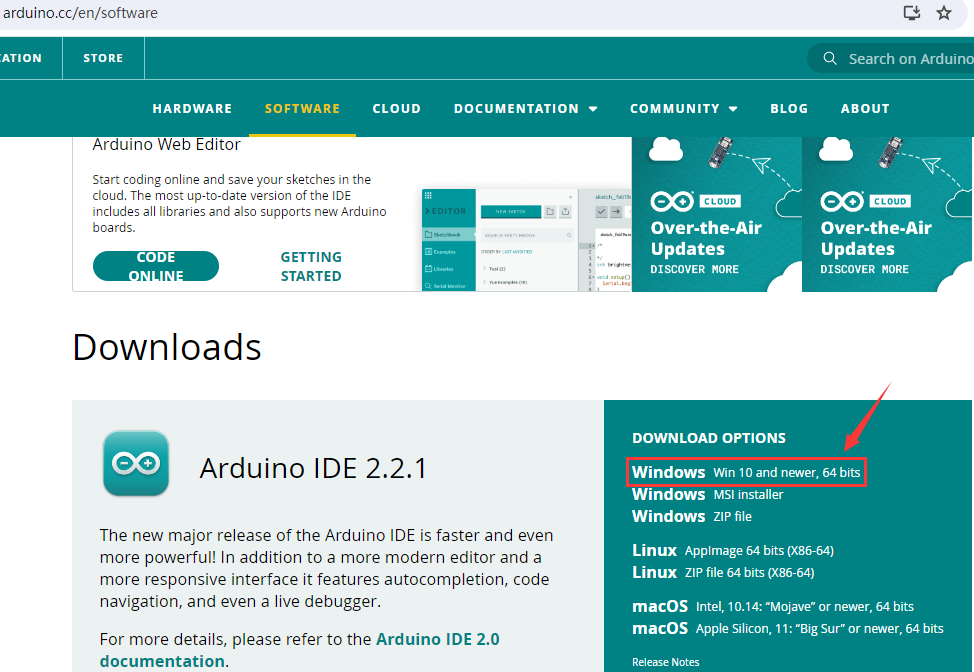

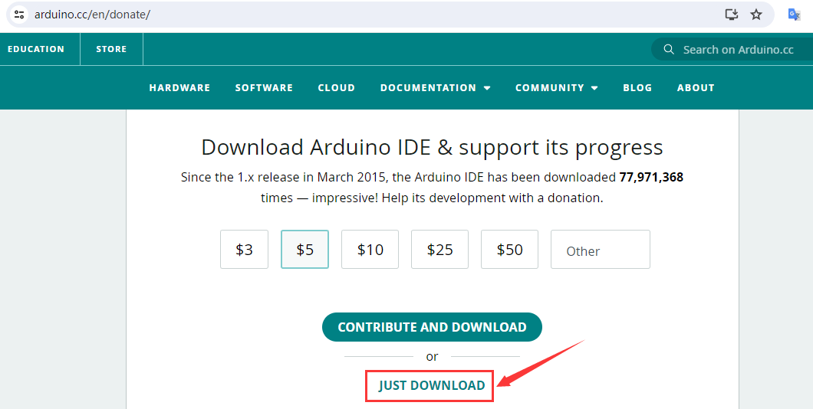

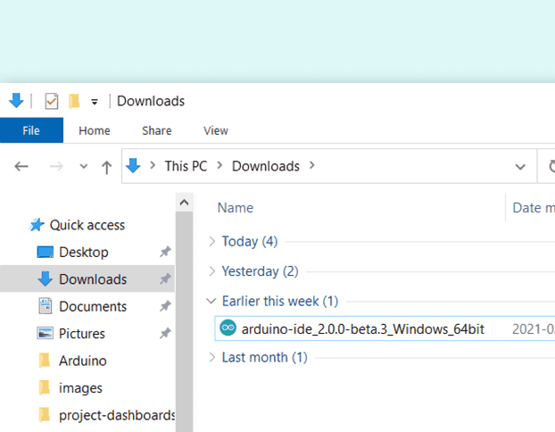

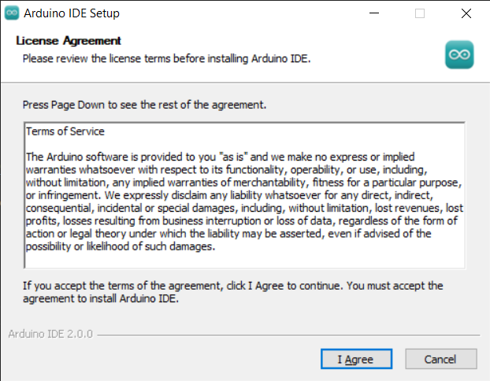

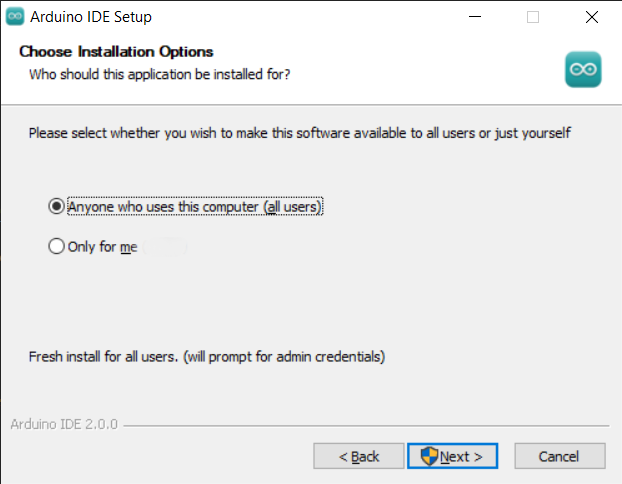

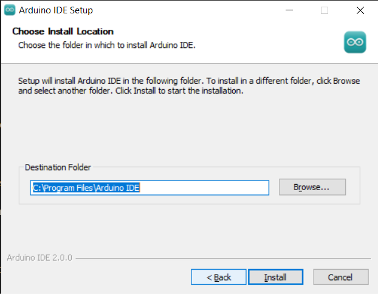

1.  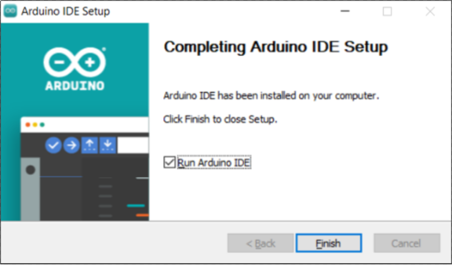Click finish and

run Arduino IDE

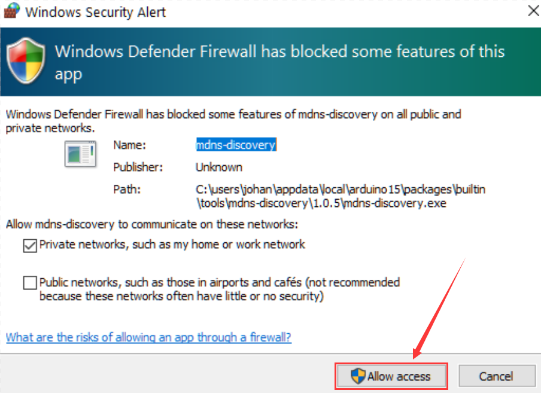

10.Firewall will ask

whether we'd like to

give allow access,just

simply click on **Allow**

**access**.

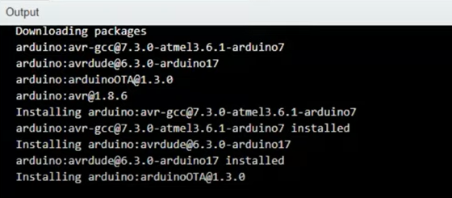

Arduino IDE 2.0

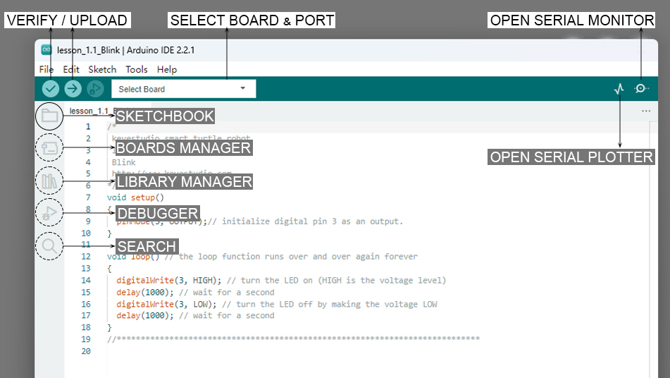

**Verify / Upload** - compile and upload your code to your Arduino Board.

**Select Board & Port** - detected Arduino boards automatically show up here, along with the port number.

**Sketchbook** - here you will find all of your sketches locally stored on your computer. Additionally, you can sync with the Arduino Cloud, and also obtain your sketches from the online environment.

**Boards Manager** - browse through Arduino & third party packages that can be installed. For example, using a MKR WiFi 1010 board requires the Arduino SAMD Boards package installed.

**Library Manager** - browse through thousands of Arduino libraries, made by Arduino & its community.

**Debugger** - test and debug programs in real time.

**Search** - search for keywords in your code.

**Open Serial Monitor** - opens the Serial Monitor tool, as a new tab in the console.

If you want to learn more about Arduino IDE, please refer to this document：[Getting Started with Arduino IDE 2](https://docs.arduino.cc/software/ide-v2/tutorials/getting-started-ide-v2)

2.3 Introduce of Keyestudio UNO Board

The core processor of this board is ATMEGA328P-AU and ATMEGA16U2 is used as a UART-to-USB conversion chip.

It has 14 digital input/output pins (of which 6 can be used as PWM outputs), 6 analog inputs, a 16 MHz crystal oscillator, a USB connection, a power jack, 1 ICSP header, and a reset button.

All you need to do is connect it to a computer via a USB cable and power it with an external power supply of DC 7-12V.

| **Microcontroller**         | **ATMEGA328P-AU**                                        |
|-----------------------------|----------------------------------------------------------|
| Operating Voltage           | 5V                                                       |
| Input Voltage (recommended) | DC 7-12V                                                 |
| Digital I/O Pins            | 14 (D0-D13)                                              |
| PWM Digital I/O Pins        | 6 (D3，D5，D6，D9，D10，D11)                             |
| Analog Input Pins           | 6 (A0-A5)                                                |
| Flash Memory                | 32 KB (ATMEGA328P-PU) of which 0.5 KB used by bootloader |
| SRAM                        | 2 KB (ATMEGA328P-PU)                                     |
| EEPROM                      | 1 KB (ATMEGA328P-PU)                                     |
| Clock Speed                 | 16 MHz                                                   |

| **Interface number** | **Introduce**                                                                                                                                                                                                                                                                                                                                                                                                                                                       |
|----------------------|---------------------------------------------------------------------------------------------------------------------------------------------------------------------------------------------------------------------------------------------------------------------------------------------------------------------------------------------------------------------------------------------------------------------------------------------------------------------|
| 1                    | **ICSP (In-Circuit Serial Programming) Header ICSP**  It is the AVR, an Arduino micro-program header consisting of MOSI, MISO, SCK, RESET, VCC, and GND. It is often called the SPI (serial peripheral interface) and can be considered an "extension" of the output. In fact, slave the output devices under the SPI bus host. When connecting to PC, program the firmware to ATMEGA328P-AU.                                                                       |
| 2                    | **Serial Communication Pin**  Connect to serial communication. 4Pins (GND, VCC (3.3V or 5V controlled by slide switch), RX, TX)                                                                                                                                                                                                                                                                                                                                     |
| 3                    | **GND**  Ground pins                                                                                                                                                                                                                                                                                                                                                                                                                                                |
| 4                    | **V Pin (VCC)**  Power the external sensors and modules. Select the voltage of 3.3V or 5V via a slide switch.                                                                                                                                                                                                                                                                                                                                                       |
| 5                    | **Digital I/O**  It has 14 digital input/output pins, labeled D0 to D13 (of which 6 can be used as PWM outputs). These pins can be configured as digital input pin to read the logic value (0 or 1). Or used as digital output pin to drive different modules like LED, relay, etc. The pin D3, D5, D6, D9, D10, and D11 can be used to generate PWM. For digital port, you can connect through female headers, or through pin headers (labeled S) of 2.54mm pitch. |
| 6                    | **AREF**  For Analog reference. Sometimes used to set an external reference voltage (0-5V) as the upper limit of analog input pins.                                                                                                                                                                                                                                                                                                                                 |
| 7                    | **SDA**  IIC communication pin                                                                                                                                                                                                                                                                                                                                                                                                                                      |
| 8                    | **SCL**  IIC communication pin                                                                                                                                                                                                                                                                                                                                                                                                                                      |
| 9                    | **ICSP (In-Circuit Serial Programming) Header**  ICSP is an AVR, an Arduino micro-program header consisting of MOSI, MISO, SCK, RESET, VCC, and GND. Connected to ATMEGA 16U2-MU. When connecting to PC, program the firmware to ATMEGA 16U2-MU.                                                                                                                                                                                                                    |
| 10                   | **Microcontroller** Each control board has its own microcontroller. You can regard it as the brain of your board. Microcontrollers are usually from ATMEL. Before you load a new program on the Arduino IDE, you must know what IC is on your board. This information can be checked at the top of IC. The microcontroller used in this board is ATMEGA328P-AU.                                                                                                     |
| 11                   | **D13 LED**  There is a built-in LED driven by digital pin 13. When the pin is HIGH value, the LED is on, when the pin is LOW, it's off.                                                                                                                                                                                                                                                                                                                            |
| 12                   | **TX LED**  Onboard you can find the label: TX (transmit) When the board communicates via serial port, send the message, TX led flashes.                                                                                                                                                                                                                                                                                                                            |
| 13                   | **RX LED**  Onboard you can find the label: RX(receive ) When the board communicates via serial port, receive the message, RX led flashes.                                                                                                                                                                                                                                                                                                                          |
| 14                   | **Power LED**  LED on means that your circuit board is correctly powered on. Otherwise LED is off.                                                                                                                                                                                                                                                                                                                                                                  |
| 15                   | **USB Connection**  You can power the board via USB connection. Or can upload the program to the board via USB port. Connect the board to PC using a USB cable via USB port.                                                                                                                                                                                                                                                                                        |
| 16                   | **ATMEGA 16U2-MU**  USB to serial chip, can convert the USB signal into serial port signal.                                                                                                                                                                                                                                                                                                                                                                         |
| 17                   | **Power Switch**  You can slide the switch to control the voltage of pin V (VCC), 3.3V or 5V.                                                                                                                                                                                                                                                                                                                                                                       |
| 18                   | **Voltage Regulator**  To control the voltage provided to the board, as well as to stabilize the DC voltage used by the processor and other components. Convert an external input DC7-12V voltage into DC 5V, then switch DC 5V to the processor and other components, output DC 5V, drive current is 2A.                                                                                                                                                           |
| 19                   | **DC Power Jack**  The board can be supplied with an external power DC7-12V from the DC power jack.                                                                                                                                                                                                                                                                                                                                                                 |
| 20                   | **IOREF**  Used to configure the operating voltage of microcontroller. Use it less.                                                                                                                                                                                                                                                                                                                                                                                 |
| 21                   | **RESET Header**  Connect an external button to reset the board. The function is the same as reset button.                                                                                                                                                                                                                                                                                                                                                          |
| 22                   | **Pin 3.3V** Output Provides 3.3V voltage output                                                                                                                                                                                                                                                                                                                                                                                                                    |
| 23                   | **Pin 5V**  Output Provides 5V voltage output                                                                                                                                                                                                                                                                                                                                                                                                                       |
| 24                   | **Vin**  You can supply an external voltage input DC7-12V through this pin to the board.                                                                                                                                                                                                                                                                                                                                                                            |
| 25                   | **Analog Pins**  The board has 6 analog inputs, labeled A0 through A5. Can also used as digital pins, A0=D14, A1=D15, A2=D16, A3=D17, A4=D18, A5=D19. For analog port, you can connect through female headers, or through pin headers (labeled S) of 2.54mm pitch.                                                                                                                                                                                                  |
| 26                   | **IIC Communication Pin**  Connect to the IIC communication. 4Pins (GND, VCC (3.3V or 5V controlled by slide switch), SDA, SCL)                                                                                                                                                                                                                                                                                                                                     |
| 27                   | **RESET Button**  You can reset your board to start the program from the initial status.                                                                                                                                                                                                                                                                                                                                                                            |

2.4 Select Board and Port in Arduino IDE

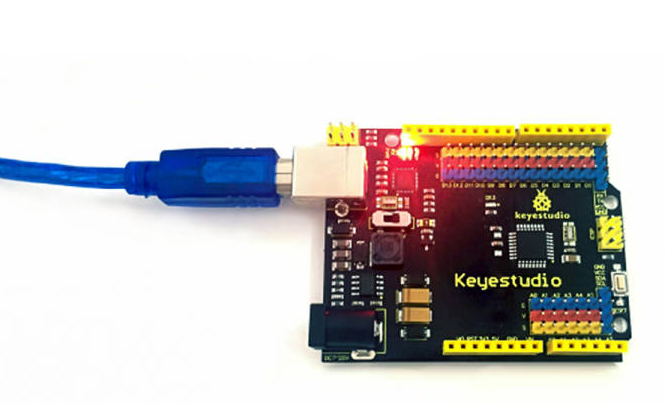

Before uploading code to the connected control board, we need to select board and port in Arduino IDE.

Two methods are introduced below:

1\. Using the Board and Port selector of the Tool drop-down list

2\. Using the board selector

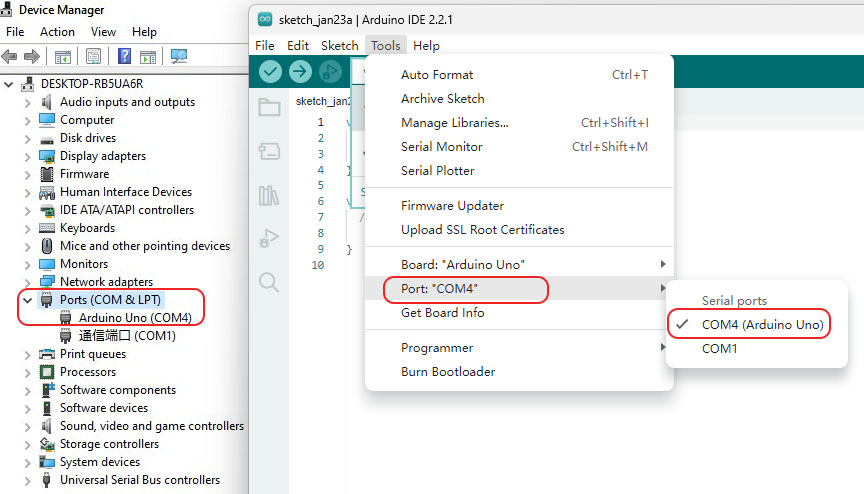

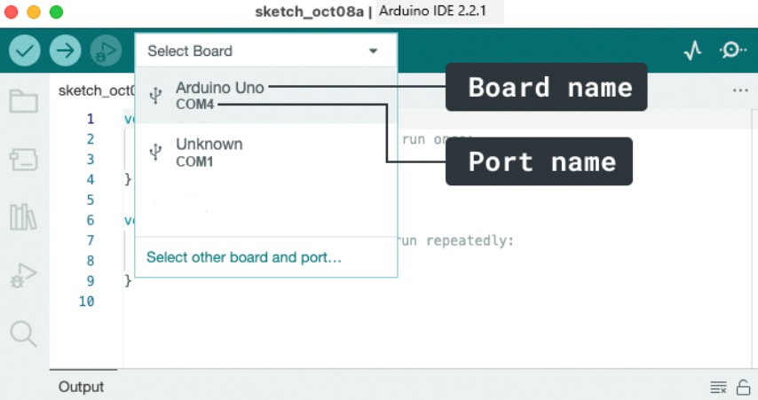

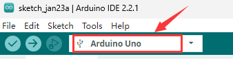

2.5 Add Libraries to Arduino IDE

**Why Use Libraries?**

Libraries are incredibly useful when creating a project of any type. They make our development experience much smoother, and there almost an infinite amount out there. They are used to interface with many different sensors, RTCs, Wi-Fi modules, RGB matrices and of course with other components on your board.

**Including a Library in the sketch**

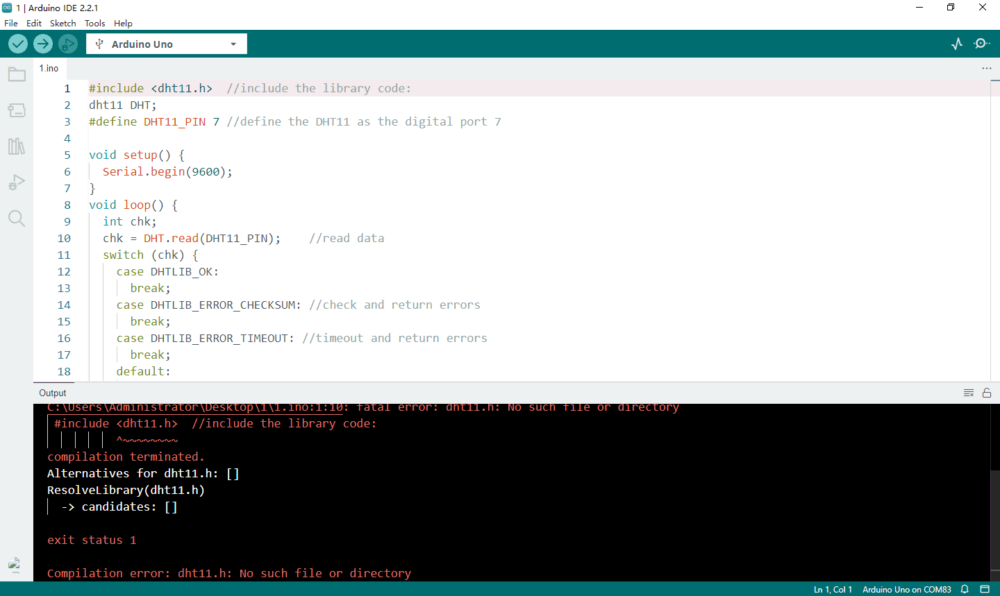

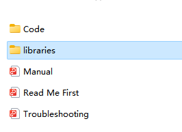

**Two ways to add libraries to Arduino IDE**

1.  **Method One: Importing a .zip Library**

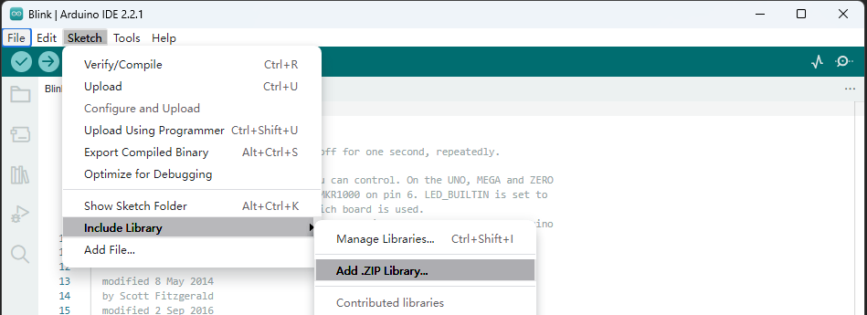

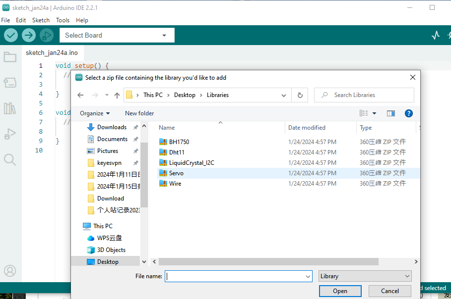

1.  **Method Two: Manual Installation**

The default location where Arduino sketches you write will be saved is called the Sketchbook. The Sketchbook is simply a folder on your computer like any other. It acts as a handy repository for sketches and is also where add-on code libraries get saved.

**Libraries Folder**

The **sketchbook\\libraries** folder is the default location where libraries are installed to from the Arduino IDE.

If you want to add a library manually, the library file cannot be added as a zip file, you need to unzip it and put it in the **libraries** folder of your sketchbook by yourself.

Uninstalling an Arduino Library

Uninstalling an Arduino Library is simpler than installing it. Find the sketchbook folder on your computer (same as in the “Manually installing a library” chapter). Go to the location and open the “libraries” folder. Select the folder containing the library you want to delete, and then simply delete it. Next time you open your Arduino IDE, there won’t be the deleted library under the Sketch \> Include Library menu.

Libraries don’t take much space and most of the time there is no reason to remove them. If you don’t intend to use them again, though, and want to declutter the list, you can safely delete them. You can always install any Arduino Library again if you need to use it in the future.

# 3.Test Electronic Parts

Lesson 1.1: LED Blinks

1.  **Description：**

LED, the abbreviation of light emitting diodes consists of Ga, As, P, N chemical compounds, and so on. The LED can flash in diverse colors by altering the delay time in the test code. When in control, power on GND and VCC, the LED will be on if the S end is at a high level; nevertheless, it will go off.

1.  **Parameters：**

Control interface: digital port

Working voltage: DC 3.3-5V

Pin spacing: 2.54mm

LED display color: yellow

1.  **You need to prepare:**

| Control Board\*1                                | USB Cable\*1                                    | Yellow LED Module\*1                            | 3pin F-F 26AWG Wire                             |
|-------------------------------------------------|-------------------------------------------------|-------------------------------------------------|-------------------------------------------------|
|  |  |  |  |

1.  **Connection diagram of the led module：**

The pin -, + and S of LED module are connected to the pin G, 5V and D3 port of

**Test Results:** LED blinks at the interval of 1s

1.  **Code Explanations:**

pinMode(LED，OUTPUT) - This function can denote that the pin is INPUT or OUTPUT

digitalWrite(LED，HIGH) - When pin is OUTPUT, we can set it to HIGH(output 5V) or LOW(output 0V)

Lesson 1.2: Changing the blinking frequency of the LED

**\>\>\>\>\>\>\>\>This lesson is an expansion of the Lesson 1.1**

Lesson 2.1: Adjust the Brightness of the LED

Hardware required for this lesson, the configuration of the arduino IDE, and the wiring between the LDE module and the control board is in the same way as **Lesson 1.1**.

**(1).Description：**

In previous lesson, we control LED on and off and make it blink.

In this project, we will control LED brightness through PWM to simulate breathing effect. Similarly, you can change the step length and delay time in the code so as to demonstrate different breathing effect.

PWM is a means of controlling the analog output via digital means. Digital control is used to generate square waves with different duty cycles (a signal that constantly switches between high and low levels) to control the analog output.In general, the input voltage of port are 0V and 5V. What if the 3V is required? Or what if switch among 1V, 3V and 3.5V? We can’t change resistor constantly. For this situation, we need to control by PWM.

For the Arduino digital port voltage output, there are only LOW and HIGH, which correspond to the voltage output of 0V and 5V. You can define LOW as 0 and HIGH as 1, and let the Arduino output five hundred 0 or 1 signals within 1 second.

If output five hundred 1, that is 5V; if all of which is 1, that is 0V. If output 010101010101 in this way then the output port is 2.5V, which is like showing movie. The movie we watch are not completely continuous. It actually outputs 25 pictures per second. In this case, the human can’t tell it, neither does PWM. If want different voltage, need to control the ratio of 0 and 1. The more 0,1 signals output per unit time, the more accurately control.

**(2).Code Explanation:**

When we need to repeat some statements, we could use FOR statement.

FOR statement format is shown below:

FOR cyclic sequence:

Round 1：1 → 2 → 3 → 4

Round 2：2 → 3 → 4

…

Until number 2 is not established, “for”loop is over,

After knowing this order, go back to code:

for (int value = 0; value \< 255; value=value+1){

…}

for (int value = 255; value \>0; value=value-1){

…}

The two“for”statements make value increase from 0 to 255, then reduce from 255 to 0, then increase to 255,….infinitely loop

There is a new function in the following —– analogWrite()

We know that digital port only has two state of 0 and 1. So how to send an analog value to a digital value? Here,this function is needed. Let’s observe the Arduino board and find 6 pins marked“\~”which can output PWM signals.

Function format as follows:

analogWrite(pin,value)

analogWrite() is used to write an analog value from 0\~255 for PWM port, so the value is in the range of 0\~255. Attention that you only write the digital pins with PWM function, such as pin 2 , 3，4 , 5，6，7 , 8 , 9，10，11 , 12 , 13 , 44, 45 , 46.

PWM is a technology to obtain analog quantity through digital method. Digital control forms a square wave, and the square wave signal only has two states of turning on and off (that is, high or low levels). By controlling the ratio of the duration of turning on and off, a voltage varying from 0 to 5V can be simulated. The time turning on(academically referred to as high level) is called pulse width, so PWM is also called pulse width modulation.

Through the following five square waves, let’s acknowledge more about PWM.

In the above figure, the green line represents a period, and value of analogWrite() corresponds to a percentage which is called Duty Cycle as well. Duty cycle implies that high-level duration is divided by low-level duration in a cycle. From top to bottom, the duty cycle of first square wave is 0% and its corresponding value is 0. The LED brightness is lowest, that is, turn off. The more time high level lasts, the brighter the LED. Therefore, the last duty cycle is 100%, which correspond to 255, LED is brightest. 25% means darker.

PWM mostly is used for adjusting the LED brightness or rotation speed of motor.

It plays vital role in controlling smart robot car.

Lesson 2.2: Slow down the change of the brightness of the LED

**\>\>\>\>\>\>\>\>This lesson is an expansion of the Lesson 2.1**

Hardware required for this lesson, the configuration of the arduino IDE, and the wiring between the LDE module and the control board is in the same way as **Lesson 1.1**.

Lesson 3.1: Read the Digital Signal of Button Module

**(1)Description**

In this project, we intend to use the push button module to control the LED.

**(2)Parameters:**

Working voltage：DC 3.3-5V

Control signal：digital signal

Size：34mm

Weight：3.8g

**(3)You need to prepare:**

| Control Board\*1                                | USB Cable\*1                                    | Yellow LED Module\*1                            | 3pin F-F 26AWG Wire\*2                          | Push Button Module\*1                           |
|-------------------------------------------------|-------------------------------------------------|-------------------------------------------------|-------------------------------------------------|-------------------------------------------------|
|  |  |  |  |  |

**(4)Connection Diagram**

| Pin Connection Table  |                      |
|-----------------------|----------------------|
| Pin of the **Button** | Pin of Control Board |
| G                     | G/D2                 |
| V                     | V/D2                 |
| S                     | S/D2                 |

| Pin Connection Table |                      |
|----------------------|----------------------|
| Pin of the **LED**   | Pin of Control Board |
| G                    | G/D3                 |
| V                    | V/D3                 |
| S                    | S/D3                 |

**(5)Code Explanation:**

Serial.begin(9600)-initialize the serial communication and set the baud rate to 9600

pinMode(pin, INPUT)-use the function pinMode() to tell Arduino whether it is an output pin or an input pin

digitalRead(pin)-read the digital level of pins,be HIGHT OT LOW

Lesson 3.2: Control the LED by the Button Module

**\>\>\>\>\>\>\>\>This lesson is an expansion of the Lesson 3.1**

Lesson 4.1: Passive Buzzer

**(1)Description**

There are prolific interactive works completed by Arduino. The most common one is sound and light display. We always use LED to make experiments. For this lesson, we design circuit to emit sound. The universal sound components are buzzer and horns. Buzzer is easier to use. And buzzer includes about active buzzer and passive buzzer. In this experiment, we adopt passive buzzer.

While using passive buzzer, we can control different sound by inputting square waves with distinct frequency. During the experiment, we control code to make buzzer sound, begin with “tick, tick” sound, then make passive buzzer emit “do re mi fa so la si do”, and play specific songs.

**(2)Parameters:**

Control interface: digital port

Working voltage: DC 3.3-5V

**(3)You need to prepare:**

| Control Board\*1                                | USB Cable\*1                                    | Passive Buzzer\*1                               | 3pin F-F 26AWG Wire                             |
|-------------------------------------------------|-------------------------------------------------|-------------------------------------------------|-------------------------------------------------|
|  |  |  |  |

1.  **Connection Diagram：**

The G, V and S pins of passive buzzer are connected to G, V and D6 of the control Board.

| Pin Connection Table  |                      |
|-----------------------|----------------------|
| Pin of the **Buzzer** | Pin of Control Board |
| G                     | G                    |
| V                     | V                    |
| S                     | D6                   |

Lesson 4.2: Use Passive Buzzer to Play Pusic

**\>\>\>\>\>\>\>\>This lesson is an expansion of the Lesson 4.1**

In the last lesson, we make the buzzer module emit”do re mi fa so la si do”. In this lesson, we will upload different code to make the passive buzzer play "Happy Birthday".

Lesson 5: 1602 LCD Display Module

1.  **Description：**

With I2C communication module, this is a display module that can show 2 lines with 16 characters per line.

It shows blue background and white word and connects to I2C interface of MCU, which highly save the MCU resources.

On the back of LCD display, there is a blue potentiometer for adjusting the backlight. The communication address defaults to 0x27.

The original 1602 LCD can start and run with 11 IO ports, but ours is built with ARDUINOIIC/I2C interface, saving 9 IO ports. Alternatively, the module comes with 4 positioning holes with a diameter of 3mm, which is convenient for you to fix on other devices.

1.  **Parameters：**

I2C address: 0x27

Backlight (blue, white)

Power supply voltage: **5V**

Adjustable contrast

GND: A pin that connects to ground

VCC: A pin that connects to a +5V power supply

SDA: A pin that connects to analog port A4 for IIC communication

SCL: A pin that connects to analog port A5 for IIC communication

1.  **You need to prepare:**

| Control Board\*1                                | USB Cable\*1                                    | LCD Display\*1                                  | 4P-1P F-F DuPon Wire                            |
|-------------------------------------------------|-------------------------------------------------|-------------------------------------------------|-------------------------------------------------|
|  |  |  |  |

**(4)Connection Diagram**

| Pin Connection Table       |                      |
|----------------------------|----------------------|
| Pin of the **LCD Dispaly** | Pin of Control Board |
| GND                        | G/A4                 |
| VCC                        | V/A4                 |
| SDA                        | S/A4                 |
| SCL                        | S/A5                 |

Lesson 6: Photosensitive Sensor

**(1)Description**

There are four photoresistor sensor modules in this kit, the ambient light sensors, with photoresistor as main component.

The resistance of a photoresistor varies with the light intensity. When there is light around, its resistance ranges in 5-10KΩ; while when it is dark, the resistance is only 0.2MΩ. Based on this property, a circuit can be built to convert the change in resistance to changes in voltage.

What’s more, the sensor comes with an anti-reverse insertion terminal with a pitch of 2.54mm to facilitate the wiring. It is also compatible with many kinds of microcontrollers, such the Arduino microcontroller series.

Here, we apply this sensor with the Arduino microcontroller. The S (signal) end of the sensor should be input to the analog pin of Arduino to detect the variation in analog value which will be printed on the serial monitor. And please notice that there are two positioning holes with a diameter of 4.9mm built on the sensor to help fix it.

**(2)Parameters:**

Working voltage：3.3V-5V（DC）

Interface：3PIN

Output signal：analog signal

Weight：2.3g

**(3)You need to prepare:**

| Control Board\*1                                | USB Cable\*1                                    | Yellow LED Module\*1                            | 3pin DuPont Wire\*2                             | Push Button Module\*4                           |
|-------------------------------------------------|-------------------------------------------------|-------------------------------------------------|-------------------------------------------------|-------------------------------------------------|
|  |  |  |  |  |

1.  **Connection Diagram:**

| Pin Connection Table     |                      |
|--------------------------|----------------------|
| Pin of **Photoresistor** | Pin of Control Board |
| G                        | G/A0                 |
| V                        | V/A0                 |
| S                        | S/A0                 |

| Pin Connection Table |                      |
|----------------------|----------------------|
| Pin of the **LED**   | Pin of Control Board |
| G                    | G/D3                 |
| V                    | V/D3                 |
| S                    | S/D3                 |

**  
**

**  
**

Lesson 7: DHT11 Temperature and Humidity Sensor

**  
**

**(1)Description:**

This DHT11 temperature and humidity sensor is a composite sensor which contains a calibrated digital signal output of the temperature and humidity.

DHT11 temperature and humidity sensor uses the acquisition technology of the digital module and temperature and humidity sensing technology, ensuring high reliability and excellent long-term stability.

It includes a resistive element and a NTC temperature measuring device.

**(2)Parameters：**

Working voltage: **+5 V**

Working temperature: 0-50 ℃ error of ± 2 ℃

Humidity: 20-90% RH ± 5% RH error

Interface: digital port

1.  **You need to prepare:**

| Control Board\*1                                | USB Cable\*1                                    | DHT11 Sensor\*1                                        | 3pin DuPont Wire                                |
|-------------------------------------------------|-------------------------------------------------|--------------------------------------------------------|-------------------------------------------------|
|  |  |  |  |

**(4)Connection Diagram**

The G, V and S pins of DHT11 Sensor\*1 are connected to G, V and D7 of the control Board.

**  
**

**  
**

Lesson 8: BH1750 Digital Light Intensity Module

The main component of this sensor is chip BH1750FVI which is an integrated chip for digital light intensity.

As shown in the picture below, BH1750 is composed of a photodiode, an operational amplifier, an ADC acquisition, a crystal oscillator, etc. The photodiode converts the input optical signal into an electrical signal through the photovoltaic effect. After being amplified by the operational amplifier circuit, the voltage is collected by the ADC, and then converted into a 16-bit binary number through the logic circuit and stored in the internal register(Note: The stronger the light, the greater the photocurrent, and the greater the voltage, so the intensity of the light can be judged by the value of the voltage.

However, it should be noted that the voltage and the light intensity are one-to-one correspondence, but not proportional. That is why this chip linear processing is done and why the integrated IC is used directly instead of photodiodes). BH1750 leads out the clock line and data line. The single-chip microcomputer can communicate with the BH1750 module through the I2C protocol. You can choose the working mode of the BH1750, or you can extract the illuminance data of the BH1750 register.

**(2)Parameters:**

I2C digital interface, supporting a maximum rate of 400Kbps

The output is Illuminance

Measuring range is 1\~65535 lux, the minimum resolution is 1lux

Low power consumption (Power down) function

Shield the interference of light changes caused by 50/60Hz mains frequency 

Supports two I2C addresses, selected by the ADDR pin

Small measurement deviation(maximum accuracy error +/-20%)

GND power ground

SDA I2C bus data pin

SCL I2C bus clock pin

VCC power supply voltage 3-5V

**(3)You need to prepare:**

| Control Board\*1                                | USB Cable\*1                                    | BH1750FVI Sensor\*1                             | 350mm 4pin F-F Wire                             |
|-------------------------------------------------|-------------------------------------------------|-------------------------------------------------|-------------------------------------------------|
|  |  |  |  |

**(4)Connection Diagram:**

**  
**

(**Note**: since the I2C bus can have multiple devices with different addresses, when the digital light intensity module is used together with the I2C LCD1602 module, there is no conflict because they have different addresses.)

Lesson 9: Test the Servo Motor

**(1)Description：**

Servo motor is a position control rotary actuator. It mainly consists of housing, circuit board, core-less motor, gear and position sensor. Its working principle is that the servo receives the signal sent by MCU or receiver, and produces a reference signal with a period of 20ms and width of 1.5ms, then compares the acquired DC bias voltage to the voltage of the potentiometer and obtains the voltage difference output.

For the servo used in this project, the brown wire is the ground, the red one is the positive wire, and the orange one is the signal wire.

The rotation angle of servo motor is controlled by regulating the duty cycle of PWM (Pulse-Width Modulation) signal. The standard cycle of PWM signal is 20ms(50Hz). Theoretically, the width is distributed between 1ms-2ms, but in fact,it’s between 0.5ms-2.5ms. The width corresponds to the rotation angle from 0° to 180°. But note that for different brand motor, the same signal may have different rotation angle.

More details:

**(2)Parameters:**

Working voltage: DC 4.8V \~ 6V

Operating angle range: about 180 ° (at 500 → 2500 μsec)

Pulse width range: 500 → 2500 μsec

No-load speed: 0.12 ± 0.01 sec / 60 (DC 4.8V) 0.1 ± 0.01 sec / 60 (DC 6V)

No-load current: 200 ± 20mA (DC 4.8V) 220 ± 20mA (DC 6V)

Stopping torque: 1.3 ± 0.01kg · cm (DC 4.8V) 1.5 ± 0.1kg · cm (DC 6V)

Stop current: ≦ 850mA (DC 4.8V) ≦ 1000mA (DC 6V)

Standby current: 3 ± 1mA (DC 4.8V) 4 ± 1mA (DC 6V)

Lead length: 250 ± 5 mm

Appearance size: 22.9 \* 12.2 \* 30mm

Weight: 9 ± 1 g (without servo horn)

1.  **You need to prepare:**

| Control Board\*1                                | USB Cable\*1                                    | Servo\*2                                               |
|-------------------------------------------------|-------------------------------------------------|--------------------------------------------------------|
|  |  |  |

**(4)Connection Diagram**

Note: The servo is connected to G (GND), V (VCC), D9. The brown wire is connected to Gnd (G), the red wire is connected to (V), and the orange wire is connected to digital pin D9.

We will introduce two ways to control the servos, one without using the **\<Servo.h**\> library file and one with the **\<Servo.h\>** library file.

**9.1 Not using the \<Servo.h\> library to control the servo**

**9.2 Using the \<Servo.h\> library to control the servo**

Lesson 10: Charging Principle of the Solar Tracking Kit

**(1)Solar and usb charging module:**

This module integrates a charging and discharging chip, which can be connected with an external rechargeable battery and a solar panel through the PH2.0MM interfaces.

In this kit, we provide a battery box that holds one 18650 battery, so you will need to prepare a rechargeable 18650 battery yourself.

The module has a Micro USB port and you can use the computer to charge the 18650 battery through the micro USB port.

In addition, it has a boost module which can increase the voltage of batteries to 6.6V. The DIP switch on the module is the OUTPUT switch of 6.6V. The pin G and V of this module can output 6.6V and the pin S can read the battery voltage after the resistance 1/2 voltage.

**Parameters:**

| Charging Interface                             | Micro USB HP2.0MM Interface for Solar Panel |
|------------------------------------------------|---------------------------------------------|
| Input voltage of the solar panel interface     | 4.4-6V                                      |
| Constant voltage charging value of the battery | 4.15-4.24V                                  |
| Maximum charging current                       | 800mA                                       |
| Output interface                               | 3 P 2.54mm Bent Needle                      |
| Input Voltage                                  | 6.6V                                        |
| Maximum output current                         | 1A                                          |
| External Battery                               | 18650 battery                               |
| Environmental attributes                       | ROHS                                        |

**Schematic Diagram**

**Features**

**  
**

**(2)PET Solar Panel**

The main factors that affect the output performance of solar panels are as follows:

(1) Load impedance

(2) Sunlight intensity

(3)Temperature

(4) Illumination angle and illumination area

You can use a multimeter to measure the output current of the solar panel, adjust the multimeter to DC current level and large range jack, connect the red pen of the multimeter to the positive pole of the solar panel and the black pen to the negative pole of the solar panel, and measure it.

Can solar panels store electricity?

No, generally it needs to be paired with a battery to store electricity.

Can solar panels generate electricity on cloudy days?

No, the power generated by solar panels on cloudy days is very small. In this case, they have voltage but no current.

Can solar panels generate electricity under indoor lighting?

No, solar panels cannot generate electricity under indoor lighting.

**(3)Charge the battery with the solar panel.**

In this kit, we provide a battery case that is compatible with one 18650 battery, and it is also configured with two interfaces so that you can charge the battery or use it for power.

2.You will need to prepare yourself a 18650 battery as well as a battery charger.

The following parameters are available for your purchase：

| Specifications            |                                                           |
|---------------------------|-----------------------------------------------------------|
| Size                      | 18650                                                     |
| Positive Terminal：       | with a top |
| Capacity                  | \>2200mAh                                                 |
| Nominal Voltage           | 3.7V                                                      |
| Maximum Voltage           | 4.2V                                                      |
| Discharge cut-off Voltage | 2.5V                                                      |
| Rechargeable              | Yes                                                       |
| Approx. Dimensions        | 18.5mm x 65.2mm                                           |

We can connect the solar panel to the charging module and a 18650 lithium case, so that the solar panel will charge the battery.

Solar panels are not batteries, do not have the function of power storage. It can store electricity in the batter.

The output of solar panels is weak in environments where there is no sunlight, indoor lighting and low winter light. The energy carried by these lights is very small, even if it is brighter.

**Note:**

The solar panel may require long periods of direct sunlight to charge the batteries enough. 18650 batteries should not be exposed to direct sunlight as well as avoiding high temperatures around it to avoid burnout.

**(5)Smart phone charging Module**

The mobile phone charging module is a lithium battery boost module of 3.7V which can output 5V, 1A through the PH2.0 terminal and USB port.

Parameters:

| Property              | non-isolated boost module (BOOST)                                                                  |
|-----------------------|----------------------------------------------------------------------------------------------------|
| Input voltage         | 1-5V                                                                                               |
| Output voltage        | 5士0.1V                                                                                            |
| Output current:       | Rated 1-1.5A (single cell lithium battery input), maximum 1.5A (single cell lithium battery input) |
| Conversion efficiency | Up to 96% .                                                                                        |
| Switching frequency   | 500KHz .                                                                                           |
| Working temperature   | industrial grade (-40°C to +85°C )                                                                 |
| Full load heating     | 30°C                                                                                               |
| Quiescent current     | 130uA                                                                                              |

PH2.0 terminal of the phone charging module can be connected to the battery case.

The USB port of it can be connected to an android phone and charged.

Note that the power of 18650 battery must be sufficient (voltage up to 3.2-4.2V) to charge an Android phone. Otherwise it does not work, even if the phone shows it is charging.

**(6)Charging Principle of the Solar Tracking Kit**

1、Maximum charging current of micro USB port 1A

2、Solar panel maximum charging current 80mA

3、Maximum output voltage of USB A port female holder: 5V/1.5A (can be used for mobile phone charging)

4、Battery type: 18650 lithium battery with a top, recommended to buy capacity greater than 2200mAh

**Note:**

1).The charging protocol of phone charging Module only supports Android but not iOS.

2).The solar panel can't charge mobile phones directly; it need to store electricity in a battery and the battery charge the phone.

3).The voltage of the 18650 battery needs to be in the range of 3.2---4.2V to charge the cell phone. When the voltage of the battery is less than 3.2V, even though the phone shows that it is charging, it is not actually charging.

4).The solar panel may require long periods of direct sunlight to charge the batteries enough. 18650 batteries should not be exposed to direct sunlight as well as avoiding high temperatures around it to avoid burnout.

5).If you want to charge your 18650 battery quickly, you can charge the battery using the 18650 dedicated charger. Or use a USB 2.0 to micro USB cable to connect the charging module and charge the battery using a computer or power supply. (USB 2.0 to micro USB cable not included in kit)

6).This is just a simulation experiment and will not meet your daily power needs, don't use it as your regular cell phone power source.

Assembling the Solar Tracking Kit

Things to note before assembly:

1.Before assembly, please tear off the protective film on the acrylic boards.

2.You will need to prepare yourself a 18650 battery as well as a battery charger.

The following parameters are available for your purchase：

| Specifications            |                                                           |
|---------------------------|-----------------------------------------------------------|
| Size                      | 18650                                                     |
| Positive Terminal：       | With a top |
| Capacity                  | \>2200mAh                                                 |
| Nominal Voltage           | 3.7V                                                      |
| Maximum Voltage           | 4.2V                                                      |
| Discharge cut-off Voltage | 2.5V                                                      |
| Rechargeable              | Yes                                                       |
| Approx. Dimensions        | 18.5mm x 65.2mm                                           |

**  
**

**Part 1**

Components Needed

Assembling the 1602 display and battery box

**Part 2**

Components Needed

Assembling the control board

**Part 3**

Components Needed

Assembling the Lithium Battery Power Module and Charging module

**Part 4**

Components Needed

Assembling the M3\*45MM Copper Columns

**Wiring the Lower Part Of The Kit**

1.  Use the 20cm M to F DuPont Wire to connect the Solar USB Charging Module to the uno control board. The G pin of the module is connected to the GND of UNO, the V pin of the module is connected to the Vin of UNO

1.  Connect the LCD display to the UNO board

| Pin Connection Table       |                      |
|----------------------------|----------------------|
| Pin of the **LCD Dispaly** | Pin of Control Board |
| GND(black wire)            | G/A4                 |
| VCC(red wire)              | V/A4                 |
| SDA(blue wire)             | S/A4                 |
| SCL(green wire)            | S/A5                 |

Note: The working voltage of the LCD Display is 5V, please make sure the 3.3-5V Switch on the control board is dial to 5V.

1.  Install an 18650 battery inside the battery case, taking care that the positive and negative terminals of the battery are all the way to the positive and negative terminals of the battery case.

Connect the battery case to the solar usb charging module and mobile phone charging module.

**  
**

**Part 5**

Components Needed

Assembling the sensors and modules

**Part 6**

Components Needed

**Part 7**

Components Needed

Note the orientation of the upper section, the buzzer module and the LCD display below are in the same orientation.

**Part 8**

Components Needed

**Part 9**

Components Needed

Installation Diagram (mind the installation direction of the servo)

**Part 10**

Components Needed

**Part 11**

Components Needed

Before putting them together, you need to adjust the angle of the **servo ②**.Set its initial angle to **10 degrees** to keep the solar panel level.

**Connection Diagram**

Note: The servo is connected to G (GND), V (VCC), D10. The brown wire is connected to Gnd (G), the red wire is connected to (V), and the orange wire is connected to digital pin D10.

Installation Diagram (pay attention to the angle of the servo, as shown in the picture)

**Note:** You cannot turn the servo shaft until you have completed this fixing step, otherwise you will need to re-set it to 10 degree using the code above.

**Part 12**

Components Needed

**Part 13**

Components Needed

**Part 14**

Components Needed

Before putting them together, you need to adjust the angle of the **servo ①**. Set its initial angle to **90 degrees**.

**Connection Diagram**

Note: The servo is connected to G (GND), V (VCC), D9. The brown wire is connected to Gnd (G), the red wire is connected to (V), and the orange wire is connected to digital pin D9.

Installation Diagram

**Note:** You cannot turn the servo shaft until you have completed this fixing step, otherwise you will need to re-set it to 90 degree using the code above.

**Part 15**

Components Needed

**Part 16**

Components Needed

**Part 17**

Components Needed

**Part 18**

Components Needed

**Part 19**

Components Needed

**Wiring the Upper Part Of The Kit**

1.  Connect the lower servo to D9 of the UNO control board, and the upper servo of D10 on the UNO control board. Connect the brown wire of the servo to G, the red wire to V, and the yellow wire to S.

2)Plug the jack of the solar panel to the SOLAR4.8-6.0V end of the solar USB charging module.

1.  Next, we will use the seven 3P 26AWG 200mm F-F DuPont Wires to connect the photosensors, buzzer module, pushbutton module and the DHT11 temperature and humidity sensor to the uno board.

The photosensitive sensor on the left is is connected to the A0 pin of UNO board.

The photosensitive sensor on the right is is connected to the A1 pin of UNO board.

The photosensitive sensor on the back is is connected to the A2 pin of UNO board.

The photosensitive sensor on the front is connected to the A3 pin of UNO board.

The button module is connected to the D2 pin of UNO board.

The buzzer module is connected to the D6 pin of UNO board.

The dht11 temperature and humidity sensor is connected to the D7 pin of UNO board.

**Note: In order to avoid reverse connection, we recommend wiring according to the following method：**

\-The G pin of the module is connected to the G pin of UNO with a black wire;

\-The V pin of the module is connected to the V pin of UNO with a red wire;

\-The S pin of the module is connected to the S pin of UNO with a orange wire.

As shown in the way the dht11 temperature and humidity sensor is connected to the UNO board.

3)Finally, connect the bh1750 digital light intensity module to the UNO board.

Lesson 11: Solar Panel Device with Multiply Functions

The assembled solar panel device is ready!

In the previous lessons, we only studied the function and working principle of a certain electronic part individually, and tested whether it can work normally.

Now we have them working together to build a solar panel device with multiple functions.

Keep the 18650 battery charged enough as it will be needed to power two servos, an LCD display, four light sensors, a DHT11 sensor and button module.

After the code is uploaded successfully, turn on the power switch of the charging module and press the power switch of the control board to 5V.

The servo will rotate to the initial angle. When the ambient light sensor detects changes in light intensity, servos rotate the solar panel to the position where the light is the strongest and LCD1602 shows the value of the light intensity and temperature and humidity detected by the BH1750 and XHT11 respectively.

If you feel that the solar panel rotates too slowly or the solar panel shakes, you can adjust the rotation speed of the servo through the button module.

For example, within the specified time, the servo rotates 1° each time. After pressing the button, the servo will rotate 2° each time within the same time.

Press it again and the servo will rotate 3° each time in the same time. By analogy, the servo can be adjusted to rotate up to 5° each time in the same time.

**“byte m_speed = 10”**

You can also change this code to set the delay time to adjust the speed of the servo; the longer the time, the smaller the speed.

# Troubleshooting

Here are some solutions to common problems that may help you.

If you don't get the answer you're looking for here, please contact our technical support:

Amazon: [service@keyestudio.com](mailto:service@keyestudio.com)

AliExpress: [tivon@keyestudio.com](mailto:tivon@keyestudio.com)

Other channels: [sunny@keyestudio.com](mailto:sunny@keyestudio.com)

For a faster and more professional resolution of your issue, please include this information when sending us an email:

1\. Your order number or where you got this product from

2\. The problems you encounter, try to include detailed descriptions, pictures or videos.

We need more information than ""It doesn't work."" Please give us good detail on what you want to accomplish and what you have tried.

Thank You!

[1. The control board is not recognized by the computer. 2](#_Toc14604)

[2. USB port can’t recognized by computer. 2](#_Toc4151)

[3. Code problems/Failed uploading/Code error. 2](#_Toc20578)

[4. The assembled Solar tracking kit doesn’t respond. 3](#_Toc6345)

[5. Servo stuck/servo hot 3](#_Toc22287)

[6. The solar panel does not track the movement of the light source or the sun 4](#_Toc32569)

[7. The solar panel moves very slowly, jerks or gets stuck. 4](#_Toc8564)

1.  **The control board is not recognized by the computer.**

\-Please check if the USB cable is good and your computer's USB port is available.

1.  **USB port can’t recognized by computer.**

\-Check if you have installed the USB driver

1.  **Code problems/Failed uploading/Code error.**

These reasons can cause problems with your code:

1) The driver is not installed.

2) The board type and COM port are not selected correctly in the Arduino IDE.

3) The library file is not installed.

(Please follow **2.Getting Started with Arduino** to troubleshoot the above problems)

4)Poor USB contact

If you don’t have the problems in 1-3 above, check that the USB cable connection is good, try re-plugging it, and then upload the code again.

1.  **The assembled Solar tracking kit doesn’t respond.**

1)These reasons may cause the robot not to work:

1)wrong wiring

2)You didn't upload the code

3)Failed uploading/Code error

4)You didn't turn on the 5V switch on the control board and the power switch on the charging module.

5）Insufficient battery power

You need to keep the 18650 battery charged enough as it will be needed to power two servos, an LCD display, four light sensors, a DHT11 sensor and button module.

1.  **Servo stuck/servo hot**

You will need to adjust the initial angle of the servo before assembling them and not change the angle until assembly is complete to ensure that the servo operates properly for solar tracking kit.

1.  **The solar panel does not track the movement of the light source or the sun**

When the ambient light sensor detects changes in light intensity, servos rotate the solar panel to the position where the light is the strongest.

In an environment with uniform lighting, the solar panel may not track the movement of the light source. You may need to apply a very strong light source, or apply a light source in a weak light area to make the solar panel move with the light source. The solar panel may not move toward the sun because the difference in light intensity detected by each ambient light sensor may not be large.

1.  **The solar panel moves very slowly, jerks or gets stuck.**
2.  Check that the servo wiring is organised and not jammed so that the servo can have enough room to move.
3.  18650 battery needs to be fully charged
4.  You can press the button module to adjust the amount of servo rotation.
