# 1. Was ist im Paket enthalten?

| Nr. | Bild                                            | Komponente                                            | Menge    |
|-----|-------------------------------------------------|--------------------------------------------------------|----------|
| 1   | 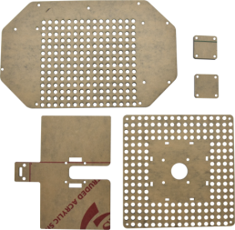 | Acrylplatte                                          | 1        |
| 2   | 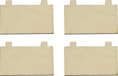 | Holzplatte 3mm* 4                                   | 1        |
| 3   | 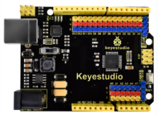 | Keyestudio UNO Board                                 | 1        |
| 4   | 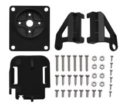 | Servo-Montage-Kit                                   | 1        |
| 5   | 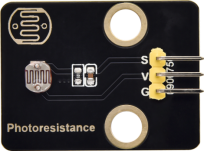 | Fotowiderstandsmodul                                | 4        |
| 6   | 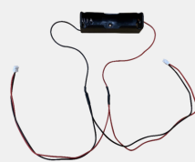 | Batteriehalter (18650 Batterie nicht enthalten)      | 1        |
| 7   | 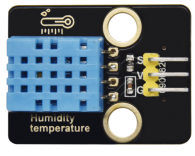 | Temperatur- und Feuchtigkeitssensor                  | 1        |
| 8   | 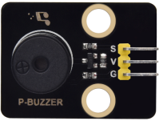 | Passives Summer-Modul                                | 1        |
| 9   | 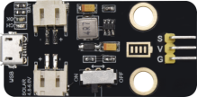 | Solar-USB-Lademodul                                 | 1        |
| 10  | 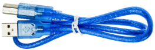 | USB-Kabel                                           | 1        |
| 11  | 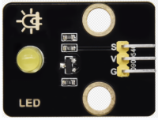 | Gelbes LED-Modul                                    | 1        |
| 12  | 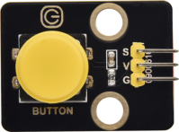 | Einkanal-Tastmodul                                 | 1        |
| 13  | 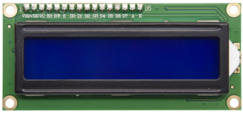 | I2C1602 Modul                                      | 1        |
| 14  | 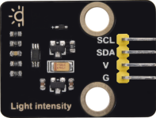 | BH1750FVI Digitales Lichtintensitätsmodul IIC Schnittstelle | 1        |
| 15  | 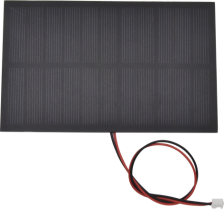 | Solarpanel mit Klebeband und Kabel                  | 1        |
| 16  |  | 2.0*40MM Schraubendreher                            | 1        |
| 17  |  | 3.0*40MM Schraubendreher                            | 1        |
| 18  | 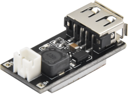 | Smartphone-Lademodul                                | 1        |
| 19  | 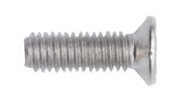 | M3*8MM Senkkopfschraube                             | 29       |
| 20  | 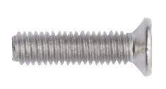 | M3*14MM Senkkopfschraube                            | 4        |
| 21  | 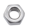 | M3 Vernickelte Mutter                               | 6        |
| 22  |  | M4 Vernickelte Mutter                               | 2        |
| 23  | 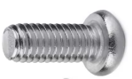 | M4*8MM Linsenkopfschraube                           | 2        |
| 24  | 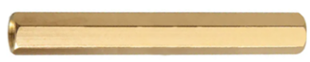 | M3*45MM Doppelgängige Kupferstütze                  | 8        |
| 25  | 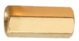 | M3*10MM Doppelgängige Kupferstütze                  | 7        |
| 26  | 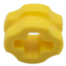 | Baustein 4265c                                      | 18       |
| 27  | 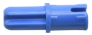 | Baustein 43093                                      | 18       |
| 28  | 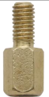 | M3*6+6MM Einfachgängige Kupferstütze                | 4        |
| 29  | 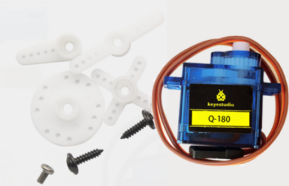 | Servo                                               | 2        |
| 30  | 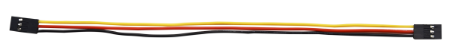 | 3P 26AWG 200mm F-F DuPont-Kabel                     | 7        |
| 31  | 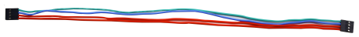 | 4P F-F 26AWG 350mm DuPont-Kabel                     | 1        |
| 32  | 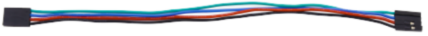 | 4P 26AWG 200mm DuPont-Kabel                         | 1        |
| 33  | 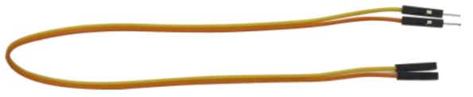 | 20cm M zu F DuPont-Kabel                            | 1        |
| 34  | 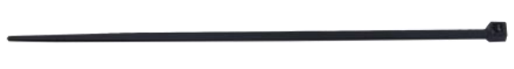 | Kunststoffschnur                                    | 4        |
| 35  | 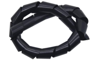 | Kunststoffpipette                                   | 1        |