# 2.Comenzando con Arduino

## **2.1 ¿Qué es Arduino?**

Arduino es una plataforma electrónica de código abierto basada en hardware y software fáciles de usar. Las placas Arduino pueden leer entradas - luz en un sensor, un dedo en un botón o un mensaje de Twitter - y convertirlas en una salida - activar un motor, encender un LED, publicar algo en línea. Puedes indicarle a tu placa qué hacer escribiendo el código del programa en el IDE y enviando las instrucciones al microcontrolador en la placa. Para ello usas el lenguaje de programación Arduino (basado en Wiring) y el Software Arduino (IDE), basado en Processing.

## **2.2 Instalación del Arduino IDE para Windows**

Visita <https://www.arduino.cc/en/software> para descargar la última versión del Arduino IDE para el sistema operativo de tu computadora. Hay versiones para Windows, Mac y Linux.

**El Arduino IDE 2**

El Arduino IDE 2 es un gran avance respecto a su robusto predecesor, Arduino IDE 1.x, y viene con una interfaz renovada, un gestor de placas y bibliotecas mejorado, depurador, función de autocompletado y mucho más.

Aquí mostraremos cómo descargar e instalar el Arduino IDE 2.2.1 en tu Windows.

Puedes elegir entre el instalador (.exe) y los paquetes Zip. Te sugerimos usar el primero que instala directamente todo lo que necesitas para usar el Software Arduino (IDE), incluidos los controladores. Con el paquete Zip necesitas instalar los controladores manualmente. El archivo Zip también es útil si quieres crear una [instalación portátil](https://arduino.cc/en/Guide/PortableIDE).

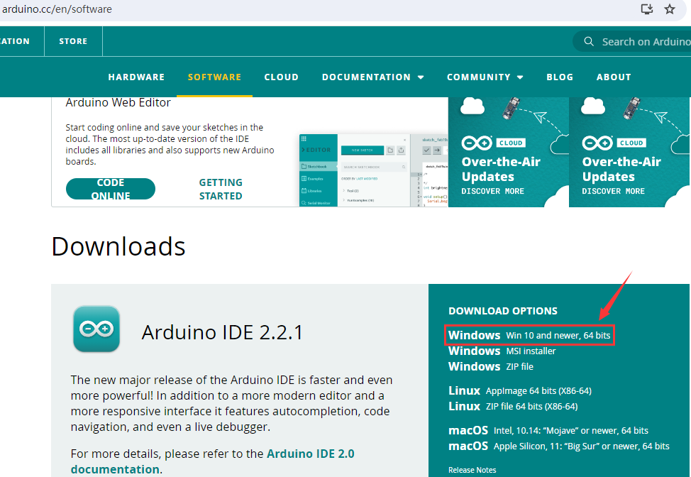

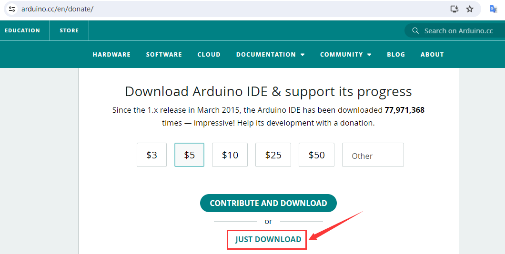

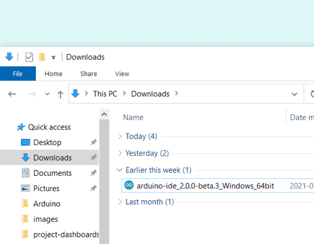

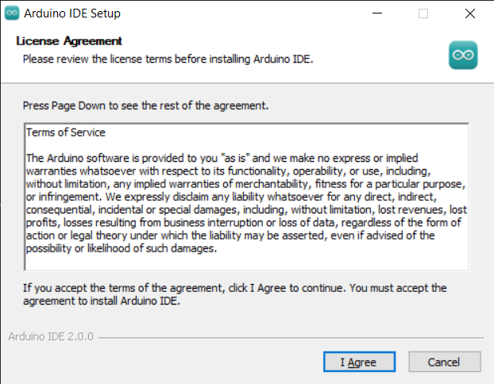

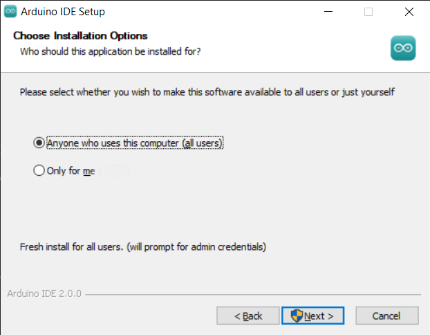

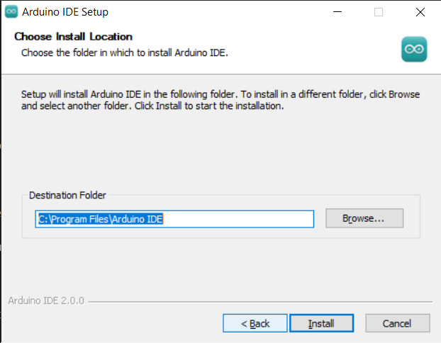

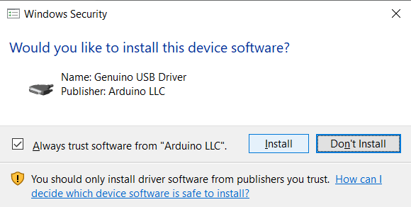

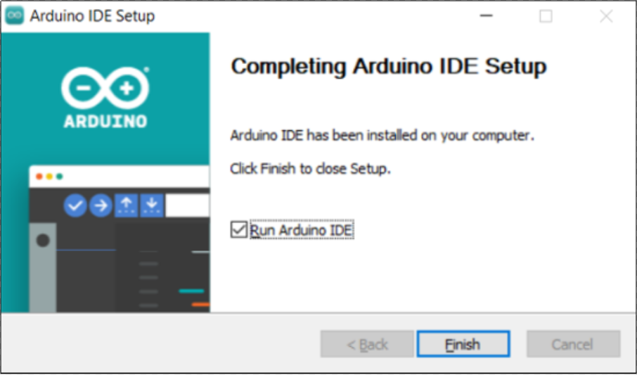

Haz clic en Finalizar y ejecuta Arduino IDE

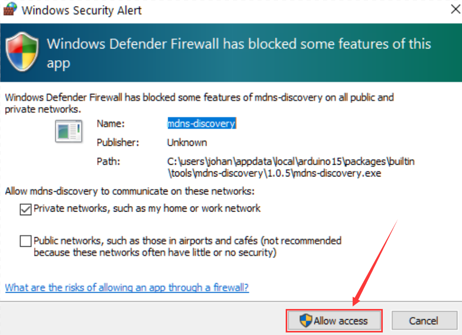

El firewall preguntará si deseas permitir el acceso, simplemente haz clic en **Permitir acceso**.

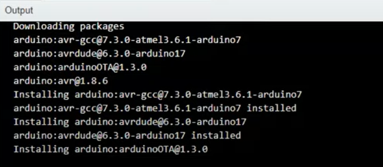

Arduino IDE 2.0

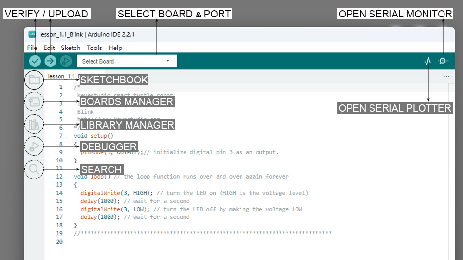

**Verificar / Subir** - compila y sube tu código a tu placa Arduino.

**Seleccionar placa y puerto** - las placas Arduino detectadas automáticamente aparecen aquí, junto con el número de puerto.

**Sketchbook** - aquí encontrarás todos tus sketches almacenados localmente en tu computadora. Además, puedes sincronizar con Arduino Cloud y también obtener tus sketches desde el entorno en línea.

**Gestor de placas** - navega entre paquetes de Arduino y de terceros que pueden ser instalados. Por ejemplo, usar una placa MKR WiFi 1010 requiere que el paquete Arduino SAMD Boards esté instalado.

**Gestor de bibliotecas** - navega entre miles de bibliotecas Arduino, hechas por Arduino y su comunidad.

**Depurador** - prueba y depura programas en tiempo real.

**Buscar** - busca palabras clave en tu código.

**Abrir monitor serial** - abre la herramienta Monitor Serial como una nueva pestaña en la consola.

Si quieres aprender más sobre Arduino IDE, por favor consulta este documento: [Getting Started with Arduino IDE 2](https://docs.arduino.cc/software/ide-v2/tutorials/getting-started-ide-v2)

## 2.3 Introducción a la placa Keyestudio UNO

El procesador principal de esta placa es ATMEGA328P-AU y ATMEGA16U2 se usa como chip de conversión UART a USB.

Tiene 14 pines digitales de entrada/salida (de los cuales 6 pueden usarse como salidas PWM), 6 entradas analógicas, un oscilador de cristal de 16 MHz, una conexión USB, un conector de alimentación, un header ICSP y un botón de reset.

Todo lo que necesitas hacer es conectarla a una computadora mediante un cable USB y alimentarla con una fuente de alimentación externa de DC 7-12V.

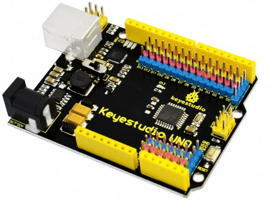

| **Microcontrolador**         | **ATMEGA328P-AU**                                        |
|-----------------------------|----------------------------------------------------------|
| Voltaje de operación         | 5V                                                       |
| Voltaje de entrada (recomendado) | DC 7-12V                                                 |
| Pines digitales I/O          | 14 (D0-D13)                                              |
| Pines digitales PWM I/O      | 6 (D3，D5，D6，D9，D10，D11)                             |
| Pines de entrada analógica   | 6 (A0-A5)                                                |
| Memoria Flash                | 32 KB (ATMEGA328P-AU) de los cuales 0.5 KB usados por el bootloader |
| SRAM                        | 2 KB (ATMEGA328P-AU)                                     |
| EEPROM                      | 1 KB (ATMEGA328P-AU)                                     |
| Velocidad de reloj           | 16 MHz                                                   |

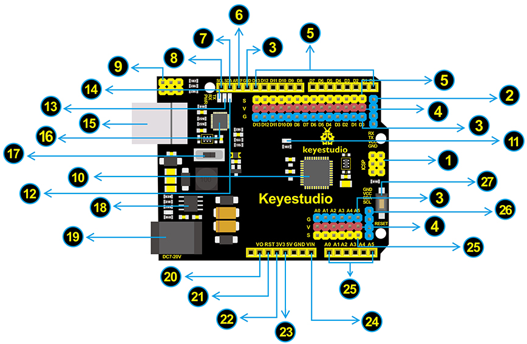

| **Número de interfaz** | **Introducción**                                                                                                                                                                                                                                                                                                                                                                                                                                                       |
|-----------------------|-------------------------------------------------------------------------------------------------------------------------------------------------------------------------------------------------------------------------------------------------------------------------------------------------------------------------------------------------------------------------------------------------------------------------------------------------------------------------|
| 1                     | **Header ICSP (Programación en circuito serial)**  Es el AVR, un header de microprogramación Arduino que consiste en MOSI, MISO, SCK, RESET, VCC y GND. A menudo se llama SPI (interfaz periférica serial) y puede considerarse una "extensión" de la salida. De hecho, esclavo los dispositivos de salida bajo el bus SPI. Al conectar a PC, programa el firmware al ATMEGA328P-AU.                                                                       |
| 2                     | **Pin de comunicación serial**  Conecta a comunicación serial. 4 pines (GND, VCC (3.3V o 5V controlado por interruptor deslizante), RX, TX)                                                                                                                                                                                                                                                                                                                             |
| 3                     | **GND**  Pines de tierra                                                                                                                                                                                                                                                                                                                                                                                                                                              |
| 4                     | **Pin V (VCC)**  Alimenta sensores y módulos externos. Selecciona el voltaje de 3.3V o 5V mediante un interruptor deslizante.                                                                                                                                                                                                                                                                                                                                         |
| 5                     | **Digital I/O**  Tiene 14 pines digitales de entrada/salida, etiquetados de D0 a D13 (de los cuales 6 pueden usarse como salidas PWM). Estos pines pueden configurarse como entrada digital para leer el valor lógico (0 o 1). O usarse como salida digital para controlar diferentes módulos como LED, relé, etc. Los pines D3, D5, D6, D9, D10 y D11 pueden usarse para generar PWM. Para el puerto digital, puedes conectar a través de headers hembra o headers macho (etiquetados S) de paso 2.54mm. |
| 6                     | **AREF**  Para referencia analógica. A veces se usa para establecer un voltaje de referencia externo (0-5V) como límite superior de las entradas analógicas.                                                                                                                                                                                                                                                                                                         |
| 7                     | **SDA**  Pin de comunicación IIC                                                                                                                                                                                                                                                                                                                                                                                                                                      |
| 8                     | **SCL**  Pin de comunicación IIC                                                                                                                                                                                                                                                                                                                                                                                                                                      |
| 9                     | **Header ICSP (Programación en circuito serial)**  ICSP es un AVR, un header de microprogramación Arduino que consiste en MOSI, MISO, SCK, RESET, VCC y GND. Conectado al ATMEGA 16U2-MU. Al conectar a PC, programa el firmware al ATMEGA 16U2-MU.                                                                                                                                                                                                                  |
| 10                    | **Microcontrolador** Cada placa de control tiene su propio microcontrolador. Puedes considerarlo como el cerebro de tu placa. Los microcontroladores suelen ser de ATMEL. Antes de cargar un nuevo programa en el Arduino IDE, debes saber qué IC está en tu placa. Esta información puede verificarse en la parte superior del IC. El microcontrolador usado en esta placa es ATMEGA328P-AU.                                                                                 |
| 11                    | **LED D13**  Hay un LED incorporado controlado por el pin digital 13. Cuando el pin está en valor ALTO, el LED está encendido; cuando está en BAJO, está apagado.                                                                                                                                                                                                                                                                                                     |
| 12                    | **LED TX**  En la placa puedes encontrar la etiqueta: TX (transmitir). Cuando la placa se comunica vía puerto serial y envía un mensaje, el LED TX parpadea.                                                                                                                                                                                                                                                                                                         |
| 13                    | **LED RX**  En la placa puedes encontrar la etiqueta: RX (recibir). Cuando la placa se comunica vía puerto serial y recibe un mensaje, el LED RX parpadea.                                                                                                                                                                                                                                                                                                           |
| 14                    | **LED de alimentación**  El LED encendido indica que tu placa está correctamente alimentada. De lo contrario, el LED está apagado.                                                                                                                                                                                                                                                                                                                                 |
| 15                    | **Conexión USB**  Puedes alimentar la placa vía conexión USB. O subir el programa a la placa vía puerto USB. Conecta la placa a la PC usando un cable USB a través del puerto USB.                                                                                                                                                                                                                                                                                   |
| 16                    | **ATMEGA 16U2-MU**  Chip USB a serial, puede convertir la señal USB en señal de puerto serial.                                                                                                                                                                                                                                                                                                                                                                       |
| 17                    | **Interruptor de alimentación**  Puedes deslizar el interruptor para controlar el voltaje del pin V (VCC), 3.3V o 5V.                                                                                                                                                                                                                                                                                                                                               |
| 18                    | **Regulador de voltaje**  Controla el voltaje suministrado a la placa, así como estabiliza el voltaje DC usado por el procesador y otros componentes. Convierte un voltaje de entrada externo DC7-12V en DC 5V, luego suministra DC 5V al procesador y otros componentes, salida DC 5V, corriente de conducción 2A.                                                                                                                                                   |
| 19                    | **Conector de alimentación DC**  La placa puede ser alimentada con una fuente externa DC7-12V desde el conector de alimentación DC.                                                                                                                                                                                                                                                                                                                                |
| 20                    | **IOREF**  Usado para configurar el voltaje de operación del microcontrolador. Se usa poco.                                                                                                                                                                                                                                                                                                                                                                         |
| 21                    | **Header RESET**  Conecta un botón externo para resetear la placa. La función es la misma que el botón de reset.                                                                                                                                                                                                                                                                                                                                                     |
| 22                    | **Pin 3.3V** Salida que proporciona voltaje de 3.3V                                                                                                                                                                                                                                                                                                                                                                                                                  |
| 23                    | **Pin 5V**  Salida que proporciona voltaje de 5V                                                                                                                                                                                                                                                                                                                                                                                                                     |
| 24                    | **Vin**  Puedes suministrar un voltaje externo de entrada DC7-12V a través de este pin a la placa.                                                                                                                                                                                                                                                                                                                                                                    |
| 25                    | **Pines analógicos**  La placa tiene 6 entradas analógicas, etiquetadas de A0 a A5. También pueden usarse como pines digitales, A0=D14, A1=D15, A2=D16, A3=D17, A4=D18, A5=D19. Para el puerto analógico, puedes conectar a través de headers hembra o headers macho (etiquetados S) de paso 2.54mm.                                                                                                                                                                  |
| 26                    | **Pin de comunicación IIC**  Conecta a la comunicación IIC. 4 pines (GND, VCC (3.3V o 5V controlado por interruptor deslizante), SDA, SCL)                                                                                                                                                                                                                                                                                                                           |
| 27                    | **Botón RESET**  Puedes resetear tu placa para iniciar el programa desde el estado inicial.                                                                                                                                                                                                                                                                                                                                                                          |

## 2.4 Seleccionar placa y puerto en Arduino IDE

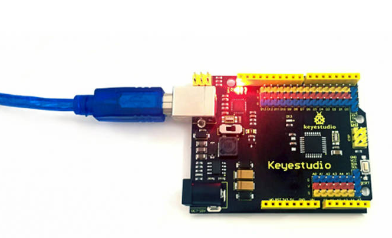

Antes de subir código a la placa de control conectada, necesitamos seleccionar la placa y el puerto en Arduino IDE.

Se introducen dos métodos a continuación:

1. Usando el selector de placa y puerto del menú Herramientas

2. Usando el selector de placa

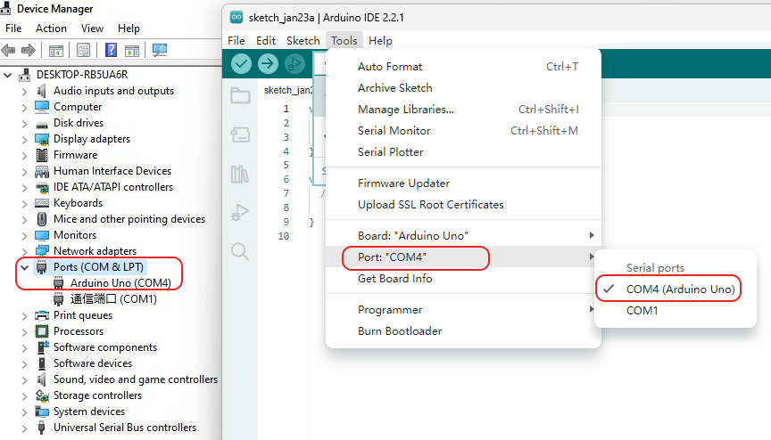

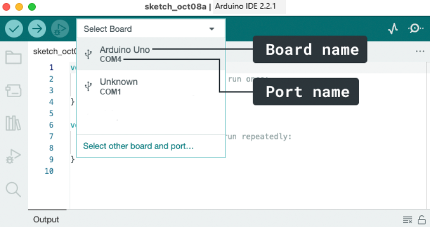

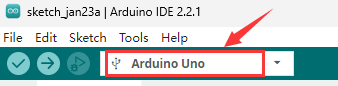

## 2.5 Añadir bibliotecas al Arduino IDE

**¿Por qué usar bibliotecas?**

Las bibliotecas son increíblemente útiles al crear un proyecto de cualquier tipo. Hacen que nuestra experiencia de desarrollo sea mucho más fluida, y hay casi una cantidad infinita de ellas. Se usan para interactuar con muchos sensores diferentes, RTCs, módulos Wi-Fi, matrices RGB y por supuesto con otros componentes en tu placa.

**Incluir una biblioteca en el sketch**

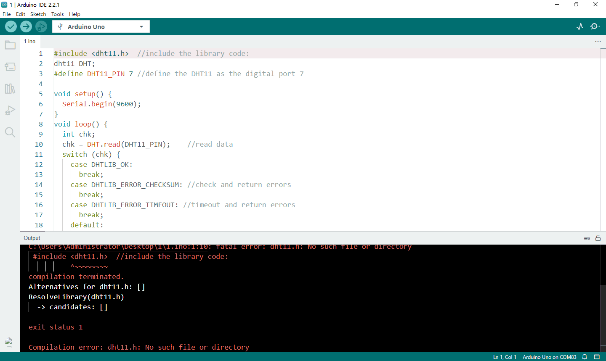

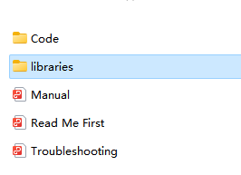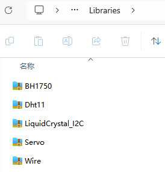

**Dos formas de añadir bibliotecas al Arduino IDE**

1.**Método uno: Importar una biblioteca .zip**

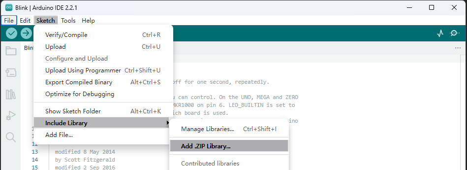

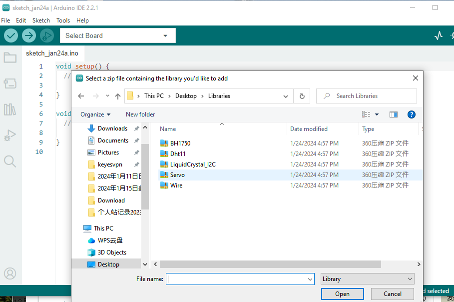

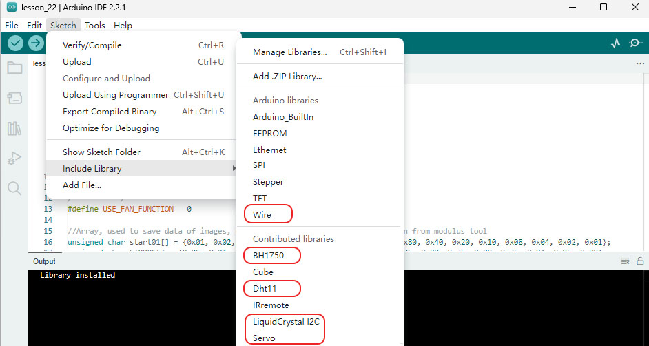

2.**Método dos: Instalación manual**

La ubicación predeterminada donde se guardan los sketches que escribes en Arduino se llama Sketchbook. El Sketchbook es simplemente una carpeta en tu computadora como cualquier otra. Actúa como un repositorio útil para los sketches y también es donde se guardan las bibliotecas de código adicionales.

**Carpeta de bibliotecas**

La carpeta **sketchbook\\libraries** es la ubicación predeterminada donde se instalan las bibliotecas desde el Arduino IDE.

Si quieres añadir una biblioteca manualmente, el archivo de la biblioteca no puede añadirse como un archivo zip, necesitas descomprimirlo y ponerlo en la carpeta **libraries** de tu sketchbook tú mismo.

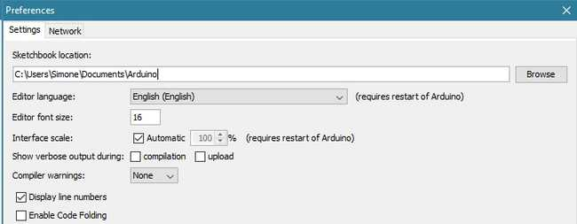

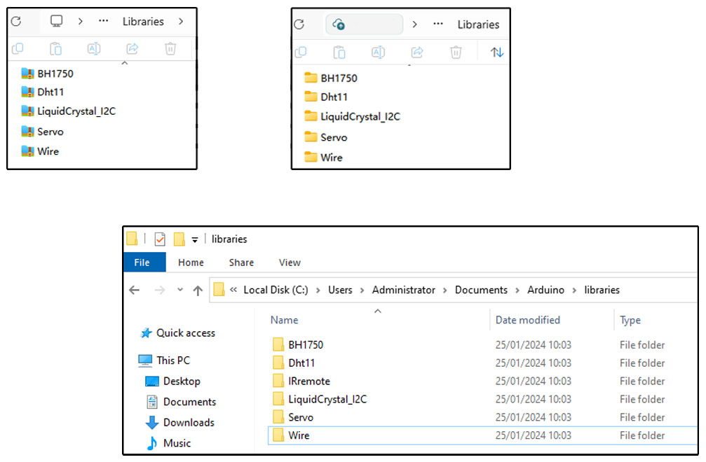

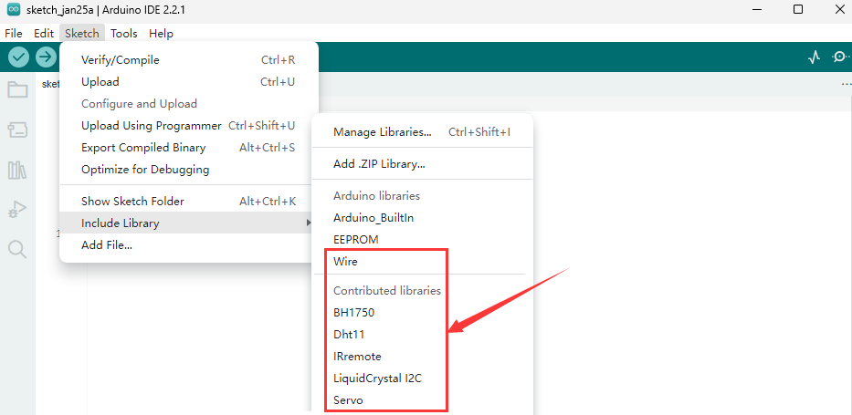

Desinstalar una biblioteca Arduino

Desinstalar una biblioteca Arduino es más sencillo que instalarla. Encuentra la carpeta sketchbook en tu computadora (igual que en el capítulo “Instalación manual de una biblioteca”). Ve a la ubicación y abre la carpeta “libraries”. Selecciona la carpeta que contiene la biblioteca que quieres eliminar y simplemente bórrala. La próxima vez que abras tu Arduino IDE, esa biblioteca eliminada no aparecerá en el menú Sketch > Incluir biblioteca.

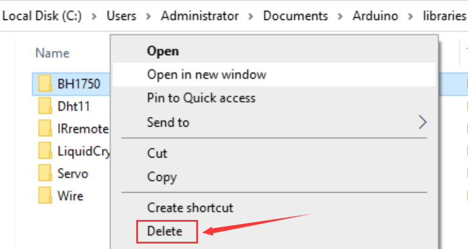

Las bibliotecas no ocupan mucho espacio y la mayoría de las veces no hay razón para eliminarlas. Sin embargo, si no piensas usarlas de nuevo y quieres limpiar la lista, puedes eliminarlas con seguridad. Siempre puedes instalar cualquier biblioteca Arduino nuevamente si necesitas usarla en el futuro.
