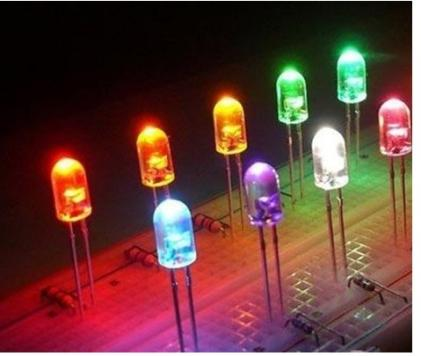
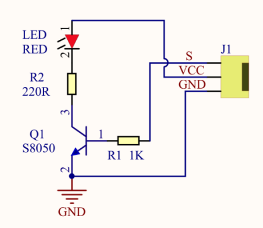
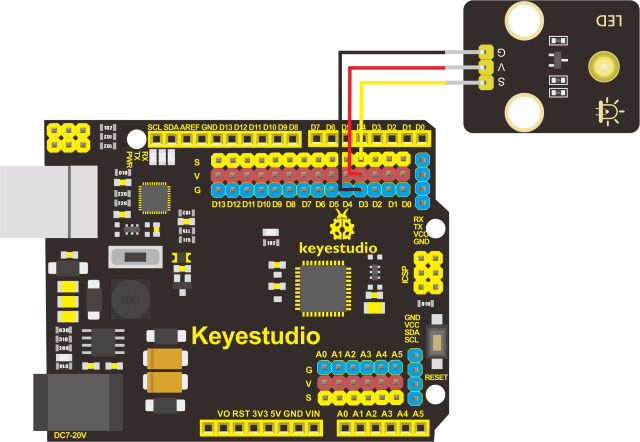
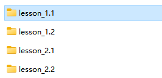
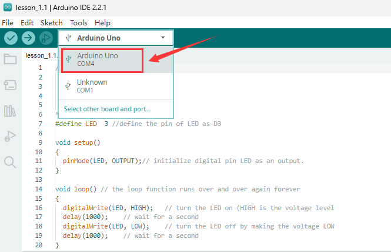
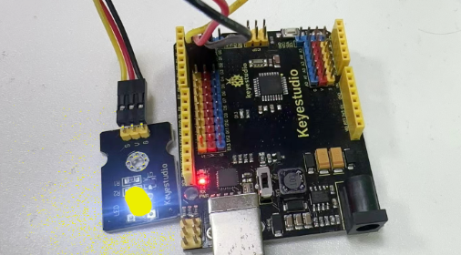

## Lesson 1.1: LED Blinks

**(1).Description：**

LED, the abbreviation of light emitting diodes consists of Ga, As, P, N chemical compounds, and so on. The LED can flash in diverse colors by altering the delay time in the test code. When in control, power on GND and VCC, the LED will be on if the S end is at a high level; nevertheless, it will go off.

**(2).Parameters：**

Control interface: digital port

Working voltage: DC 3.3-5V

Pin spacing: 2.54mm

LED display color: yellow

**(3).You need to prepare:**

| Control Board*1                                | USB Cable*1                                    | Yellow LED Module*1                            | 3pin F-F 26AWG Wire                             |
|-------------------------------------------------|-------------------------------------------------|-------------------------------------------------|-------------------------------------------------|
|  |  |  |  |

**(4).Connection diagram of the led module：**

The pin -, + and S of LED module are connected to the pin G, 5V and D3 port of the control board.

**(5).Test Results:** LED blinks at the interval of 1s

**(6).Code Explanations:**

pinMode(LED，OUTPUT) - This function can denote that the pin is INPUT or OUTPUT

digitalWrite(LED，HIGH) - When pin is OUTPUT, we can set it to HIGH(output 5V) or LOW(output 0V)

