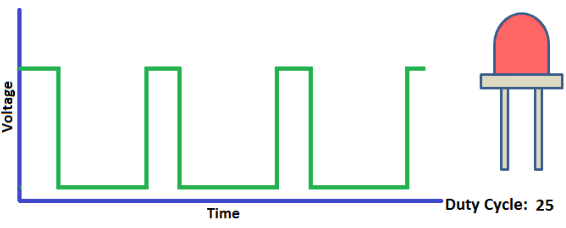
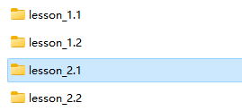
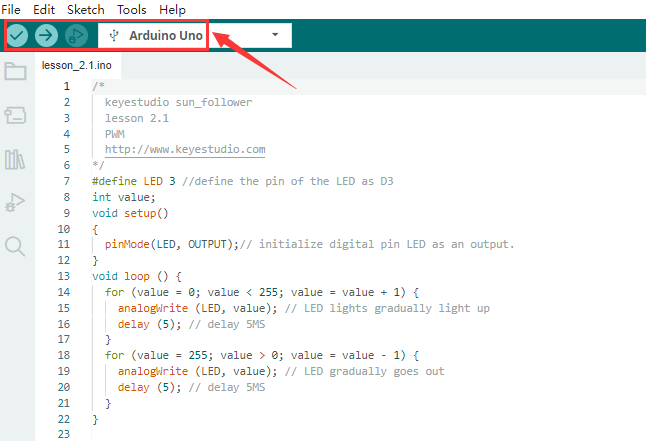
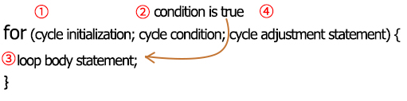
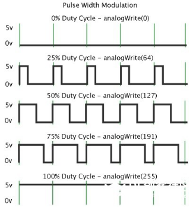

## Leçon 2.1 : Ajuster la luminosité de la LED

Le matériel requis pour cette leçon, la configuration de l'IDE Arduino, et le câblage entre le module LED et la carte de contrôle sont les mêmes que pour la **Leçon 1.1**.

**(1). Description :**

Dans la leçon précédente, nous avons contrôlé l’allumage et l’extinction de la LED et fait clignoter celle-ci.

Dans ce projet, nous allons contrôler la luminosité de la LED via le PWM pour simuler un effet de respiration. De même, vous pouvez modifier la longueur de pas et le temps de délai dans le code afin de démontrer différents effets de respiration.

 Le PWM est un moyen de contrôler la sortie analogique par des moyens numériques. Le contrôle numérique est utilisé pour générer des ondes carrées avec différents cycles de service (un signal qui commute constamment entre des niveaux haut et bas) afin de contrôler la sortie analogique. En général, la tension d’entrée du port est de 0V ou 5V. Que faire si 3V est requis ? Ou si l’on veut commuter entre 1V, 3V et 3,5V ? On ne peut pas changer constamment la résistance. Dans ce cas, il faut contrôler par PWM.

Pour la sortie de tension du port numérique Arduino, il n’y a que LOW et HIGH, qui correspondent respectivement à une sortie de 0V et 5V. Vous pouvez définir LOW comme 0 et HIGH comme 1, et laisser l’Arduino émettre cinq cents signaux 0 ou 1 en une seconde.

Si on émet cinq cents 1, cela correspond à 5V ; si tous sont 0, cela correspond à 0V. Si on émet 010101010101 de cette manière, alors la sortie du port est de 2,5V, ce qui est similaire à la projection d’un film. Le film que nous regardons n’est pas complètement continu. En réalité, il affiche 25 images par seconde. Dans ce cas, l’œil humain ne peut pas le percevoir, pas plus que le PWM. Si l’on veut une tension différente, il faut contrôler le ratio entre 0 et 1. Plus il y a de signaux 0 ou 1 émis par unité de temps, plus le contrôle est précis.

**(2). Explication du code :**

Lorsque nous devons répéter certaines instructions, nous pouvons utiliser l’instruction FOR.

Le format de l’instruction FOR est montré ci-dessous :

Séquence cyclique FOR :

Tour 1 : 1 → 2 → 3 → 4

Tour 2 : 2 → 3 → 4

…

Jusqu’à ce que le nombre 2 ne soit plus valide, la boucle “for” est terminée.

Après avoir compris cet ordre, revenons au code :

for (int value = 0; value < 255; value=value+1){

…}

for (int value = 255; value >0; value=value-1){

…}

Les deux instructions “for” font augmenter la valeur de 0 à 255, puis la réduire de 255 à 0, puis l’augmenter à nouveau à 255, … en boucle infinie.

Il y a une nouvelle fonction dans ce qui suit —– analogWrite()

Nous savons que le port numérique n’a que deux états : 0 et 1. Alors comment envoyer une valeur analogique à une valeur numérique ? Ici, cette fonction est nécessaire. Observons la carte Arduino et trouvons 6 broches marquées “\~” qui peuvent émettre des signaux PWM.

Le format de la fonction est le suivant :

analogWrite(pin,value)

analogWrite() est utilisée pour écrire une valeur analogique de 0 à 255 pour un port PWM, donc la valeur est dans la plage de 0 à 255. Attention, vous ne devez écrire que sur les broches numériques avec fonction PWM, telles que les broches 2, 3, 4, 5, 6, 7, 8, 9, 10, 11, 12, 13, 44, 45, 46.

Le PWM est une technologie permettant d’obtenir une grandeur analogique par une méthode numérique. Le contrôle numérique forme une onde carrée, et le signal d’onde carrée n’a que deux états : allumé et éteint (c’est-à-dire niveaux haut ou bas). En contrôlant le rapport de la durée d’allumage et d’extinction, on peut simuler une tension variant de 0 à 5V. Le temps d’allumage (appelé académiquement niveau haut) est appelé largeur d’impulsion, donc le PWM est aussi appelé modulation de largeur d’impulsion.

À travers les cinq ondes carrées suivantes, découvrons davantage le PWM.

Dans la figure ci-dessus, la ligne verte représente une période, et la valeur de analogWrite() correspond à un pourcentage appelé aussi cycle de service (Duty Cycle). Le cycle de service signifie que la durée du niveau haut est divisée par la durée du niveau bas dans un cycle. De haut en bas, le cycle de service de la première onde carrée est de 0% et sa valeur correspondante est 0. La luminosité de la LED est la plus faible, c’est-à-dire éteinte. Plus le niveau haut dure longtemps, plus la LED est brillante. Par conséquent, le dernier cycle de service est de 100%, ce qui correspond à 255, la LED est la plus brillante. 25% signifie plus sombre.

Le PWM est principalement utilisé pour ajuster la luminosité des LED ou la vitesse de rotation des moteurs.

Il joue un rôle vital dans le contrôle des voitures robots intelligentes.