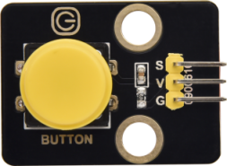
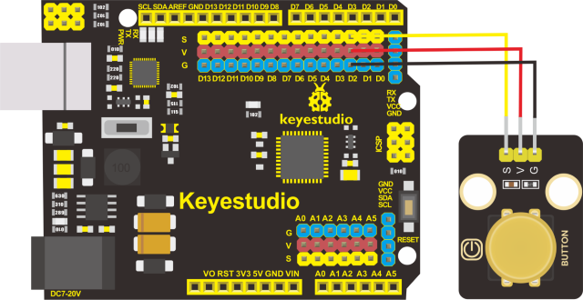
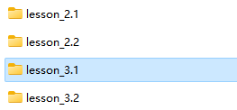
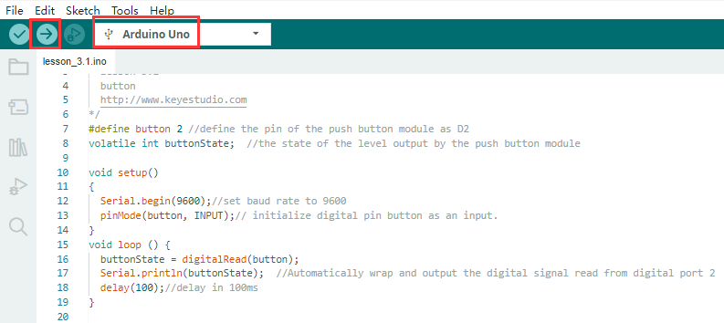
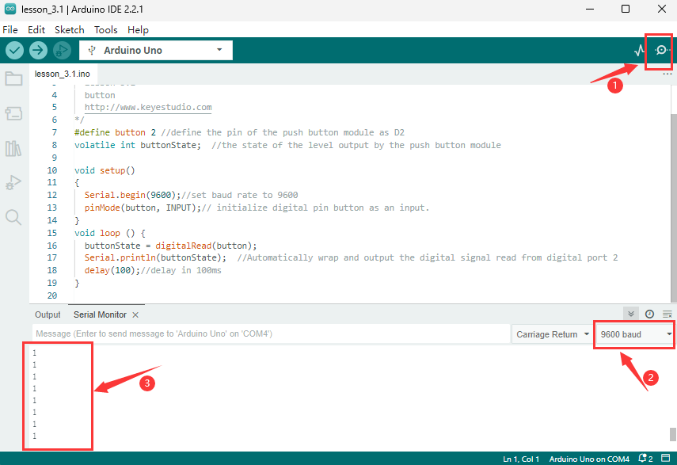

## Lección 3.1: Leer la Señal Digital del Módulo de Botón

**(1)Descripción**

En este proyecto, pretendemos usar el módulo de botón pulsador para controlar el LED.

**(2)Parámetros:**

Voltaje de trabajo：DC 3.3-5V

Señal de control：señal digital

Tamaño：34mm

Peso：3.8g

**(3)Necesitas preparar:**

| Placa de Control*1                             | Cable USB*1                                   | Módulo LED Amarillo*1                         | Cable 3pin F-F 26AWG*2                         | Módulo de Botón Pulsador*1                     |
|-------------------------------------------------|-------------------------------------------------|-------------------------------------------------|-------------------------------------------------|-------------------------------------------------|
|  |  |  |  |  |

**(4)Diagrama de Conexión**

| Tabla de Conexión de Pines |                      |
|----------------------------|----------------------|
| Pin del **Botón**          | Pin de la Placa de Control |
| G                          | G(GND)               |
| V                          | V(5V)                |
| S                          | D2                   |

| Tabla de Conexión de Pines |                      |
|----------------------------|----------------------|
| Pin del **LED**            | Pin de la Placa de Control |
| G                          | G(GND)               |
| V                          | V(5V)                |
| S                          | D3                   |

**(5)Explicación del Código:**

Serial.begin(9600)-inicializa la comunicación serial y establece la velocidad en baudios a 9600

pinMode(pin, INPUT)-usa la función pinMode() para indicarle a Arduino si es un pin de salida o un pin de entrada

digitalRead(pin)-lee el nivel digital de los pines, puede ser ALTO o BAJO