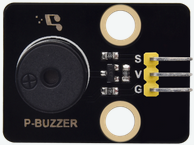
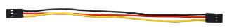
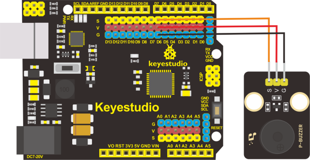
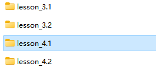
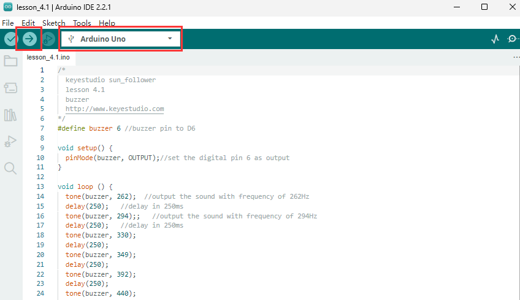
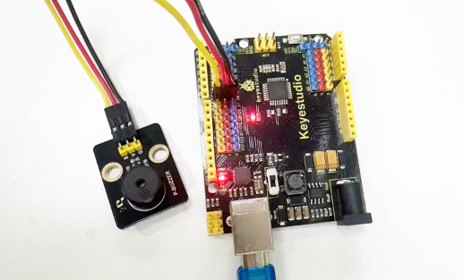

## Leçon 4.1 : Buzzer Passif

**(1) Description**

De nombreuses œuvres interactives ont été réalisées avec Arduino. La plus courante est l'affichage sonore et lumineux. Nous utilisons toujours des LED pour faire des expériences. Pour cette leçon, nous concevons un circuit pour émettre du son. Les composants sonores universels sont le buzzer et les avertisseurs sonores. Le buzzer est plus facile à utiliser. Et le buzzer se divise en buzzer actif et buzzer passif. Dans cette expérience, nous utilisons un buzzer passif.

Lors de l'utilisation d'un buzzer passif, nous pouvons contrôler différents sons en entrant des ondes carrées avec des fréquences distinctes. Pendant l'expérience, nous contrôlons le code pour faire sonner le buzzer, en commençant par un son « tic, tic », puis faire émettre au buzzer passif les notes « do ré mi fa sol la si do », et jouer des chansons spécifiques.

**(2) Paramètres :**

Interface de contrôle : port numérique

Tension de fonctionnement : DC 3.3-5V

**(3) Ce dont vous avez besoin :**

| Carte de Contrôle*1                             | Câble USB*1                                   | Buzzer Passif*1                               | Fil 3 broches F-F 26AWG                        |
|-------------------------------------------------|-------------------------------------------------|-------------------------------------------------|-------------------------------------------------|
|  |  |  |  |

**(4). Schéma de Connexion :**

Les broches G, V et S du buzzer passif sont connectées respectivement aux broches G, V et D6 de la carte de contrôle.

| Tableau de Connexion des Broches |                      |
|---------------------------------|----------------------|
| Broche du **Buzzer**             | Broche de la Carte de Contrôle |
| G                               | G                    |
| V                               | V                    |
| S                               | D6                   |

