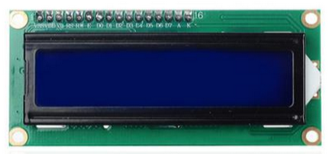
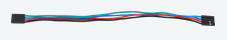
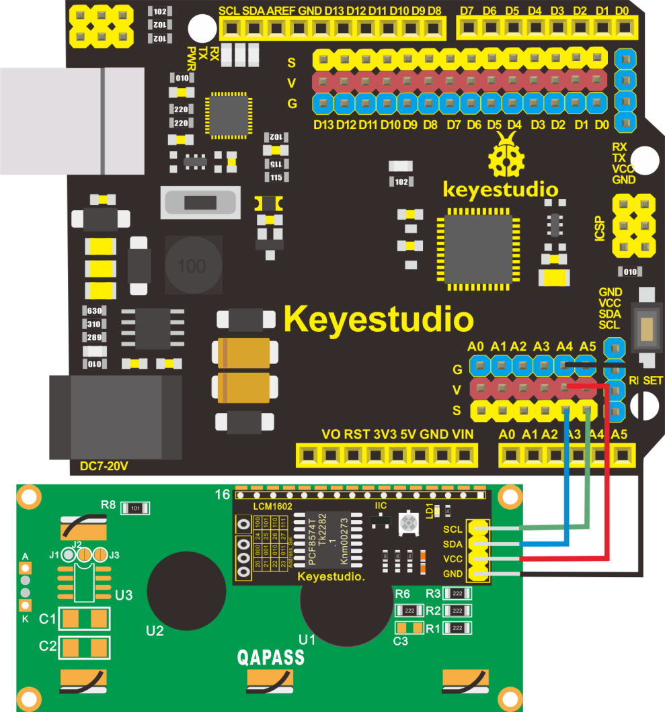
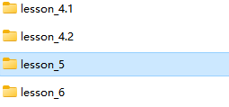
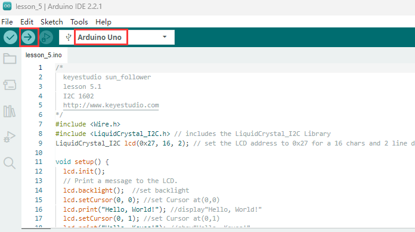
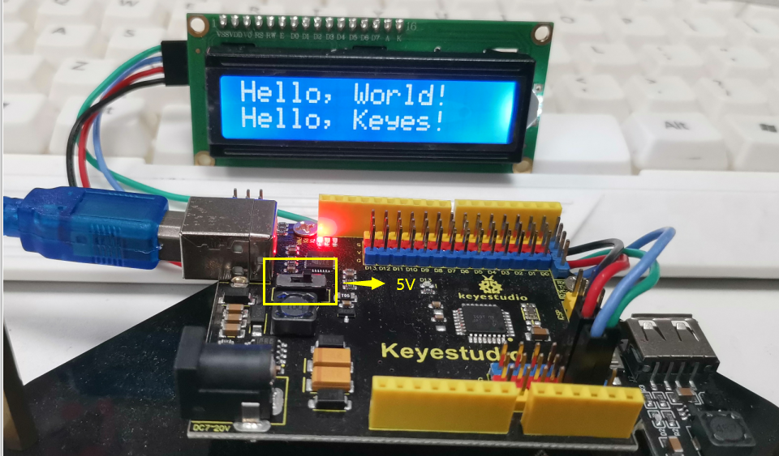
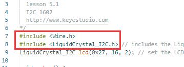

## Lezione 5: Modulo Display LCD 1602

**(1).Descrizione：**

Con modulo di comunicazione I2C, questo è un modulo display che può mostrare 2 righe con 16 caratteri per riga.

Mostra sfondo blu e caratteri bianchi e si collega all'interfaccia I2C del MCU, risparmiando notevolmente le risorse del MCU.

Sul retro del display LCD, c'è un potenziometro blu per regolare la retroilluminazione. L'indirizzo di comunicazione predefinito è 0x27.

Il display LCD 1602 originale può avviarsi e funzionare con 11 porte IO, ma il nostro è costruito con interfaccia ARDUINOIIC/I2C, risparmiando 9 porte IO. In alternativa, il modulo è dotato di 4 fori di posizionamento con un diametro di 3mm, che è comodo per fissarlo su altri dispositivi.

**(2).Parametri：**

Indirizzo I2C: 0x27

Retroilluminazione (blu, bianca)

Tensione di alimentazione: **5V**

Contrasto regolabile

GND: Un pin che si collega a massa

VCC: Un pin che si collega a un'alimentazione +5V

SDA: Un pin che si collega alla porta analogica A4 per comunicazione IIC

SCL: Un pin che si collega alla porta analogica A5 per comunicazione IIC

**(3).Devi preparare:**

| Scheda di Controllo*1                             | Cavo USB*1                                     | Display LCD*1                                  | Filo DuPon 4P-1P F-F                            |
|--------------------------------------------------|------------------------------------------------|------------------------------------------------|-------------------------------------------------|
|  |  |  |  |

**(4)Schema di Collegamento**

| Tabella di Collegamento Pin |                      |
|-----------------------------|----------------------|
| Pin del **Display LCD**      | Pin della Scheda di Controllo |
| GND                         | G(GND)                 |
| VCC                         | V(5V)                 |
| SDA                         | A4                 |
| SCL                         | A5                 |

