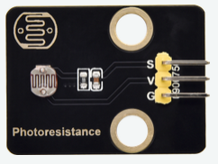
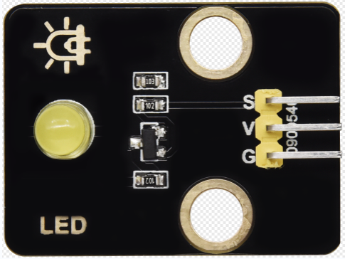
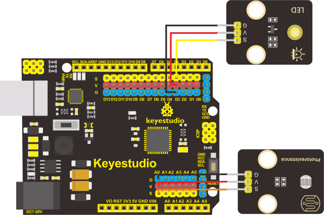
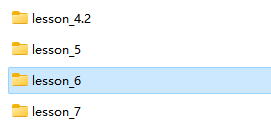
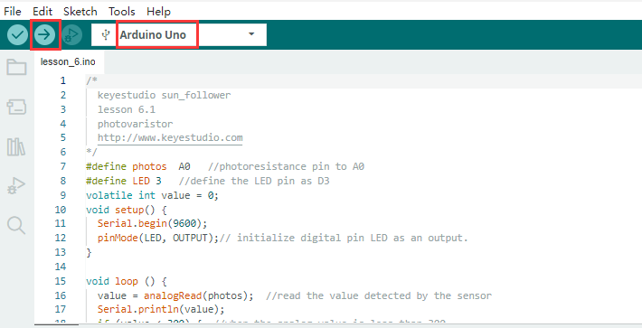
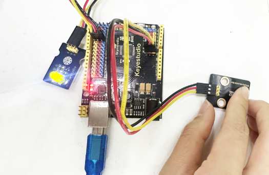
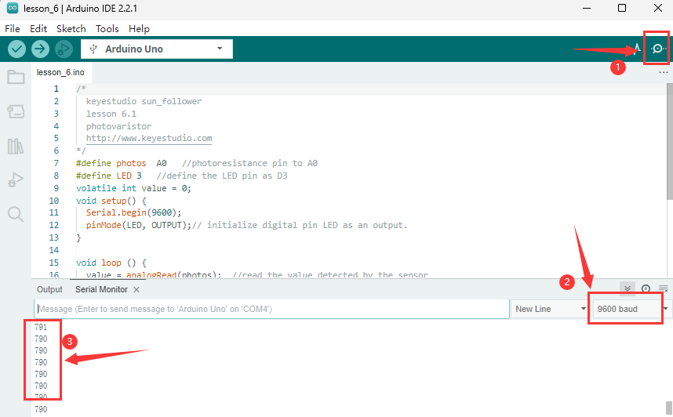

## Lektion 6: Fotosensitiver Sensor

**(1)Beschreibung**

In diesem Kit sind vier Fotowiderstand-Sensormodule enthalten, die Umgebungslichtsensoren mit Fotowiderstand als Hauptkomponente.

Der Widerstand eines Fotowiderstands variiert mit der Lichtintensität. Wenn Licht vorhanden ist, liegt sein Widerstand im Bereich von 5-10KΩ; während er im Dunkeln nur 0,2MΩ beträgt. Basierend auf dieser Eigenschaft kann eine Schaltung aufgebaut werden, die die Widerstandsänderung in Spannungsänderungen umwandelt.

Außerdem verfügt der Sensor über einen verpolungssicheren Anschluss mit einem Rastermaß von 2,54 mm, um die Verkabelung zu erleichtern. Er ist auch mit vielen Arten von Mikrocontrollern kompatibel, wie der Arduino-Mikrocontroller-Serie.

Hier verwenden wir diesen Sensor mit dem Arduino-Mikrocontroller. Der S (Signal)-Anschluss des Sensors sollte an den analogen Pin des Arduino angeschlossen werden, um die Variation des analogen Werts zu erfassen, der im seriellen Monitor ausgegeben wird. Bitte beachten Sie, dass der Sensor zwei Positionierlöcher mit einem Durchmesser von 4,9 mm besitzt, um die Befestigung zu erleichtern.

**(2)Parameter:**

Betriebsspannung：3,3V-5V（DC）

Schnittstelle：3PIN

Ausgangssignal：analoges Signal

Gewicht：2,3g

**(3)Sie müssen vorbereiten:**

| Steuerplatine*1                                | USB-Kabel*1                                    | Gelbes LED-Modul*1                            | 3-poliges DuPont-Kabel*2                       | Taster-Modul*4                                |
|-------------------------------------------------|-------------------------------------------------|-------------------------------------------------|-------------------------------------------------|-------------------------------------------------|
|  |  |  |  |  |

**(4).Anschlussdiagramm:**

| Anschluss-Tabelle       |                      |
|------------------------|----------------------|
| Pin des **Fotowiderstands** | Pin der Steuerplatine |
| G                      | G(GND)               |
| V                      | V(5V)                |
| S                      | A0                   |

| Anschluss-Tabelle      |                      |
|-----------------------|----------------------|
| Pin der **LED**       | Pin der Steuerplatine |
| G                     | G(GND)               |
| V                     | V(5V)                |
| S                     | D3                   |

