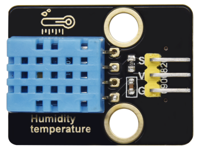
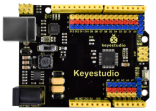
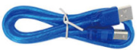
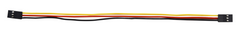
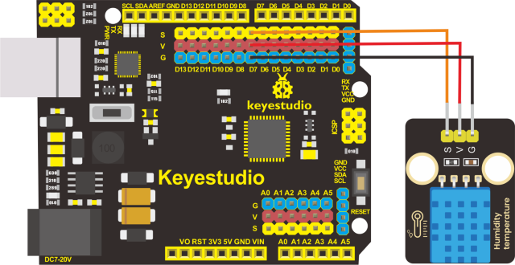
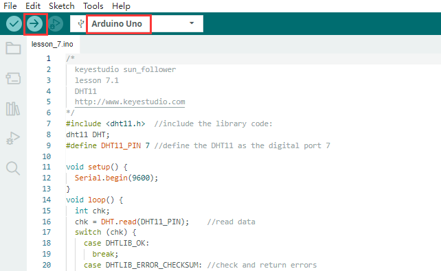
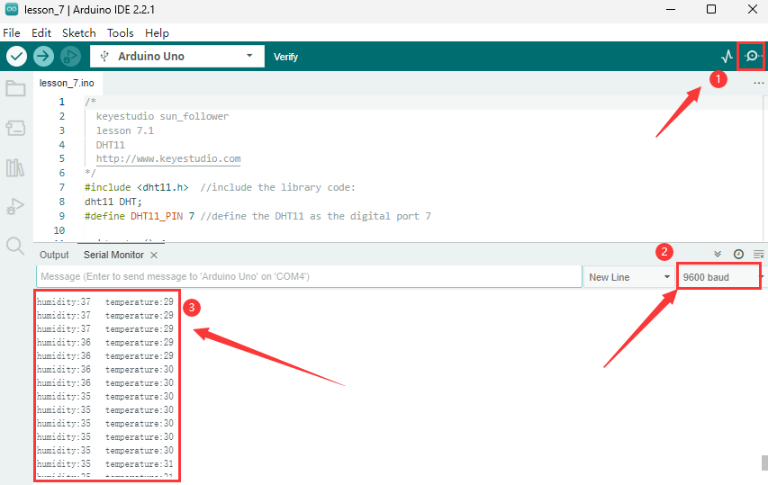
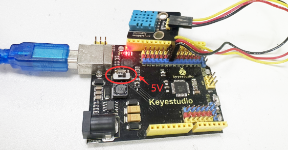

## Lección 7: Sensor de Temperatura y Humedad DHT11

**(1)Descripción:**

Este sensor de temperatura y humedad DHT11 es un sensor compuesto que contiene una salida digital calibrada de la señal de temperatura y humedad.

El sensor de temperatura y humedad DHT11 utiliza la tecnología de adquisición del módulo digital y la tecnología de detección de temperatura y humedad, asegurando alta fiabilidad y excelente estabilidad a largo plazo.

Incluye un elemento resistivo y un dispositivo de medición de temperatura NTC.

**(2)Parámetros：**

Voltaje de trabajo: **+5 V**

Temperatura de trabajo: 0-50 ℃ con un error de ± 2 ℃

Humedad: 20-90% RH con un error de ± 5% RH

Interfaz: puerto digital

**(3).Necesitas preparar:**

| Placa de Control*1                                | Cable USB*1                                    | Sensor DHT11*1                                        | Cable DuPont de 3 pines                                |
|-------------------------------------------------|-------------------------------------------------|--------------------------------------------------------|-------------------------------------------------|
|  |  |  |  |

**(4)Diagrama de Conexión**

Los pines G, V y S del Sensor DHT11*1 están conectados a G, V y D7 de la placa de control.

