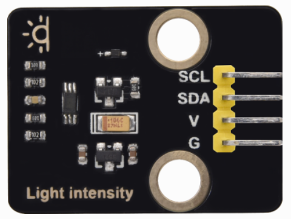
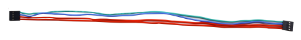
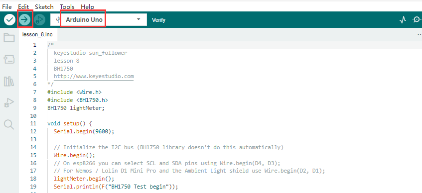
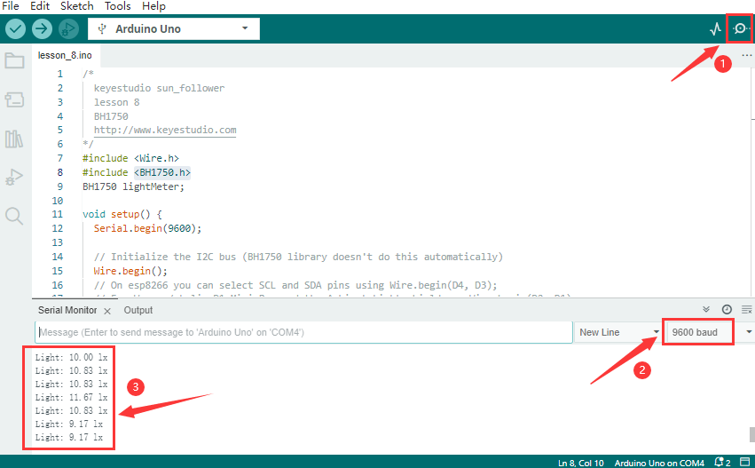

## Lesson 8: BH1750 Digital Light Intensity Module

**(1)Description:**

The main component of this sensor is chip BH1750FVI which is an integrated chip for digital light intensity.

As shown in the picture below, BH1750 is composed of a photodiode, an operational amplifier, an ADC acquisition, a crystal oscillator, etc. The photodiode converts the input optical signal into an electrical signal through the photovoltaic effect. After being amplified by the operational amplifier circuit, the voltage is collected by the ADC, and then converted into a 16-bit binary number through the logic circuit and stored in the internal register(Note: The stronger the light, the greater the photocurrent, and the greater the voltage, so the intensity of the light can be judged by the value of the voltage.

However, it should be noted that the voltage and the light intensity are one-to-one correspondence, but not proportional. That is why this chip linear processing is done and why the integrated IC is used directly instead of photodiodes). BH1750 leads out the clock line and data line. The single-chip microcomputer can communicate with the BH1750 module through the I2C protocol. You can choose the working mode of the BH1750, or you can extract the illuminance data of the BH1750 register.

**(2)Parameters:**

I2C digital interface, supporting a maximum rate of 400Kbps

The output is Illuminance

Measuring range is 1\~65535 lux, the minimum resolution is 1lux

Low power consumption (Power down) function

Shield the interference of light changes caused by 50/60Hz mains frequency 

Supports two I2C addresses, selected by the ADDR pin

Small measurement deviation(maximum accuracy error +/-20%)

GND power ground

SDA I2C bus data pin

SCL I2C bus clock pin

VCC power supply voltage 3-5V

**(3)You need to prepare:**

| Control Board*1                                | USB Cable*1                                    | BH1750FVI Sensor*1                             | 350mm 4pin F-F Wire                             |
|-------------------------------------------------|-------------------------------------------------|-------------------------------------------------|-------------------------------------------------|
|  |  |  |  |

**(4)Connection Diagram:**

(**Note**: since the I2C bus can have multiple devices with different addresses, when the digital light intensity module is used together with the I2C LCD1602 module, there is no conflict because they have different addresses.)

