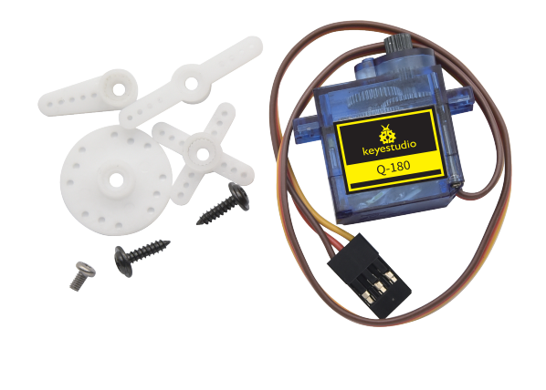
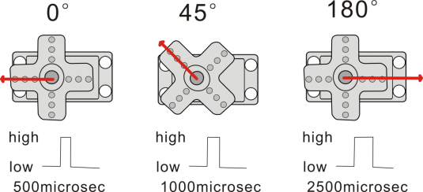
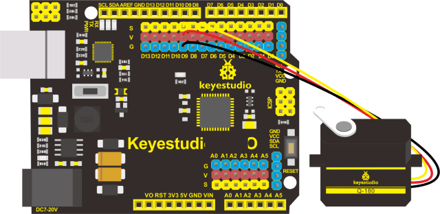
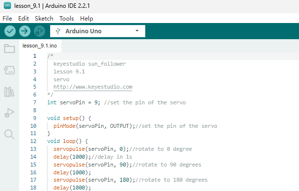
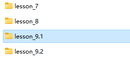
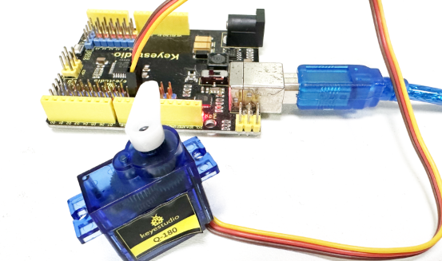
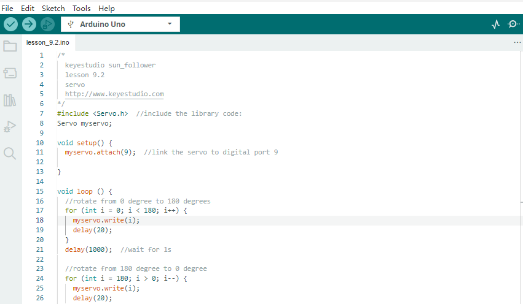
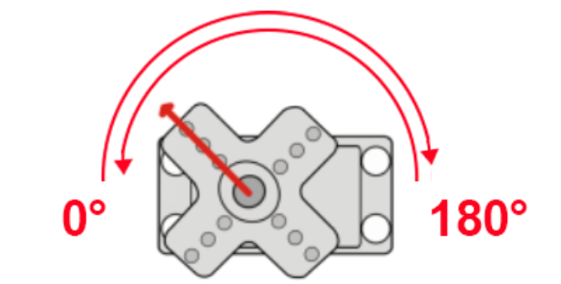
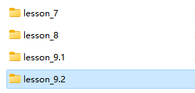

## レッスン9：サーボモーターのテスト

**(1)説明：**

サーボモーターは位置制御回転アクチュエーターです。主にハウジング、回路基板、コアレスモーター、ギア、位置センサーで構成されています。その動作原理は、サーボがMCUまたは受信機から送られた信号を受け取り、周期20ms、幅1.5msの基準信号を生成し、取得した直流バイアス電圧とポテンショメーターの電圧を比較して電圧差を出力することです。

このプロジェクトで使用するサーボでは、茶色の線がグランド、赤色の線がプラス線、オレンジ色の線が信号線です。

サーボモーターの回転角度は、PWM（パルス幅変調）信号のデューティサイクルを調整することで制御されます。PWM信号の標準周期は20ms（50Hz）です。理論的には幅は1ms〜2msの間ですが、実際には0.5ms〜2.5msの範囲です。この幅は0°から180°の回転角度に対応します。ただし、ブランドによっては同じ信号でも回転角度が異なる場合があります。

詳細：

**(2)パラメータ：**

動作電圧：DC 4.8V 〜 6V

動作角度範囲：約180°（500 → 2500 μsec）

パルス幅範囲：500 → 2500 μsec

無負荷速度：0.12 ± 0.01秒 / 60（DC 4.8V） 0.1 ± 0.01秒 / 60（DC 6V）

無負荷電流：200 ± 20mA（DC 4.8V） 220 ± 20mA（DC 6V）

停止トルク：1.3 ± 0.01kg・cm（DC 4.8V） 1.5 ± 0.1kg・cm（DC 6V）

停止電流：≦ 850mA（DC 4.8V） ≦ 1000mA（DC 6V）

待機電流：3 ± 1mA（DC 4.8V） 4 ± 1mA（DC 6V）

リード線長さ：250 ± 5 mm

外形寸法：22.9 * 12.2 * 30mm

重量：9 ± 1 g（サーボホーンなし）

**(3)準備するもの：**

| コントロールボード*1                                | USBケーブル*1                                    | サーボ*2                                               |
|-------------------------------------------------|-------------------------------------------------|--------------------------------------------------------|
|  |  |  |

**(4)接続図**

注意：サーボはG（GND）、V（VCC）、D9に接続します。茶色の線はGnd（G）に、赤色の線はVに、オレンジ色の線はデジタルピンD9に接続します。

サーボを制御する方法を2つ紹介します。1つは**<Servo.h>**ライブラリを使わない方法、もう1つは**<Servo.h>**ライブラリを使う方法です。

**9.1 <Servo.h>ライブラリを使わずにサーボを制御する**

**9.2 <Servo.h>ライブラリを使ってサーボを制御する**

