## Lección 10: Principio de carga del Kit de Seguimiento Solar

**(1) Módulo de carga solar y USB:**

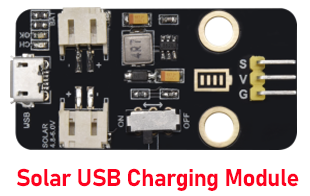

Este módulo integra un chip de carga y descarga, que puede conectarse con una batería recargable externa y un panel solar a través de las interfaces PH2.0MM.

En este kit, proporcionamos una caja para batería que contiene una batería 18650, por lo que necesitarás preparar una batería recargable 18650 por tu cuenta.

El módulo tiene un puerto Micro USB y puedes usar la computadora para cargar la batería 18650 a través del puerto micro USB.

Además, cuenta con un módulo boost que puede aumentar el voltaje de las baterías a 6.6V. El interruptor DIP en el módulo es el interruptor de SALIDA de 6.6V. El pin G y V de este módulo pueden entregar 6.6V y el pin S puede leer el voltaje de la batería después de la resistencia de 1/2 voltaje.

**Parámetros:**

| Interfaz de carga                             | Interfaz Micro USB HP2.0MM para panel solar |
|----------------------------------------------|----------------------------------------------|
| Voltaje de entrada de la interfaz del panel solar | 4.4-6V                                       |
| Valor de carga de voltaje constante de la batería | 4.15-4.24V                                   |
| Corriente máxima de carga                     | 800mA                                        |
| Interfaz de salida                            | 3 P 2.54mm Aguja doblada                      |
| Voltaje de entrada                            | 6.6V                                         |
| Corriente máxima de salida                     | 1A                                           |
| Batería externa                              | Batería 18650                                |
| Atributos ambientales                         | ROHS                                         |

**Diagrama esquemático**

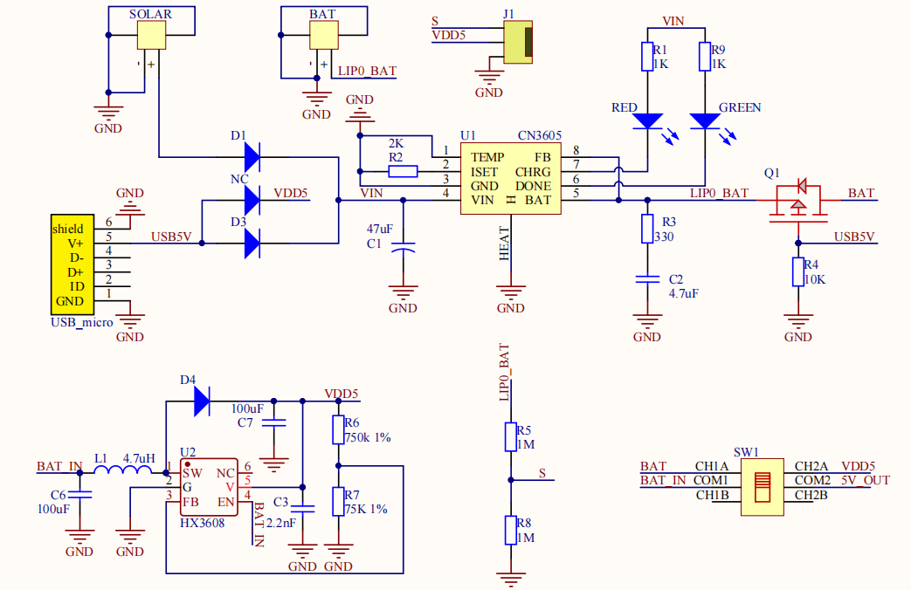

**Características**

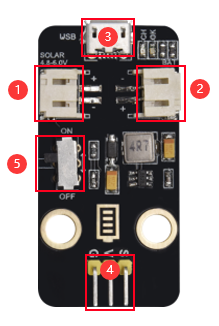

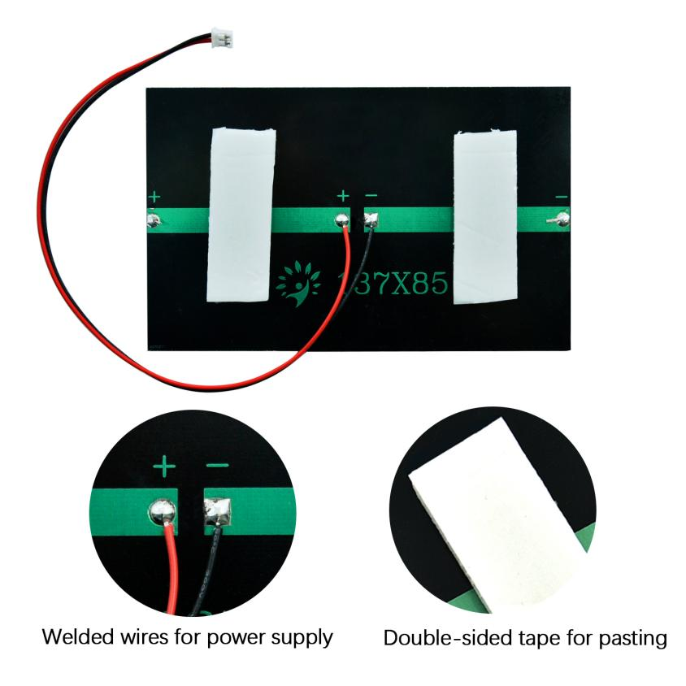

**(2) Panel solar PET**

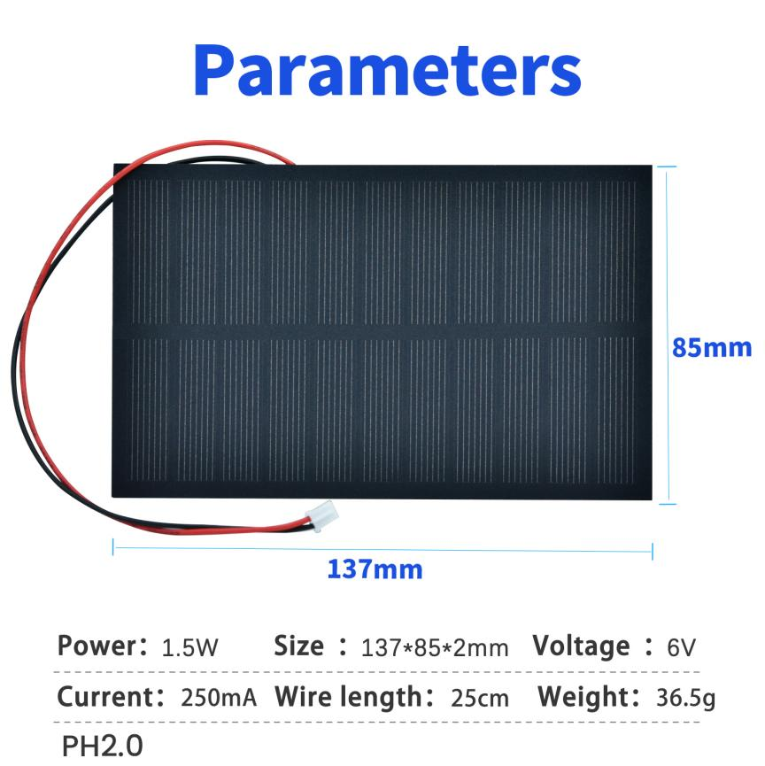

Los principales factores que afectan el rendimiento de salida de los paneles solares son los siguientes:

(1) Impedancia de carga

(2) Intensidad de la luz solar

(3) Temperatura

(4) Ángulo de iluminación y área de iluminación

Puedes usar un multímetro para medir la corriente de salida del panel solar, ajusta el multímetro al nivel de corriente continua y al conector de rango grande, conecta la punta roja del multímetro al polo positivo del panel solar y la punta negra al polo negativo del panel solar, y mide.

¿Pueden los paneles solares almacenar electricidad?

No, generalmente necesitan estar emparejados con una batería para almacenar electricidad.

¿Pueden los paneles solares generar electricidad en días nublados?

No, la energía generada por los paneles solares en días nublados es muy pequeña. En este caso, tienen voltaje pero no corriente.

¿Pueden los paneles solares generar electricidad bajo iluminación interior?

No, los paneles solares no pueden generar electricidad bajo iluminación interior.

**(3) Cargar la batería con el panel solar.**

En este kit, proporcionamos una caja para batería compatible con una batería 18650, y también está configurada con dos interfaces para que puedas cargar la batería o usarla como fuente de energía.

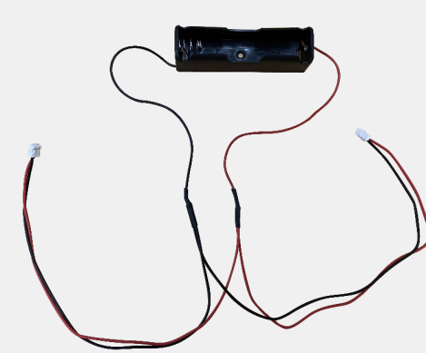

Necesitarás preparar una batería 18650 así como un cargador de baterías.

Los siguientes parámetros están disponibles para tu compra：

| Especificaciones         |                                                           |
|-------------------------|-----------------------------------------------------------|
| Tamaño                  | 18650                                                     |
| Terminal positivo：      | 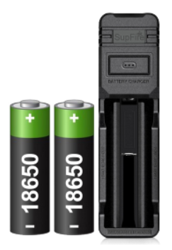 con parte superior |
| Capacidad               | >2200mAh                                                  |
| Voltaje nominal         | 3.7V                                                      |
| Voltaje máximo          | 4.2V                                                      |
| Voltaje de corte de descarga | 2.5V                                                      |
| Recargable              | Sí                                                        |
| Dimensiones aproximadas | 18.5mm x 65.2mm                                           |

Podemos conectar el panel solar al módulo de carga y a una caja para batería 18650, de modo que el panel solar cargue la batería.

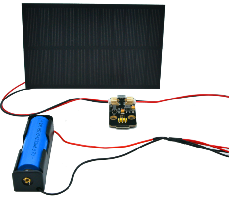

Los paneles solares no son baterías, no tienen la función de almacenamiento de energía. Pueden almacenar electricidad en la batería.

La salida de los paneles solares es débil en ambientes donde no hay luz solar, iluminación interior y luz baja en invierno. La energía transportada por estas luces es muy pequeña, incluso si es más brillante.

**Nota:**

El panel solar puede requerir largos períodos de luz solar directa para cargar suficientemente las baterías. Las baterías 18650 no deben exponerse a la luz solar directa ni a altas temperaturas alrededor para evitar que se quemen.

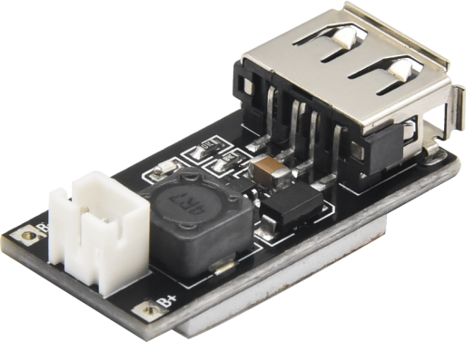
**(4) Módulo de carga para teléfono inteligente**

El módulo de carga para teléfono móvil es un módulo boost de batería de litio de 3.7V que puede entregar 5V, 1A a través del terminal PH2.0 y el puerto USB.

Parámetros:

| Propiedad              | Módulo boost no aislado (BOOST)                                                                |
|------------------------|------------------------------------------------------------------------------------------------|
| Voltaje de entrada     | 1-5V                                                                                           |
| Voltaje de salida      | 5±0.1V                                                                                        |
| Corriente de salida:   | Nominal 1-1.5A (entrada de batería de litio de una celda), máximo 1.5A (entrada de batería de litio de una celda) |
| Eficiencia de conversión | Hasta 96%                                                                                      |
| Frecuencia de conmutación | 500KHz                                                                                       |
| Temperatura de trabajo | Grado industrial (-40°C a +85°C)                                                              |
| Calentamiento a carga completa | 30°C                                                                                     |
| Corriente en reposo    | 130uA                                                                                         |

El terminal PH2.0 del módulo de carga del teléfono puede conectarse a la caja de batería.

El puerto USB puede conectarse a un teléfono Android y cargarlo.

Ten en cuenta que la potencia de la batería 18650 debe ser suficiente (voltaje entre 3.2-4.2V) para cargar un teléfono Android. De lo contrario, no funcionará, aunque el teléfono muestre que se está cargando.

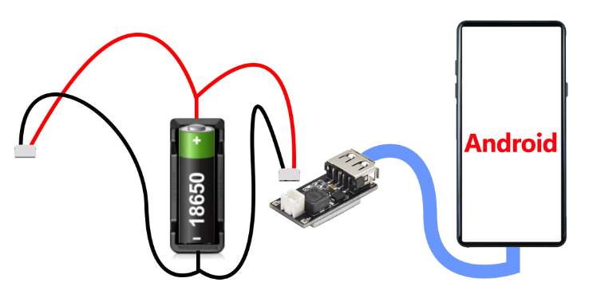

**(5) Principio de carga del Kit de Seguimiento Solar**

1. Corriente máxima de carga del puerto micro USB 1A

2. Corriente máxima de carga del panel solar 80mA

3. Voltaje máximo de salida del puerto USB A hembra: 5V/1.5A (puede usarse para cargar teléfonos móviles)

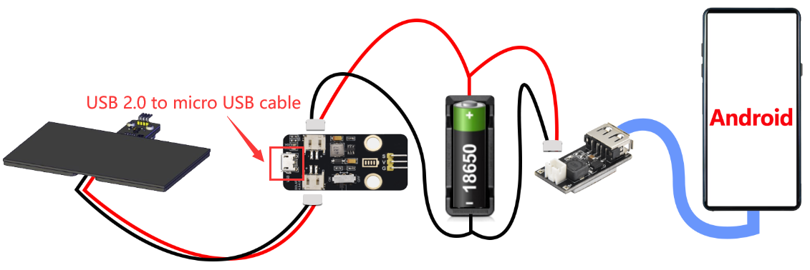

4. Tipo de batería: batería de litio 18650 con parte superior, se recomienda comprar con capacidad mayor a 2200mAh

**Nota:**

1). El protocolo de carga del módulo de carga para teléfono solo soporta Android, no iOS.

2). El panel solar no puede cargar teléfonos móviles directamente; necesita almacenar electricidad en una batería y la batería carga el teléfono.

3). El voltaje de la batería 18650 debe estar en el rango de 3.2---4.2V para cargar el teléfono celular. Cuando el voltaje de la batería es menor a 3.2V, aunque el teléfono muestre que se está cargando, en realidad no se está cargando.

4). El panel solar puede requerir largos períodos de luz solar directa para cargar suficientemente las baterías. Las baterías 18650 no deben exponerse a la luz solar directa ni a altas temperaturas alrededor para evitar que se quemen.

5). Si deseas cargar tu batería 18650 rápidamente, puedes cargar la batería usando un cargador dedicado para 18650. O usar un cable USB 2.0 a micro USB para conectar el módulo de carga y cargar la batería usando una computadora o fuente de alimentación. (El cable USB 2.0 a micro USB no está incluido en el kit)

6). Esto es solo un experimento de simulación y no cubrirá tus necesidades diarias de energía, no lo uses como fuente regular de energía para tu teléfono celular.