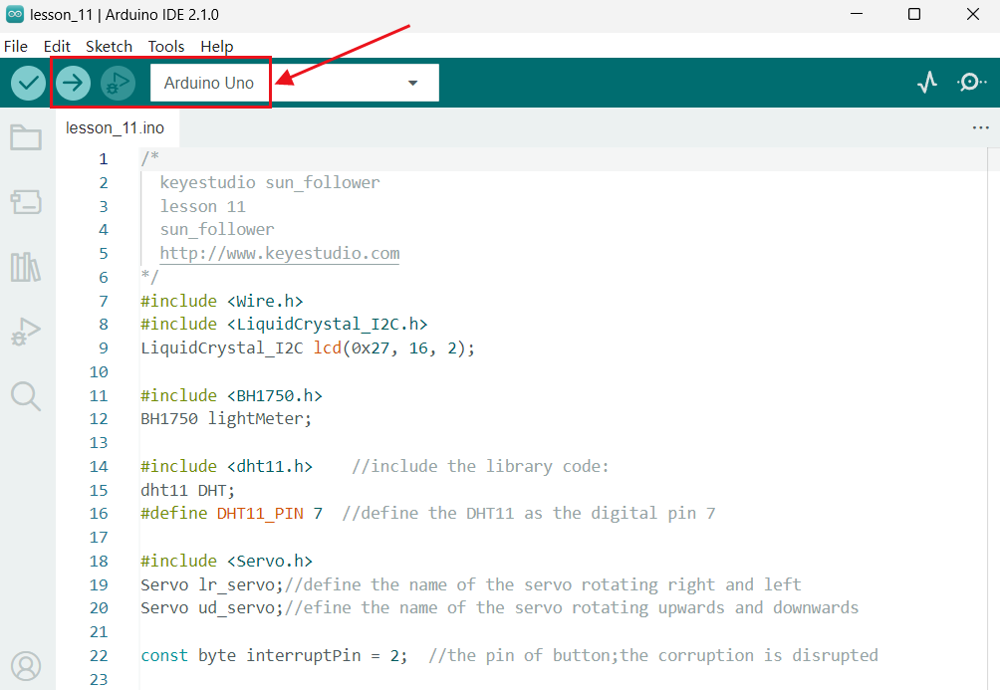
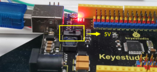
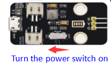
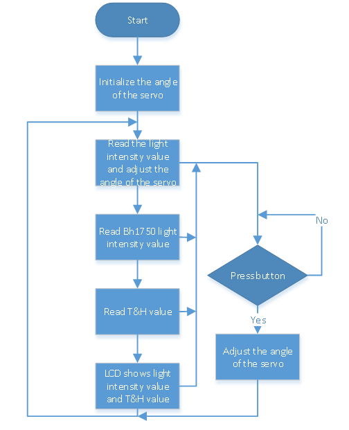

# 5.Zonnepaneelapparaat met Meerdere Functies

Het geassembleerde zonnepaneelapparaat is klaar!

In de vorige lessen bestudeerden we alleen de functie en het werkingsprincipe van een bepaald elektronisch onderdeel afzonderlijk, en testten we of het normaal kon werken.

Nu laten we ze samenwerken om een zonnepaneelapparaat met meerdere functies te bouwen.

Houd de 18650-batterij voldoende opgeladen, omdat deze nodig zal zijn om twee servo's, een LCD-display, vier lichtsensoren, een DHT11-sensor en een knopmodule van stroom te voorzien.

Nadat de code succesvol is geüpload, zet je de aan/uit-schakelaar van de laadmodule aan en druk je de aan/uit-schakelaar van de besturingskaart op 5V.

De servo zal naar de beginhoek draaien. Wanneer de omgevingslichtsensor veranderingen in lichtintensiteit detecteert, draaien de servo's het zonnepaneel naar de positie waar het licht het sterkst is en toont de LCD1602 de waarde van de lichtintensiteit en de temperatuur en vochtigheid die respectievelijk door de BH1750 en DHT11 worden gedetecteerd.

Als je vindt dat het zonnepaneel te langzaam draait of het zonnepaneel schudt, kun je de draaisnelheid van de servo aanpassen via de knopmodule.

Bijvoorbeeld, binnen de gespecificeerde tijd draait de servo elke keer 1°. Na het indrukken van de knop draait de servo elke keer 2° binnen dezelfde tijd.

Druk nogmaals en de servo draait elke keer 3° binnen dezelfde tijd. Door analogie kan de servo worden aangepast om tot 5° per keer te draaien binnen dezelfde tijd.

**“byte resolution = 1”**

Je kunt de resolutie aanpassen om de draaisnelheid van de servo te veranderen. Druk op de knop om de resolutie te wijzigen van 1° tot 5°. Je kunt ook `byte m_speed = 10` wijzigen om de vertragingstijd in te stellen om de snelheid van de servo aan te passen; hoe langer de tijd, hoe kleiner de snelheid.

