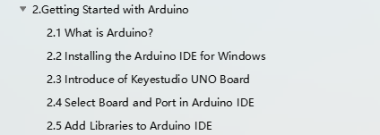

# 6.Foutoplossing

Hier zijn enkele oplossingen voor veelvoorkomende problemen die u kunnen helpen.

Als u hier niet het antwoord vindt dat u zoekt, neem dan contact op met onze technische ondersteuning:

Amazon: [service@keyestudio.com](mailto:service@keyestudio.com)

AliExpress: [tivon@keyestudio.com](mailto:tivon@keyestudio.com)

Andere kanalen: [sunny@keyestudio.com](mailto:sunny@keyestudio.com)

Voor een snellere en professionelere oplossing van uw probleem, voeg alstublieft deze informatie toe wanneer u ons een e-mail stuurt:

Uw ordernummer of waar u dit product heeft gekocht

De problemen die u tegenkomt, probeer gedetailleerde beschrijvingen, foto's of video's toe te voegen.

We hebben meer informatie nodig dan "Het werkt niet." Geef ons alstublieft goede details over wat u wilt bereiken en wat u al heeft geprobeerd.

Dank u!

**(1) Het besturingsbord wordt niet herkend door de computer.**

-Controleer of de USB-kabel goed is en of de USB-poort van uw computer beschikbaar is.

**(2) USB-poort wordt niet herkend door de computer.**

-Controleer of u de USB-driver heeft geïnstalleerd.

**(3) Codeproblemen/Mislukte upload/Codefout.**

Deze redenen kunnen problemen met uw code veroorzaken:

1) De driver is niet geïnstalleerd.

2) Het bordtype en de COM-poort zijn niet correct geselecteerd in de Arduino IDE.

3) Het bibliotheekbestand is niet geïnstalleerd.

(Volg alstublieft **2.Getting Started with Arduino** om bovenstaande problemen op te lossen)

**(4) Slechte USB-verbinding**

Als u de problemen 1-3 hierboven niet heeft, controleer dan of de USB-kabelverbinding goed is, probeer deze opnieuw in te pluggen en upload de code opnieuw.

**(5) De geassembleerde Solar tracking kit reageert niet.**

1) Deze redenen kunnen ervoor zorgen dat de robot niet werkt:

1) verkeerde bedrading

2) U heeft de code niet geüpload

3) Mislukte upload/Codefout

4) U heeft de 5V-schakelaar op het besturingsbord en de aan/uit-schakelaar op de oplaadmodule niet ingeschakeld.

5) Onvoldoende batterijvermogen

U moet de 18650-batterij voldoende opgeladen houden omdat deze nodig is om twee servo's, een LCD-display, vier lichtsensoren, een DHT11-sensor en een knopmodule van stroom te voorzien.

**(6) Servo blijft hangen/servo wordt heet**

U moet de beginhoek van de servo aanpassen voordat u deze monteert en de hoek niet veranderen totdat de montage is voltooid om ervoor te zorgen dat de servo correct werkt voor de solar tracking kit.

**(7) Het zonnepaneel volgt de beweging van de lichtbron of de zon niet**

Wanneer de omgevingslichtsensor veranderingen in lichtintensiteit detecteert, draaien de servo's het zonnepaneel naar de positie waar het licht het sterkst is.

In een omgeving met gelijkmatige verlichting kan het zonnepaneel de beweging van de lichtbron mogelijk niet volgen. U moet mogelijk een zeer sterke lichtbron toepassen, of een lichtbron in een zwak verlichte ruimte gebruiken om het zonnepaneel met de lichtbron te laten meebewegen. Het zonnepaneel beweegt mogelijk niet naar de zon omdat het verschil in lichtintensiteit dat door elke omgevingslichtsensor wordt gedetecteerd, niet groot genoeg is.

1.  **Het zonnepaneel beweegt erg langzaam, haperend of blijft hangen.**
2.  Controleer of de servo-bedrading netjes is en niet klem zit zodat de servo voldoende ruimte heeft om te bewegen.
3.  De 18650-batterij moet volledig opgeladen zijn.
4.  U kunt op de knopmodule drukken om de hoeveelheid servo-rotatie aan te passen.